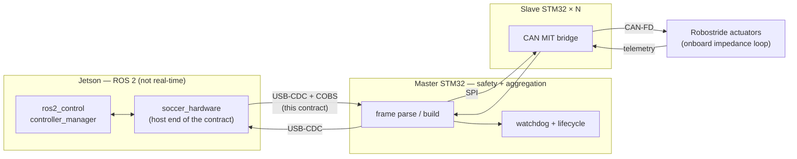
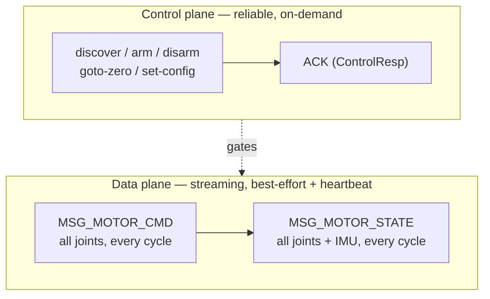
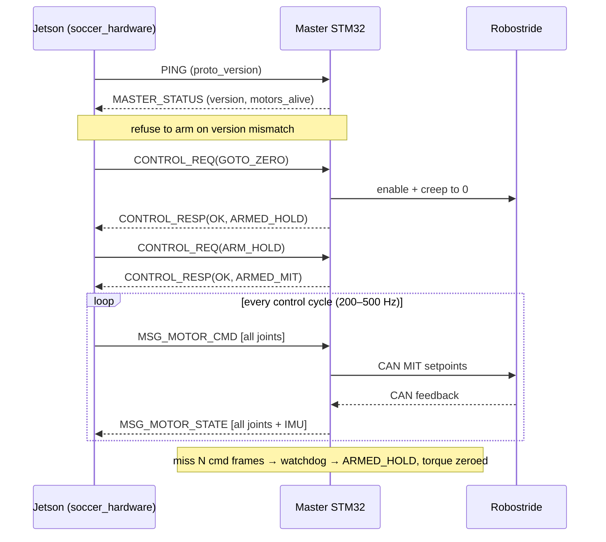

# Jetson ↔ Master Communication Contract — Recommendation & Open Decisions

> Status: **DRAFT for firmware + software team review.** Authored 2026-06-27.
> Scope: the wire contract between the Jetson (ROS 2 `ros2_control`) and the
> Master STM32, and onward to the Slave STM32(s) and Robostride CAN actuators.
> This document captures the **reasoning**, the **recommended contract**, and the
> **decisions still open**. Nothing here is final — it is the basis for agreement.

---

## 1. Goal & constraints

Build the actuation contract for a **RoboCup humanoid soccer robot**. The robot
uses **Robostride** quasi-direct-drive actuators (CAN bus, MIT-mode impedance
control) behind an STM32 Master/Slave bridge, commanded from a Jetson running the
ROS 2 stack.

Hard constraints that drive the design:

| Constraint                                                                  | Source                                                            | Implication for the contract                                  |
| --------------------------------------------------------------------------- | ----------------------------------------------------------------- | ------------------------------------------------------------- |
| Bounded-residual RL + MPC produce `q*, qd*` and (reserved) feed-forward `τ` | [new_architecture_blueprint.md](new_architecture_blueprint.md) §4 | Command must carry a **full MIT impedance tuple**             |
| Actuators close the torque loop **onboard**                                 | Robostride MIT mode                                               | Jetson streams **setpoints**, not a 1 kHz PD loop             |
| Linux is not hard-real-time; an MCU must own safety                         | blueprint §0, §9                                                  | Master MCU keeps a **watchdog**; contract carries a heartbeat |
| Observation vector = `q, qd, τ, IMU, contact`                               | blueprint §9                                                      | Telemetry must carry **measured torque + body sensors**       |
| Sim-to-real parity through one `ros2_control` boundary                      | blueprint §10                                                     | The contract maps cleanly onto `ros2_control` interfaces      |

---

## 2. What already exists (verified in the `soccer-firmware` submodule)

The firmware team has **already built a substantial, well-structured protocol**.
This is the starting point — most of it should be kept.

| Artifact                                  | Path                                                     |
| ----------------------------------------- | -------------------------------------------------------- |
| Shared C contract                         | `soccer-firmware/firmware/common/include/protocol.h`     |
| Config-driven motor table (gen from YAML) | `soccer-firmware/firmware/common/include/motor_config.h` |
| Python host implementation                | `soccer-firmware/host/jetson/protocol.py`                |
| Host round-trip tests                     | `soccer-firmware/host/jetson/tests/test_protocol.py`     |



**Already designed well (keep):**

- **Framing**: 16-byte header (`type, seq, src, dst, ts, len, flags, crc16`),
  CRC16-CCITT (poly `0x1021`, init `0xFFFF`).
- **COBS** byte-stuffing with a `0x00` delimiter for stream resynchronisation —
  the correct choice for a USB-CDC byte stream.
- **Lifecycle state machine** with an explicit **arming handshake** (no torque
  until armed): `BOOT → DISCOVERING → IDLE → ARMED_HOLD → ARMED_MIT`, plus
  `ZEROING`, `FAULT`, `DISABLED`.
- **Request/response control plane** (`ControlReq`/`ControlResp`) with ACKs.
- **Config-driven motors**: `motor_config.h` is generated from
  `configs/slave0.yaml` — per-motor CAN id, model, soft limits, default gains.
- **Packed telemetry** (`SpiMotorTele`) using the Robostride-native uint16
  encoding, so values are lossless end-to-end.

---

## 3. Findings — what is missing or wrong

Determined by reading the contract end-to-end. Ordered by severity.

| #   | Issue                                                                       | Evidence                                                                                                                                                    | Severity   |
| --- | --------------------------------------------------------------------------- | ----------------------------------------------------------------------------------------------------------------------------------------------------------- | ---------- |
| 1   | **C and Python have already diverged** — there is no single source of truth | C `MsgType` (`MASTER_STATUS=2…MOTOR_CMD=7`) ≠ Python `MsgType` (`DISCOVER=2…MOTOR_STATE=6`); `ts_ms` (C) vs `ts_us` (Python); 8-state vs 10-state lifecycle | **High**   |
| 2   | **The SPI command drops the impedance gains**                               | `SpiMitCmd` carries only `pos, vel, valid` — `kp, kd, tau_ff` are discarded                                                                                 | **High**   |
| 3   | **The high-rate MIT command is unwired**                                    | `MotorCmd` / `MSG_MOTOR_CMD` is marked `stub – not wired`                                                                                                   | **High**   |
| 4   | **No IMU or foot-contact anywhere**                                         | telemetry has no body-sensor fields; obs vector needs them                                                                                                  | **High**   |
| 5   | **No protocol version handshake**                                           | header `flags` reserved; `PING` carries no version; given #1, silent mismatch is likely                                                                     | **Medium** |

**Why #2 is the critical one for a humanoid.** Robostride actuators are MIT-mode
quasi-direct-drive motors — `can_mit_control_set(id, τ, pos, speed, kp, kd)`.
Their entire advantage is **per-cycle variable impedance**: stiff in stance,
compliant in swing, soft on ball contact. A contract that fixes `kp/kd` throws
away the actuator's reason for existing. For legged locomotion this is
non-negotiable.

---

## 4. Recommended contract

### 4.1 Principle: two traffic classes, not one



| Class         | Messages                                        | Pattern                             | Rate       | Reliability                      |
| ------------- | ----------------------------------------------- | ----------------------------------- | ---------- | -------------------------------- |
| Control plane | discover, arm/disarm, goto-zero, status, config | request → ACK                       | on demand  | reliable (retry on timeout)      |
| Data plane    | MIT command, joint+body state                   | streaming, **all joints per frame** | 200–500 Hz | best-effort + heartbeat/watchdog |

Keeping the two classes separate means a dropped telemetry frame never stalls a
lifecycle transition, and the high-rate path stays fixed-size and allocation-free.

### 4.2 Data-plane command (Jetson → Master)

```c
/* MSG_MOTOR_CMD — streamed at the control rate. One frame = all joints = one heartbeat. */
typedef struct PROTO_PACKED {
    float q_des;      /* rad        target position            */
    float qd_des;     /* rad/s      target velocity            */
    float kp;         /*            impedance stiffness         */
    float kd;         /*            impedance damping           */
    float tau_ff;     /* N·m        feed-forward torque         */
} JointMitCmd;        /* 20 bytes/joint                          */
/* payload: uint16 n_joints; JointMitCmd joint[n_joints];        */
```

### 4.3 Data-plane telemetry (Master → Jetson)

```c
/* MSG_MOTOR_STATE — same cadence as the command. */
typedef struct PROTO_PACKED {
    float    q;            /* rad   measured position           */
    float    qd;           /* rad/s measured velocity           */
    float    tau;          /* N·m   measured (current-sense)     */
    int8_t   temp_c;       /* °C                                */
    uint8_t  state;        /* MotorLifecycle                    */
    uint16_t fault_flags;  /* Robostride fault bits             */
    uint16_t last_cmd_seq; /* echoes the command seq → RTT/drop  */
} JointState;             /* 16 bytes/joint                      */

/* Body sensors appended once per frame (IMU on the Master MCU). */
typedef struct PROTO_PACKED {
    float    quat[4];      /* w,x,y,z                           */
    float    gyro[3];      /* rad/s                             */
    float    accel[3];     /* m/s²                              */
    uint16_t contact_bits; /* per-foot contact, bit i = foot i  */
} BodyState;
```

### 4.4 Sequence — arm, then stream



### 4.5 Design decisions and rationale

| Decision               | Choice                                                                | Why                                                                                                                                                                                                                               |
| ---------------------- | --------------------------------------------------------------------- | --------------------------------------------------------------------------------------------------------------------------------------------------------------------------------------------------------------------------------- |
| Command richness       | **Full MIT** (`q*, qd*, kp, kd, τ_ff`) end-to-end, including over SPI | Fixes finding #2; unlocks variable impedance — the point of the actuator                                                                                                                                                          |
| Wire encoding (USB)    | **float32 engineering units**                                         | USB bandwidth is ample (~400 B × 500 Hz = 200 KB/s ≪ USB-FS 1.5 MB/s). Decouples the host contract from Robostride's bit-packing — swap actuators without changing the USB contract. Master converts float→CAN-uint16 at the edge |
| Frame granularity      | **All joints in one frame**                                           | One command frame = one heartbeat → trivial watchdog, bounded latency, no per-motor request storm                                                                                                                                 |
| Joint indexing         | **integer `motor_idx`**, mapped to `joint_name` in shared config      | Compact wire; mapping lives in the already-generated `motor_config.h`                                                                                                                                                             |
| Single source of truth | **Generate C + Python + C++ from one spec**                           | Kills finding #1 permanently; extend the existing `gen_motor_config.py` codegen pattern                                                                                                                                           |
| Versioning             | **`proto_version` in PING/STATUS**, refuse to arm on mismatch         | Kills finding #5                                                                                                                                                                                                                  |
| Transport              | **Keep USB-CDC + COBS**                                               | Adequate because the actuator owns the fast loop; Master stays the safety/aggregation layer the blueprint requires                                                                                                                |

### 4.6 Transport analysis

| Option                       | Verdict                                                                                                                                                      |
| ---------------------------- | ------------------------------------------------------------------------------------------------------------------------------------------------------------ |
| **USB-CDC + COBS** (current) | **Recommended.** Bandwidth trivial. Ceiling = USB-FS 1 ms polling → ~1 kHz with ~1 ms jitter. Fine for setpoint streaming while the actuator closes the loop |
| CAN-FD direct from Jetson    | Removes the MCU safety layer the blueprint wants; Linux not real-time. Rejected for now                                                                      |
| EtherCAT                     | Overkill at this scale and dev cost. Revisit only for a larger robot                                                                                         |

If sub-millisecond synchronised commanding across all joints is later required,
revisit a USB-HS-capable MCU or EtherCAT — **not** needed for the current design.

---

## 5. Decisions still open (need firmware + software agreement)

These size the contract and cannot be settled unilaterally.

| #   | Decision                             | Options                                                                                                                | Default if unanswered         |
| --- | ------------------------------------ | ---------------------------------------------------------------------------------------------------------------------- | ----------------------------- |
| D1  | **DOF count & bus topology**         | total joints; number of CAN buses / Slave STM32s                                                                       | grow `N_MOTORS`; `SLAVE_0..k` |
| D2  | **IMU placement**                    | (a) on Master MCU, in telemetry frame (hardware-synced) — **recommended**; (b) separate IMU on Jetson, out-of-protocol | (a) — chosen for this draft   |
| D3  | **Foot-contact sensing**             | in telemetry `contact_bits` vs separate                                                                                | in telemetry frame            |
| D4  | **Wire encoding**                    | float32 on USB (recommended) vs packed-uint16 throughout                                                               | float32 on USB                |
| D5  | **Control rate**                     | 200 / 500 / 1000 Hz host→master                                                                                        | 500 Hz; watchdog 100 ms       |
| D6  | **Single-source-of-truth mechanism** | neutral YAML/JSON spec → codegen (recommended) vs canonical C header → parse                                           | YAML spec → codegen           |

---

## 6. Conclusion

1. The firmware team's **framing, lifecycle, arming, and config-driven design are
   solid — keep them.** This is not a rewrite of the protocol.
2. The gap is the **high-rate control path**. Wire `MSG_MOTOR_CMD` as a
   **full-MIT, all-joints, float32** streaming frame, and **carry `kp/kd/τ_ff`
   all the way to the actuator** (fix `SpiMitCmd`).
3. Add **body sensors** (IMU + contact) to the telemetry frame (decision D2/D3).
4. Make the contract a **single generated source** for C, Python, and the C++
   `ros2_control` interface, and add a **version handshake**.
5. **Keep USB-CDC + COBS**; the Master MCU remains the real-time safety layer.

The host-side `ros2_control` interface in `soccer_hardware` has been rewritten to
this recommended contract as a **reviewable draft** — see
[soccer_hardware_rewrite.md](soccer_hardware_rewrite.md).
