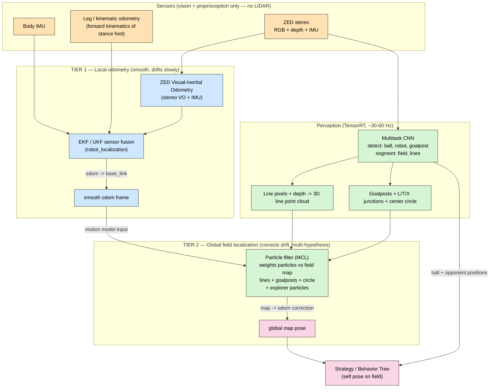
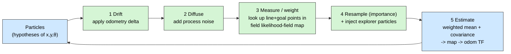
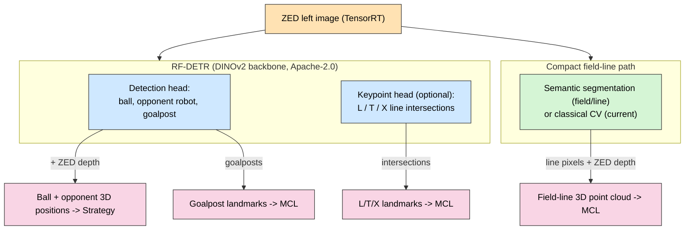
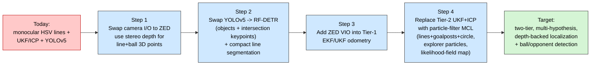

# RoboCup Humanoid — Localization & Detection Strategy Report

> **Purpose:** Verify the localization recommendations from `localization_research_conversation.md` (the Gemini conversation), conduct independent research against the current (June 2026) state of the art, and deliver a concrete, justified recommendation for **our** specific case: a RoboCup humanoid on **Jetson + ZED**, running the architecture in `new_architecture_blueprint.md`, needing both **self-localization** and **ball + opponent detection**.
>
> **Method:** Cross-checked the Gemini advice against (a) the actual code already in this repo, (b) NVIDIA Isaac ROS Visual SLAM (cuVSLAM) r4.4 docs, (c) Stereolabs ZED SDK positional-tracking docs, (d) RoboCup Humanoid League rules, and (e) the source code of the leading open-source RoboCup Humanoid team (Hamburg Bit-Bots, now on ROS 2 Jazzy).

---

## 0. Executive Summary (Read This First)

| Question                                                                                                       | Verdict                                                                                                                                                                                                                                                                                                                                                                                                                                                                           |
| -------------------------------------------------------------------------------------------------------------- | --------------------------------------------------------------------------------------------------------------------------------------------------------------------------------------------------------------------------------------------------------------------------------------------------------------------------------------------------------------------------------------------------------------------------------------------------------------------------------- |
| Is Gemini's core direction (field-line features + particle filter instead of YOLO-boxes + single EKF) correct? | ✅ **Yes, directionally correct** — it matches RoboCup SOTA. But the framing has important inaccuracies for _our_ repo (see §2).                                                                                                                                                                                                                                                                                                                                                  |
| Should we "drop YOLO"?                                                                                         | ❌ **No.** Drop YOLO _for localization_ only. **Keep a detector for ball + opponents** — that is exactly what a detector is good at.                                                                                                                                                                                                                                                                                                                                              |
| Is **RF-DETR** a better detector than our YOLOv5?                                                              | ✅ **Yes — recommended.** RF-DETR (ICLR 2026, DINOv2 backbone, **Apache-2.0**) gives a stronger accuracy-latency Pareto, far better **small-data domain adaptation**, and better crowded-scene handling. Use it for **ball + opponents + goalposts** (+ optional intersection keypoints). Caveats: **benchmark on the actual Jetson** (public numbers are T4), and keep a **semantic-segmentation path** for field lines (RF-DETR can't do thin-line segmentation). See §3.2–3.3. |
| Do we need to **start from scratch**?                                                                          | ❌ **No.** The detector is a **swappable ROS node**. Swapping YOLOv5 → RF-DETR does **not** disturb the localization architecture, field geometry, MCL, or TF tree. Reuse the rest.                                                                                                                                                                                                                                                                                               |
| Is a particle filter (MCL) the right localizer?                                                                | ✅ **Yes**, for the **global field-pose** tier. It is the proven RoboCup approach and resolves field symmetry / kidnapped-robot.                                                                                                                                                                                                                                                                                                                                                  |
| Does MCL _replace_ the blueprint's `robot_localization` EKF?                                                   | ⚠️ **No — they are different tiers.** Keep an EKF/UKF for smooth local **odometry**; add MCL on top for **global** correction. The blueprint and Gemini are not in conflict; they operate at different layers.                                                                                                                                                                                                                                                                    |
| Do we need cuVSLAM / ZED VSLAM?                                                                                | 🔶 **Useful but secondary.** Use ZED Visual-Inertial Odometry as _one odometry input_, **not** as the field-localization authority (grass gives few visual keypoints; the field is full of moving robots).                                                                                                                                                                                                                                                                        |
| What does the ZED add over our current monocular pipeline?                                                     | ✅ **Real stereo depth** — replaces the fragile flat-ground pixel projection we use today, giving accurate 3D line/ball points and a VIO odometry source.                                                                                                                                                                                                                                                                                                                         |

**The one-line conclusion:** Keep the field-line localization we already have, but **upgrade the filter from single-hypothesis UKF+ICP to a multi-hypothesis particle filter (MCL) fusing lines + goalposts + center-circle**, feed it a **ZED-depth-backed** feature pipeline and **VIO-assisted odometry**, and run a **modern detection transformer (RF-DETR)** for ball/opponent/goalpost detection, paired with a **compact field-line segmentation** path. This combines the localization architecture the top RoboCup teams ship today with a 2026-current, Apache-licensed detector.

---

## 1. Our Specific Situation (Grounding the Analysis)

Generic "best SLAM" advice is misleading here, because RoboCup Humanoid is a constrained, adversarial, symmetric environment. The constraints that actually drive the decision:

| Constraint                                                | Source                        | Consequence for localization                                                                                                   |
| --------------------------------------------------------- | ----------------------------- | ------------------------------------------------------------------------------------------------------------------------------ |
| **No LIDAR / no non-human-like range sensors**            | RoboCup Humanoid League rules | Localization must be **vision + proprioception only**. This is _the_ defining constraint.                                      |
| **Highly symmetric field**                                | Field geometry                | A single-hypothesis filter (EKF/UKF/ICP) can lock onto the _wrong half_. Need **multi-modal** belief → particle filter.        |
| **Field is mostly uniform green** with sparse white lines | Field surface                 | Generic visual-feature SLAM (cuVSLAM/ORB) finds **few stable keypoints** when looking at the pitch.                            |
| **Many moving robots** on the field                       | Gameplay                      | Violates the _static-scene_ assumption of VO/VSLAM. Static **field features** (lines, goals, circle) are the reliable anchors. |
| **Violent gait / head motion → motion blur**              | Humanoid walking & kicking    | Favors **geometric line features** (a blurred line is still a line) over fragile point descriptors.                            |
| **Jetson compute budget**                                 | Onboard HW                    | Perception must be **TensorRT-accelerated**; the filter must be cheap (C++, few-hundred particles).                            |

### 1.1 What this repo _already_ does (verified in code)

A crucial finding: the Gemini conversation assumed we localize from "YOLO boxes + EKF." **We do not.** The repo already implements a field-line geometric localizer:

| Component            | File                                                                                                                                                                                                   | What it actually does                                                                                                                                                                          |
| -------------------- | ------------------------------------------------------------------------------------------------------------------------------------------------------------------------------------------------------ | ---------------------------------------------------------------------------------------------------------------------------------------------------------------------------------------------- |
| Field-line detection | [soccer_perception/soccer_object_localization/src/soccer_object_localization/detector_fieldline.py](soccer_perception/soccer_object_localization/src/soccer_object_localization/detector_fieldline.py) | Classical CV: HSV **grass mask** → extract white lines → project pixels to the floor via a **monocular flat-ground homography** (`find_floor_coordinate`) → emit a **field-line point cloud**. |
| Field model          | [soccer_perception/soccer_localization/src/soccer_localization/field.py](soccer_perception/soccer_localization/src/soccer_localization/field.py)                                                       | Exact RoboCup field geometry (lines + center circle). `matchPointsWithMap` does **ICP-style** alignment of observed points to the map.                                                         |
| Filter               | [soccer_perception/soccer_localization/src/soccer_localization/field_lines_ukf_ros.py](soccer_perception/soccer_localization/src/soccer_localization/field_lines_ukf_ros.py)                           | An **Unscented Kalman Filter** (not an EKF) that consumes `odom_combined` + the line point cloud, and broadcasts a `world → odom` correction. Publishes a (misnamed) `amcl_pose`.              |
| Object detection     | [soccer_perception/soccer_object_detection/soccer_object_detection/object_detect_node.py](soccer_perception/soccer_object_detection/soccer_object_detection/object_detect_node.py)                     | **YOLOv5** detecting `BALL, GOALPOST, ROBOT` **and** `L/T/X line intersections`.                                                                                                               |

Two implications:

1. We are **already** on the correct conceptual path (geometric field features + a Bayesian filter producing a `map → odom` correction). The real upgrade is the **filter type** and the **feature front-end**, not a ground-up redesign.
2. The blueprint's description of localization as "`robot_localization` EKF" is **inaccurate to the current code** (which is a UKF + ICP over field lines). We should fix that wording when we adopt this report.

---

## 2. Verifying the Gemini Conversation — Point by Point

Overall: the conversation is **well-aligned with RoboCup SOTA and mostly correct**, but it (a) mischaracterizes our existing pipeline, (b) over-states "drop YOLO," and (c) conflates two different localization tiers. Detailed audit:

| #   | Gemini's claim                                                                                             | Verdict                  | Correction / nuance                                                                                                                                                                                                                                                                                                                              |
| --- | ---------------------------------------------------------------------------------------------------------- | ------------------------ | ------------------------------------------------------------------------------------------------------------------------------------------------------------------------------------------------------------------------------------------------------------------------------------------------------------------------------------------------ |
| 1   | YOLO **bounding boxes** are poor for precise localization                                                  | ✅ Correct               | A box around a goalpost is mostly grass; you need the _base point_ / _line geometry_. Confirmed by practice.                                                                                                                                                                                                                                     |
| 2   | Field **lines & junctions (L/T/X)** are the right landmarks                                                | ✅ Correct (SOTA)        | This is exactly what Bit-Bots / B-Human / HULKs use. We already detect L/T/X.                                                                                                                                                                                                                                                                    |
| 3   | Use **Monte Carlo Localization (particle filter)** to resolve symmetry                                     | ✅ Correct (SOTA)        | Verified in Bit-Bots source: a particle filter with **explorer particles** for kidnapped-robot recovery. Single-hypothesis filters cannot represent "two equally likely halves."                                                                                                                                                                 |
| 4   | **Motion blur** degrades detectors; geometric lines are more robust                                        | ✅ Correct               | A motion-blurred white line is still a line. Note: blur hurts **segmentation too**, just less than point-descriptor matching. Mitigate with **global-shutter** imaging and shorter exposure.                                                                                                                                                     |
| 5   | Replace `robot_localization` **EKF** with a **particle filter**                                            | ⚠️ **Misleading**        | They are **different tiers**, not substitutes. Keep an **EKF/UKF for local odometry fusion** (IMU + leg odometry + VIO); add **MCL for global field pose**. See §3. Also, our current global filter is already a UKF, not the blueprint's EKF.                                                                                                   |
| 6   | Perception via **semantic segmentation (PIDNet/BiSeNet/Fast-ViT)** rather than boxes                       | ✅ Reasonable, 🔶 refine | Semantic segmentation is the right tool for the **field-line mask** that feeds the MCL. But ball/opponents/goalposts remain a **detection** problem, best served by a modern detector (**RF-DETR**, §3.2–3.3). So: a detector for objects **+** a compact semantic-seg (or classical CV) for line pixels — not one heavy seg net for everything. |
| 7   | Extract junctions with **SuperPoint** (neural keypoints)                                                   | 🔶 Optional, now cleaner | Not needed as a separate model: we already output L/T/X as detector classes, and **RF-DETR has a keypoint head** that can localize intersections directly. Reserve generic neural keypoints (SuperPoint) for if we ever need them.                                                                                                               |
| 8   | Use **cuVSLAM / ZED SLAM for raw odometry**, and focus custom work on **semantic mapping + filter fusion** | ✅ Correct & well-judged | This is the right division of labor and matches my recommendation: VIO = odometry input; the **field-feature MCL** is the global authority.                                                                                                                                                                                                      |
| 9   | "Millimeter-accurate localization"                                                                         | ❌ Over-claim            | Vision field-localization on a humanoid is realistically **~5–15 cm / few-degree** class, depending on feature visibility. Plan strategy around that, not millimeters.                                                                                                                                                                           |
| 10  | Chamfer / line-distance matching for particle weights                                                      | ✅ Correct (SOTA)        | Verified: Bit-Bots weight particles with a **precomputed likelihood-field map image** (a distance transform of the field lines) — the efficient form of Chamfer matching.                                                                                                                                                                        |

**Net:** adopt the _direction_ (geometric features + MCL + segmentation-based front-end), reject the _over-corrections_ ("drop YOLO," "replace the EKF"), and add the missing pieces Gemini omitted: **goalposts + center-circle as additional landmarks**, a **likelihood-field map** for fast weighting, **explorer particles**, and the **two-tier odom/map split**.

---

## 3. The Recommended Architecture — Two-Tier Localization

The single most important design decision is to **separate local odometry from global field localization**. This is the standard ROS `map → odom → base_link` transform tree, and it cleanly reconciles "EKF vs particle filter": you use **both**, at different tiers.

**Why two tiers:**

- **Tier 1 (odom)** is _smooth and high-rate_ but _drifts globally_. It answers "how have I moved since the last instant?" Best sources: IMU + leg odometry, optionally improved by ZED VIO. This is where an **EKF/UKF** belongs (and what `robot_localization` is for).
- **Tier 2 (map)** is _globally anchored_ but _lower-rate and discrete_. It answers "where am I on the field?" Best method: **particle filter** over **static field features**. It outputs the `map → odom` correction that removes Tier 1's drift and **resolves which half of the field we are on**.

This is exactly the structure our current code gropes toward — the UKF already broadcasts a `world → odom` correction from line matching while consuming a combined odometry. The upgrade is to make Tier 2 a **proper multi-hypothesis MCL** and to let Tier 1 ingest **ZED VIO**.

### 3.1 Tier 2 detail — the particle filter (MCL) loop

Key properties (all verified as the shipping Bit-Bots design, and the right target for us):

- **Measurement model = likelihood field.** Precompute a distance-transform image of the field lines (and one for goals). Each observed line point's weight is an O(1) lookup — this is the efficient form of "Chamfer matching" Gemini referenced.
- **Multiple landmark classes.** Lines are the workhorse; **goalposts** and the **center circle** add the asymmetry needed to disambiguate. (Gemini under-weighted goalposts — they are very informative.)
- **Explorer particles.** A fraction of particles are re-seeded from a prior each step, giving automatic **kidnapped-robot / penalty-return** recovery — the thing single-hypothesis filters cannot do.
- **Few hundred particles** in C++ is real-time on a Jetson.

### 3.2 Perception front-end — modern detector + line segmentation

Our combined requirement is really **two different vision problems**, and conflating them is a mistake:

1. **Object detection** — ball, opponent robots, goalposts. Sparse box/centroid outputs. Needs strong accuracy on **small/distant** objects and **crowded** scenes (robots clustering around the ball in a goalmouth).
2. **Field-line extraction** — dense, thin, _continuous_ structures that feed the MCL point cloud. This is **semantic segmentation** (each pixel = line / field / background), **not** object/instance detection.

The earlier draft proposed a single YOEO-style multitask CNN. After evaluating **RF-DETR** (your suggestion) against the current field (§3.3), the recommendation is updated: **adopt RF-DETR for the detection problem**, and keep a **compact semantic-segmentation path** (or, initially, our existing classical line extractor) for the line problem. RF-DETR additionally has a **keypoint head** that can detect **L/T/X intersections directly** as strong, sparse MCL landmarks.

**Why RF-DETR for the detector (justification):**

- **SOTA accuracy-latency Pareto + small-data domain adaptation.** RF-DETR (ICLR 2026) couples a **DINOv2** pretrained backbone with weight-sharing **NAS**; the paper reports the _nano_ model at **48.0 COCO AP, beating D-FINE-nano by 5.3 AP at similar latency**, and is explicitly built to **generalize to out-of-distribution classes** from limited fine-tuning data. RoboCup teams have **small, custom datasets** — exactly where a pretrained transformer beats training a CNN from scratch.
- **Better on occlusion / crowded scenes** than YOLO CNNs — directly relevant when several robots and the ball overlap.
- **Permissive licensing.** Core Nano–Large weights (detection **and** instance segmentation) are **Apache-2.0**, unlike Ultralytics YOLO (**AGPL-3.0**, which can force source disclosure or a paid commercial license). Material for a team that may keep code closed.
- **One toolchain.** Detection, instance segmentation, and keypoints share one export path (ONNX → TensorRT), reducing moving parts.
- **Depth-backed projection (independent of detector).** The ZED's stereo depth replaces our current **flat-ground homography** (`find_floor_coordinate`) — the largest error source in the existing monocular pipeline — giving accurate 3D ball/line positions.

**Honest caveats (must validate before committing):**

- **Published latencies are NVIDIA T4, not Jetson.** All RF-DETR latency figures (e.g., nano ~2.3 ms) are **T4 GPU, TensorRT FP16, batch 1** — a datacenter card. On **Jetson Orin NX**, attention-heavy transformers are typically **slower relative to well-optimized YOLO CNNs**. **Benchmark the chosen variant on the actual Orin/Thor** before deciding.
- **Small / distant ball.** DETRs historically trail CNNs on **very small** objects; the ball at range is a few pixels. RF-DETR's multi-resolution training + DINOv2 mitigate this, but **input resolution drives both recall and latency** (Nano 384², Small 512², Medium 576², Large 704²). Expect to move up a size to keep the distant ball — validate recall at competition distances.
- **Field lines are _semantic_, not _instance_, segmentation.** RF-DETR-Seg outputs **instance** masks for objects; continuous lines are not "instances." So RF-DETR does **not** replace the line point-cloud path — keep a dedicated semantic-seg (or the existing classical extractor) for the MCL line cloud.
- **Vendor-reported comparisons.** "Beats YOLO26" style claims originate largely from Roboflow (RF-DETR's author); the **arXiv/ICLR** COCO + RF100-VL numbers are the authoritative part. Rely on your **own RoboCup-data benchmark**.

### 3.3 Detector selection — RF-DETR vs YOLO vs other real-time models

You asked specifically about RF-DETR and whether to start over. Here is the honest landscape as of June 2026:

| Model                           | Family / type                   | Strengths for us                                                                                                                                 | Weaknesses for us                                                                                                | License           | Verdict                                                               |
| ------------------------------- | ------------------------------- | ------------------------------------------------------------------------------------------------------------------------------------------------ | ---------------------------------------------------------------------------------------------------------------- | ----------------- | --------------------------------------------------------------------- |
| **RF-DETR** (Nano–Large)        | DETR transformer (DINOv2 + NAS) | Best accuracy-latency Pareto; **excellent small-data fine-tuning**; strong on occlusion; detection + instance-seg + **keypoints**; ONNX/TensorRT | DETR small-object gap (mitigated, not gone); **Jetson latency unproven** (T4 benches); no thin-line semantic seg | **Apache-2.0** ✅ | ✅ **Recommended** for objects (+ keypoints)                          |
| Ultralytics **YOLO11 / YOLO26** | CNN (YOLO26 NMS-free)           | Very fast on Jetson; mature tooling; strong small-object; huge community                                                                         | **AGPL-3.0** (source-disclosure / paid license); less domain-transfer from small data                            | AGPL-3.0 ⚠️       | 🔶 Strong fallback if RF-DETR misses latency on Jetson                |
| **YOLO27**                      | CNN (+depth)                    | Adds monocular/stereo depth tasks                                                                                                                | **Not released** (Sept 2026); no benchmarks; licensing TBD                                                       | TBD               | ⛔ Can't build on it yet                                              |
| **RT-DETR / RT-DETRv2**         | DETR transformer                | Mature real-time DETR; NMS-free                                                                                                                  | Superseded by RF-DETR on the Pareto; weaker small-data transfer                                                  | Apache-2.0 ✅     | 🔶 Viable, but RF-DETR is better                                      |
| **D-FINE**                      | DETR transformer                | Excellent COCO numbers                                                                                                                           | **Documented fine-tuning/overfitting** issues on simple class sets — bad for our small custom dataset            | Apache-2.0 ✅     | ⚠️ Risky to fine-tune                                                 |
| **DEIM**                        | DETR training scheme            | Improved DETR matching/convergence                                                                                                               | Less turnkey tooling; same small-object caveats                                                                  | Apache-2.0 ✅     | 🔶 Research-grade alternative                                         |
| **YOEO**                        | CNN multitask (YOLOv5-era)      | **Purpose-built for RoboCup**: detection **+** field/line **semantic seg** in one net                                                            | Older backbone; lower ceiling than RF-DETR                                                                       | GPL-ish           | 🔶 **Fallback** if a single shared-backbone net is needed for compute |
| **YOLOv5** _(current)_          | CNN                             | Already integrated; L/T/X classes                                                                                                                | Oldest here; AGPL; weakest accuracy                                                                              | AGPL-3.0 ⚠️       | ⬇️ Replace                                                            |

**What to actually do:** treat RF-DETR as the **primary candidate** and run a **bake-off on the real Jetson** with RoboCup data: train Nano/Small/Medium from the COCO checkpoint, export to TensorRT (FP16), and measure **(a) distant-ball recall** and **(b) end-to-end latency** alongside the line-seg path and MCL. Pick the **smallest variant** that meets ball-range recall within budget. Keep **YOLO26 as the fallback** if the transformer can't hit the latency target on Orin. This is a **node-level swap**, so the bake-off is cheap and reversible — no need to "start from scratch."

---

## 4. Why _not_ "just use a SLAM" (cuVSLAM / ZED VSLAM as the localizer)

This is the most important independent finding, because it is tempting to point cuVSLAM at the problem and call it done.

| Factor                            | Finding (verified)                                                                                                  | Implication                                                                                                                               |
| --------------------------------- | ------------------------------------------------------------------------------------------------------------------- | ----------------------------------------------------------------------------------------------------------------------------------------- |
| Accuracy on benchmarks            | cuVSLAM is best-in-class: ~**0.94%** translation error, **0.0019 deg/m**, ~**7 ms** latency on Jetson.              | Excellent **odometry** — great Tier-1 input.                                                                                              |
| **Feature availability on grass** | cuVSLAM docs: a near-uniform surface yields **no keypoints**; it then leans on the IMU.                             | The pitch is exactly such a surface → VO quality drops when the head looks down.                                                          |
| **Dynamic scene**                 | VO/VSLAM assume a mostly **static** world.                                                                          | A field full of moving robots injects error; static **field features** are safer anchors.                                                 |
| **Global vs relative**            | VSLAM gives pose **relative to start**, in its **own** map; loop closure ≠ knowing which goal is yours.             | It **cannot resolve field symmetry** by itself. You still need the field-map MCL.                                                         |
| **Hardware coupling**             | Isaac ROS **r4.4 (Apr 2026)** Visual SLAM targets **Jetson Thor / JetPack 7.1 / Jazzy**; Orin runs older JetPack 6. | On **Orin**, prefer the **ZED SDK's own VIO** (works on JetPack 6) over bleeding-edge Isaac ROS cuVSLAM. Ties directly to blueprint §3.2. |

**Conclusion:** cuVSLAM/ZED-VIO is a **valuable odometry source**, not a field localizer. Use it to strengthen Tier 1; never let it be the authority on "where am I on the field." That authority is the **field-feature particle filter**.

---

## 5. Filter Comparison (Why MCL Wins Tier 2)

| Property                         | EKF (single Gaussian)     | UKF + ICP _(our current)_    | **Particle filter / MCL (recommended)** | VSLAM (cuVSLAM/ZED)       |
| -------------------------------- | ------------------------- | ---------------------------- | --------------------------------------- | ------------------------- |
| Belief representation            | Unimodal                  | Unimodal                     | **Multi-modal**                         | Unimodal track + map      |
| Resolves field symmetry          | ❌                        | ❌ (ICP may lock wrong half) | ✅                                      | ❌                        |
| Kidnapped-robot / penalty return | ❌                        | ⚠️ partial (re-init mode)    | ✅ (explorer particles)                 | ⚠️ relocalization only    |
| Robust to motion blur            | ✅ (if features survive)  | ✅                           | ✅                                      | ❌ (descriptor-dependent) |
| Works on uniform grass           | n/a (uses given features) | ✅ (uses field lines)        | ✅ (uses field features)                | ❌ (few keypoints)        |
| Handles nonlinearity             | ⚠️ linearized             | ✅                           | ✅                                      | ✅                        |
| Cost on Jetson                   | Low                       | Low–med                      | **Med (few-hundred particles, C++)**    | Med–high (GPU)            |
| Role in our stack                | Tier-1 odometry option    | (replace at Tier 2)          | **Tier-2 global pose**                  | Tier-1 odometry input     |

---

## 6. How This Maps Onto Our Repo (Concrete Migration)

A pragmatic, low-risk path that reuses what works:

| Area           | Current file                                      | Change                                                                                                                                                                                                                                |
| -------------- | ------------------------------------------------- | ------------------------------------------------------------------------------------------------------------------------------------------------------------------------------------------------------------------------------------- |
| Camera         | `camera_calculations.py` (pinhole + flat-ground)  | Use **ZED depth** for `find_floor_coordinate`; keep the pinhole as a fallback.                                                                                                                                                        |
| Line front-end | `detector_fieldline.py` (HSV mask)                | Replace/augment with the **segmentation head**; output the same `field_point_cloud` so downstream is unchanged.                                                                                                                       |
| Detection      | `object_detect_node.py` (YOLOv5)                  | Replace YOLOv5 with **RF-DETR** (ball/robot/goalpost, + optional L/T/X **keypoints**); keep the same `BoundingBoxes` / ball topics so downstream is unchanged. Use **ZED depth** for ball range. Benchmark the variant on the Jetson. |
| Global filter  | `field_lines_ukf_ros.py` (UKF) + `field.py` (ICP) | Introduce an **MCL** node publishing `map → odom`; optionally keep ICP as a local refinement of the MCL estimate. Reuse `field.py` geometry to **bake the likelihood-field map**.                                                     |
| Odometry       | `odom_combined` consumer                          | Add **ZED VIO** as an input to the Tier-1 fusion feeding `odom_combined`.                                                                                                                                                             |

Interfaces stay stable: the line **point cloud**, the **goalpost** detections, and the `map → odom` TF are the same contracts the current nodes already use, so this is an incremental swap, not a rewrite.

---

## 7. Justification Summary

1. **The rules force vision + proprioception.** No LIDAR. So localization _must_ be anchored to what the camera can see reliably — and on a green pitch full of moving robots, that means the **static white-line geometry, goalposts, and center circle**, not generic visual keypoints. ✅ aligns with Gemini.
2. **The field is symmetric**, so the belief is inherently **multi-modal** → a **particle filter** is the correct tool, and **explorer particles** give free kidnapped-robot recovery. ✅ aligns with Gemini, with the added rigor of goalposts + likelihood-field weighting verified from the leading team's code.
3. **EKF and MCL are complementary, not competing.** Smooth **odometry** (EKF/UKF, optionally ZED-VIO-assisted) + **global** field MCL = the standard `map → odom → base_link` tree. ⚠️ corrects Gemini's "replace the EKF" framing.
4. **Keep a detector for ball + opponents — and make it a modern one.** **RF-DETR** (DINOv2 + NAS, Apache-2.0) beats our YOLOv5 on the accuracy-latency Pareto and, crucially, on **small-data domain adaptation** (RoboCup teams have little labeled data). Pair it with a compact **semantic-seg** path for the field-line cloud (RF-DETR can't segment thin lines). ⚠️ corrects Gemini's "drop YOLO" **and** modernizes the detector — but validate latency on the actual Jetson, not the T4 the public numbers use.
5. **The ZED's real value is depth + VIO**, which removes our biggest current error (flat-ground projection) and strengthens odometry — but VSLAM is _not_ the field localizer. ✅ matches and sharpens Gemini's "use SLAM for odometry, do your own semantic mapping/fusion."

---

## 8. Ultimate Conclusion

**Adopt a two-tier, vision-anchored localization stack:**

- **Tier 1 — Odometry (smooth):** EKF/UKF fusion of **IMU + leg odometry + ZED Visual-Inertial Odometry** → `odom → base_link`.
- **Tier 2 — Global field pose (authoritative):** a **particle filter (MCL)** weighting particles against a **precomputed field likelihood-field map**, using **field lines (depth-projected) + goalposts + center circle**, with **explorer particles** for symmetry/kidnap recovery → `map → odom`.
- **Perception:** **RF-DETR** (TensorRT, DINOv2 backbone, Apache-2.0) for **ball, opponent robots, goalposts** (+ optional **L/T/X intersection keypoints**), paired with a **compact semantic-segmentation** path (or the existing classical extractor) for the **field-line** point cloud, all using **ZED depth** for accurate 3D projection. Pick the smallest RF-DETR variant that holds distant-ball recall **on the Jetson**; keep YOLO26 as the fallback.

This **validates the spirit** of the Gemini conversation (field features + MCL + segmentation front-end, SLAM only for odometry) while **correcting** its three framing errors (don't drop YOLO; don't replace the EKF — layer it; add goalposts + likelihood-field weighting). It also **reuses most of our existing pipeline** (field geometry, line-cloud contract, YOLO classes), making it a staged upgrade rather than a rewrite. It is, in short, the architecture the strongest RoboCup Humanoid teams are running today, adapted to our Jetson + ZED hardware.

---

## 9. Open Questions That Affect the Final Tuning

These change parameters, not the architecture — worth confirming:

1. **Head kinematics:** Is the ZED **fixed to the torso** or on a **pan/tilt neck**? A neck lets the robot actively sweep for goalposts/lines (huge for fast convergence) but requires the TF chain to include the neck joints in the camera→base transform. _(Gemini also raised this — it matters most for active perception.)_
2. **Size class:** **KidSize** (teams of 4) vs **AdultSize** — sets field dimensions for the likelihood-field map and the realistic feature-visibility range.
3. **Imaging:** Confirm whether the ZED model in use has a **global shutter** / supports short exposure; rolling shutter + humanoid gait worsens line blur (affects §2 claim 4).
4. **Onboard compute (ties to blueprint §3.2):** On **Orin (JetPack 6)** use **ZED SDK VIO**; only on **Thor (JetPack 7.1)** is **Isaac ROS cuVSLAM r4.4** the native choice.
5. **Compute budget split:** Confirm the Jetson can run **RF-DETR + the line-segmentation path** (~30–60 Hz) **and** the MCL (few-hundred particles) within thermal/power limits during play.
6. **RF-DETR variant + resolution:** Which size (Nano/Small/Medium…) and input resolution hold **distant-ball recall** while meeting the latency budget **on the actual Orin/Thor** (not the T4 the public benchmarks use)? Decide detection-only vs adding the keypoint/segmentation heads, and whether YOLO26 is the fallback.

---

## Appendix — Sources (verified June 2026)

- **RoboCup Humanoid League** — official site & rules: human-like senses only (no LIDAR/range sensors); KidSize (40–100 cm, teams of 4) and AdultSize (100–200 cm); self-localization is an explicit research problem.
- **NVIDIA Isaac ROS Visual SLAM (cuVSLAM), release 4.4 (updated 2026-04-30)** — GPU stereo VIO; KITTI ≈0.94% translation / 0.0019 deg/m / ~7 ms; uniform surfaces yield no keypoints (IMU fallback); r4.4 supported on **Jetson Thor / JetPack 7.1 / ROS 2 Jazzy**; cuVSLAM 14 added Jazzy support 2025-10-24.
- **Stereolabs ZED SDK — Positional Tracking** — stereo Visual-Inertial SLAM with loop closure and relocalization; external odometry fusion (leg/wheel) is **not** provided by the SDK (custom integration required); humanoids listed as a target use case; ROS 2 wrapper available.
- **Hamburg Bit-Bots — `bitbots_localization` (ROS 2 Jazzy, open source)** — Monte Carlo Localization: `RobotPoseObservationModel` weights particles from **field-line point clouds + goalposts** against **precomputed likelihood-field map images** (`lines.png`, `goals.png`); `RobotMotionModel` drift(odometry)+diffuse(noise); `ImportanceResamplingWE` = importance resampling **with explorer particles** for kidnapped-robot recovery. Confirms the recommended Tier-2 design.
- **RF-DETR (Roboflow; arXiv:2511.09554, ICLR 2026; package v1.7.x, June 2026)** — real-time detection **transformer** (LW-DETR + **DINOv2** backbone + weight-sharing **NAS**) for object detection, **instance** segmentation, and **keypoints**. Reported nano **48.0 COCO AP** (beats D-FINE-nano by 5.3 AP at similar latency); 2XL is the first real-time detector >60 AP COCO. **Latency benchmarks are NVIDIA T4 / TensorRT FP16 / batch 1 — not Jetson.** Core Nano–Large weights **Apache-2.0**; XL/2XL detection under restrictive PML 1.0. Comparative "beats YOLO26" claims are vendor-reported (Roboflow) — rely on the arXiv/ICLR numbers and your own RoboCup-data benchmark.
- **Detector field (June 2026), for context** — Ultralytics **YOLO11 / YOLO26** (edge-optimized, NMS-free; **AGPL-3.0**), **YOLO27** (announced for Sept 2026, adds depth; not yet released, licensing TBD), **RT-DETR / RT-DETRv2**, **D-FINE** (strong COCO, but documented **fine-tuning/overfitting** issues on simple class sets), and **DEIM** (improved DETR matching). RF-DETR is the strongest **Apache-licensed, small-data-friendly** option among these for our case.
- **YOEO ("You Only Encode Once") multitask perception** — shared encoder with a YOLO-style **detection** head (ball, robot, goalpost) and a **segmentation** head (field, lines); a viable **fallback** single-network design (one forward pass) if the RF-DETR-plus-segmentation pair exceeds the Jetson budget.
- **This repository** — existing field-line localizer (`field_lines_ukf_ros.py` UKF + `field.py` ICP), monocular flat-ground projection (`camera_calculations.py`), and YOLOv5 detector with L/T/X classes (`object_detect_node.py`).
