# RoboCup Humanoid — Modern Architecture & Workflow Blueprint

> **Purpose:** A vendor-honest, research-backed conclusion for the _new_ team repository and engineering workflow. This document synthesizes the two prior proposals (`new_flow_proposal.md`, `new-architecture-conversation.md`), corrects their technical errors, and folds in your confirmed preferences plus fresh **June 2026** research.
>
> **Scope:** 1–3 nearly-identical autonomous humanoids · NVIDIA Isaac ecosystem · hierarchical MPC + residual RL control · RoboCup Humanoid GameController · ~$10,000 budget.

---

> **Update (2026-06-27) — L0 actuation revised.** The original plan put a custom
> **1 kHz PD loop on an STM32/Teensy MCU** (`firmware/motor_controller`). The robot
> now uses **Robostride** quasi-direct-drive actuators that **close the MIT
> impedance loop onboard**; an **STM32 Master/Slave** bridge (the `soccer-firmware`
> submodule, replacing `firmware/`) handles safety, the watchdog, telemetry
> aggregation, and the CAN-FD link. The Jetson streams the full MIT setpoint
> (`q*, qd*, kp, kd, τ_ff`) rather than a position target. The blueprint's core
> argument is **unchanged** — the hard-real-time loop stays **off** the Linux box —
> only its _location_ moved from a custom MCU to the actuator. Wherever this doc
> says "1 kHz PD on the MCU," read "onboard MIT impedance on the Robostride; Master
> = safety + aggregation." Details:
> [jetson_master_protocol.md](jetson_master_protocol.md) ·
> [soccer_hardware_rewrite.md](soccer_hardware_rewrite.md).

---

## 0. Confirmed Decisions & Recommendations (Read This First)

| Area                      | Your Choice                     | My Recommendation (with research)                                                                 | Status             |
| ------------------------- | ------------------------------- | ------------------------------------------------------------------------------------------------- | ------------------ |
| **Simulation / Learning** | NVIDIA Isaac Lab                | ✅ Isaac Lab (+ Isaac Sim). Use teacher→student distillation + domain randomization.              | Locked             |
| **Locomotion control**    | Hierarchical: MPC + residual RL | ✅ Excellent and modern. MPC = reference, RL = disturbance absorber, PD = 1 kHz on MCU.           | Locked             |
| **Training compute**      | Buy GPU workstation             | ✅ RTX 4090/5090 workstation. Owning beats cloud for continuous RL.                               | Locked             |
| **Onboard compute**       | Jetson Orin NX / AGX            | ⚠️ See **§3.2** — the _latest_ Isaac ROS moved to **Jetson Thor / JetPack 7.1**. Decision needed. | Needs validation   |
| **Fleet**                 | 1–3, nearly identical           | ✅ Fully decentralized, namespaced, no master robot.                                              | Locked             |
| **ROS 2 distro**          | Humble now, open to upgrade     | 🔶 **Recommend Jazzy Jalisco (LTS → 2029).** Humble dies **May 2027**.                            | Recommended change |
| **Languages**             | C++ realtime, Python ML         | ✅ C++ for `ros2_control`/BT.CPP/MPC, Python for perception/RL/tooling.                           | Locked             |

> **The single most important open decision** is the **ROS distro ↔ Jetson generation coupling** (§3.2). Everything else is settled.

---

## 1. Critical Analysis of the Two Prior Proposals

You asked me to weigh both documents and **double-verify the logic** of `new_flow_proposal.md`. Here is the honest audit.

### 1.1 `new_flow_proposal.md` (had old-repo context)

| Claim                                                               | Verdict       | Correction / Note                                                                                                                                                                               |
| ------------------------------------------------------------------- | ------------- | ----------------------------------------------------------------------------------------------------------------------------------------------------------------------------------------------- |
| Split **Proprioception** (internal) vs **Exteroception** (external) | ✅ Correct    | This is the right mental model and we keep it.                                                                                                                                                  |
| **RL policy runs at 500–1000 Hz**                                   | ❌ **Wrong**  | Modern humanoid RL **policies run at ~50 Hz** (some 100–200 Hz). The **1 kHz loop is the low-level PD/torque controller**, not the neural net. Conflating them is the proposal's biggest error. |
| State estimation EKF at **500–1000 Hz**                             | ⚠️ Misleading | IMU streams fast, but `robot_localization` EKF typically fuses at **100–400 Hz**. 1 kHz fusion is atypical.                                                                                     |
| RL as a `ros2_control` controller plugin, "zero network latency"    | ⚠️ Half-right | Good _intent_ (run policy close to hardware). But the policy is **~50 Hz**; the **1 kHz PD belongs on the microcontroller**, not the Jetson.                                                    |
| YOLO + TensorRT on ZED feed                                         | ✅ Correct    | Keep.                                                                                                                                                                                           |
| **Behavior Trees over FSM**                                         | ✅ Correct    | Keep.                                                                                                                                                                                           |
| `ros2_control` as the sim/real abstraction boundary                 | ✅ Correct    | Keep — this is the linchpin of sim-to-real parity.                                                                                                                                              |

### 1.2 `new-architecture-conversation.md` (no old-repo context, Gemini)

| Claim                                                     | Verdict              | Correction / Note                                                                                                                                                         |
| --------------------------------------------------------- | -------------------- | ------------------------------------------------------------------------------------------------------------------------------------------------------------------------- |
| ROS 2 + Docker + monorepo + micro-ROS + Ansible           | ✅ Solid             | Professional and current; we adopt it.                                                                                                                                    |
| **Don't wire motors to Jetson; use an MCU for 1 kHz PID** | ✅ Correct           | This is exactly why the 1 kHz loop is _not_ on the Jetson.                                                                                                                |
| **Heartbeat safe-halt** if Jetson process dies            | ✅ Correct           | MCU watchdog must zero torque on bus silence.                                                                                                                             |
| **No single master robot** (decentralized)                | ✅ Correct           | Matches RoboCup rules — robots must be autonomous on-field.                                                                                                               |
| First answer's **off-field "Coach" issuing commands**     | ❌ Rules conflict    | Humanoid League forbids external computation/human control during play. Only **robot↔robot team communication** is allowed. The revised answer correctly drops the coach. |
| **STP (Skills/Tactics/Plays)**                            | ⚠️ Borrowed from SSL | STP is from the _wheeled_ Small-Size League. For Humanoid, per-robot **Behavior Trees + lightweight role negotiation** is the better fit.                                 |
| **Isaac over MuJoCo** for sensor rendering                | ✅ Aligns            | Historically true; and you chose Isaac Lab, so moot. (Note: MuJoCo + NVIDIA _Newton_ are converging.)                                                                     |

**Net:** Both proposals broadly agree on the modern stack (ROS 2 · `ros2_control` · Behavior Trees · Docker · Isaac · decentralized fleet). The corrections that matter: **fix the control-loop frequencies**, **kill the off-field coach**, and **prefer Behavior Trees + role negotiation over STP**.

---

## 2. The Big Picture — Layered Architecture & Frequency Domains

The cardinal rule of professional robotics: **isolate loops by frequency**. Heavy, slow cognition (vision, strategy) must never block the fast, real-time balance loop.

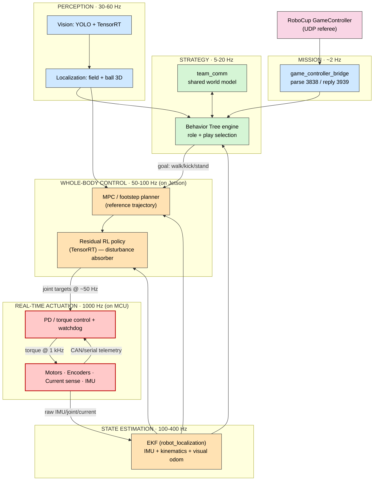

**Why this layering is the standard:** a segfault in the vision node (L3) cannot stall the balance controller (L1) or the MCU safety loop (L0). Each layer degrades gracefully.

---

## 3. Technology Stack — Decisions & Justification

### 3.1 ROS 2 Distribution — **Recommend Jazzy Jalisco**

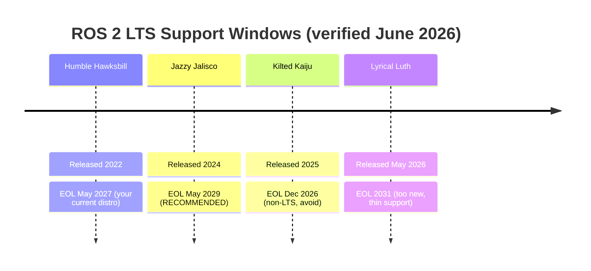

- You are starting a **multi-year, multi-robot** program. Building it on **Humble (EOL May 2027)** means a forced migration mid-competition-cycle.
- **Jazzy** is the current LTS (→2029), and critically, **the latest NVIDIA Isaac ROS and ZED SDK v5 both target Jazzy / Ubuntu 24.04**.
- Avoid Kilted (non-LTS, dies Dec 2026) and Lyrical (released weeks ago; third-party support is thin).

### 3.2 ⚠️ The Decision You Must Make: Jetson Generation ↔ Distro Coupling

Research surfaced a hard coupling that the prior docs missed. NVIDIA's **latest Isaac ROS (release-4.x, Apr 2026)** is documented as: _"All Isaac ROS packages are designed and tested to be compatible with ROS 2 Jazzy"_ — on **JetPack 7.1 / Jetson Thor**. Orin runs the **older** JetPack 6 (Ubuntu 22.04 = Humble-era).

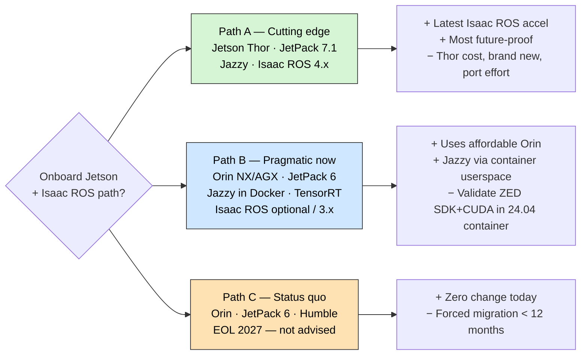

**My recommendation — Path B as default, Path A for one "pilot" robot:**

- Standardize the **project on Jazzy** regardless (it's the LTS the whole ecosystem is converging on).
- Run Jazzy via **Docker containers** on your existing **Orin NX/AGX** (the container provides the Ubuntu 24.04 userspace; the L4T host kernel stays JetPack 6). You do **not** strictly need Isaac ROS — you can run **plain TensorRT** for YOLO acceleration. Isaac ROS is a _nice-to-have accelerator_, not a hard dependency.
- **Spike to de-risk:** before committing the fleet, verify `ZED SDK v5 + CUDA + YOLO/TensorRT` runs inside an Ubuntu-24.04/Jazzy container on one Orin. If it's painful, buy **one Jetson Thor** as the lead-robot pilot (Path A) and keep Orins as backups.

> **Important nuance for your sim choice:** **Isaac Lab runs on the x86 training workstation**, exports **ONNX** policy weights, and is therefore **decoupled from the robot's ROS distro**. Your sim choice does _not_ force the onboard distro — only Isaac _ROS_ (the runtime accel libs) does.

### 3.3 Full Stack Summary

| Layer              | Technology                                            | Language      | Runs on           |
| ------------------ | ----------------------------------------------------- | ------------- | ----------------- |
| Learning / Sim     | Isaac Lab + Isaac Sim (PhysX/Newton)                  | Python        | Workstation (RTX) |
| Perception         | YOLO → TensorRT, ZED SDK v5, `robot_localization` EKF | Python / C++  | Jetson            |
| Strategy           | BehaviorTree.CPP + Groot2 (visual debug)              | C++           | Jetson            |
| Whole-body control | MPC + residual RL (ONNX→TensorRT) via `ros2_control`  | C++           | Jetson            |
| Real-time          | PD/torque + watchdog (micro-ROS)                      | C/C++         | STM32/Teensy MCU  |
| Referee            | GameController bridge (UDP 3838/3939)                 | C++ or Python | Jetson            |
| Team comms         | DDS / CycloneDDS over 5 GHz Wi-Fi                     | —             | Jetson↔Jetson     |
| DevOps             | Docker + GHCR + Ansible + GitHub Actions              | YAML          | Everywhere        |

---

## 4. Control Architecture — Hierarchical MPC + Residual RL (Your Design)

Your chosen paradigm is genuinely state-of-the-art. The professional implementation splits responsibility across three frequency bands:

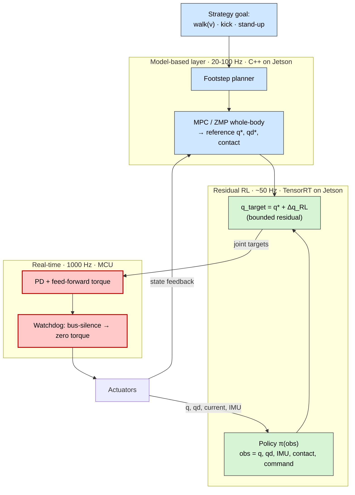

**Why residual RL (not end-to-end):** the MPC guarantees a **physically grounded, debuggable** trajectory (essential for precise kicks and rules compliance), while the **bounded RL residual** absorbs model error, contact shocks, and pushes — the things classical MPC handles poorly. Because the residual is bounded, a misbehaving policy can't drive the robot into instability. This is the safest way to get RL's adaptability without losing determinism.

**Frequency contract (the corrected truth vs `new_flow_proposal.md`):**

| Loop                       | Frequency   | Where             |
| -------------------------- | ----------- | ----------------- |
| Footstep / MPC reference   | 20–100 Hz   | Jetson (C++)      |
| RL residual policy         | ~50 Hz      | Jetson (TensorRT) |
| **PD / torque + watchdog** | **1000 Hz** | **MCU**           |
| State estimator (EKF)      | 100–400 Hz  | Jetson            |

---

## 5. Perception & State Estimation (Proprioception vs Exteroception)

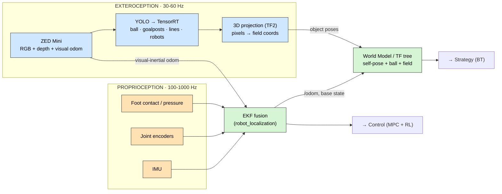

- **Exteroception** (slow, GPU-heavy): ZED → YOLO/TensorRT → 3D projection. Decoupled from the balance loop.
- **Proprioception** (fast): IMU + encoders + foot contact, fused by the EKF into a drift-resistant base state.
- The **World Model + TF tree** is the single shared truth that Strategy and Control read from.

---

## 6. Strategy — Behavior Trees + Lightweight Role Negotiation

We replace the old monolithic FSM (and reject heavyweight STP) with **per-robot Behavior Trees** (BehaviorTree.CPP + **Groot2** for live visual debugging). Team coordination is a **decentralized role auction**, not a master.

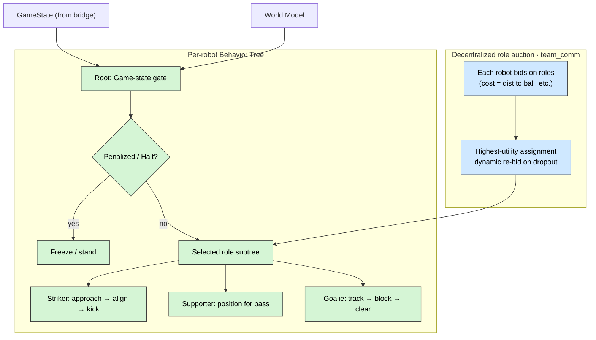

- Roles are **XML trees** loaded at launch (`striker.xml`, `goalie.xml`, …). Swapping a robot's behavior is a config change, not a code change.
- **Role auction:** robots broadcast bids (e.g., distance-to-ball) over team comms; each independently computes the same optimal assignment. If a robot drops out, the team **re-bids automatically** — no master, no single point of failure (RoboCup-legal).

---

## 7. GameController Integration (Verified Protocol)

The RoboCup-Humanoid-TC GameController (Rust/Tauri, 2025 rework) speaks a precise UDP protocol. **Verified details:**

- **Control → robots:** UDP **broadcast**, port **3838**, **2 Hz**, struct `HlRoboCupGameControlData`.
- **Status ← robots:** UDP **unicast**, port **3939**, **0.5–2 Hz**, struct `HlRoboCupGameControlReturnData`. _(Robots must reply, or the GC flags them.)_
- Competitions: `KidSize`, `AdultSize`, `DropIn`. Note: after goals/transitions the GC may broadcast a "fake" prior state for up to 15 s — your bridge must not over-react.

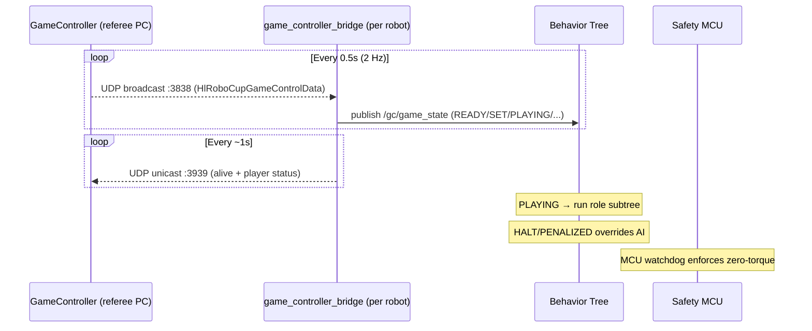

**Design:** a thin `game_controller_bridge` node parses 3838, publishes a clean `/gc/game_state` topic (all namespaced robots subscribe), and emits the mandatory 3939 heartbeat. It is the **ultimate authority** — `HALT`/`PENALIZED` overrides all AI.

---

## 8. Multi-Robot — Fully Decentralized (No Master)

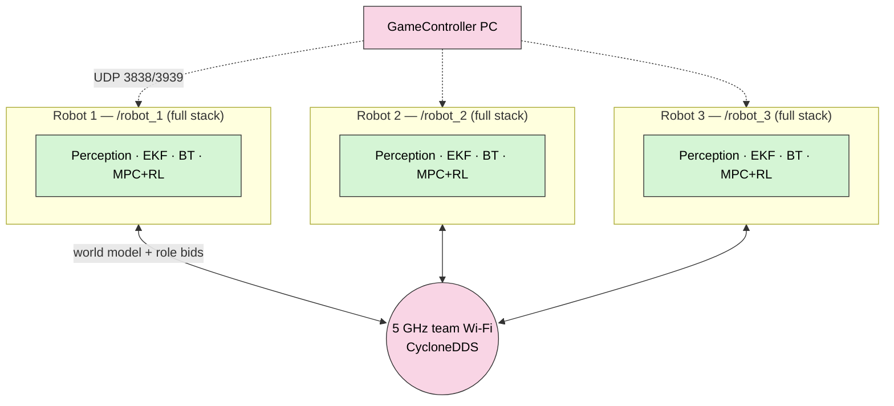

- Every robot runs the **identical container**; identity is just a **ROS namespace** (`/robot_1`…) + TF prefix. Launching the fleet is a parameter, not a fork.
- Robots share only a **lightweight world model + role bids** over DDS. Each is **independently autonomous** — losing one degrades the team gracefully.
- **Domain ID / discovery** isolation per team to avoid cross-talk with opponents.

---

## 9. Hardware ↔ Firmware Bridge & the RL State Vector

**Do not connect motors directly to the Jetson.** The Jetson runs Linux (not hard-real-time). A dedicated **MCU** (STM32/Teensy) on the firmware team's PCB owns the 1 kHz loop and safety.

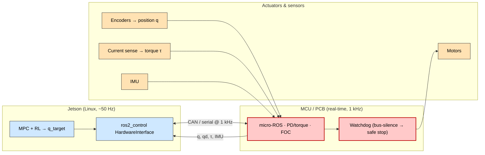

### The RL state vector — what hardware MUST provide

For the policy $\pi_\theta(a_t \mid s_t)$ to work **identically in sim and reality**, the PCB must measure, per joint:

| Symbol     | Quantity                   | Hardware requirement                            |
| ---------- | -------------------------- | ----------------------------------------------- |
| $q_t$      | Joint position             | Encoder on each output                          |
| $\dot q_t$ | Joint velocity             | MCU differentiates encoder                      |
| $\tau_t$   | Joint torque/effort        | **Current-sense resistors** in the motor driver |
| IMU        | Base orientation/ang. vel. | Body IMU (the ZED Mini IMU can cross-check)     |
| contact    | Foot contact               | Foot pressure / contact switches                |

> **Tell the firmware team:** the **current-sense path is non-negotiable** for residual RL — without measured $\tau$, your observation vector differs between sim and robot and the policy won't transfer. Expose everything as standard `sensor_msgs/JointState` + `sensor_msgs/Imu` (via micro-ROS) so the `ros2_control` interface is identical in sim and on hardware.

**Actuator note (advisory):** RoboCup KidSize humanoids commonly use **Dynamixel X-series** servos (current-based control mode gives you $\tau$). If the team is designing custom BLDC + FOC drivers, ensure the driver firmware exposes commanded/measured current. Either way, the `ros2_control` boundary stays identical.

---

## 10. Sim-to-Real Pipeline (Isaac Lab)

The `ros2_control` boundary means **the exact same ROS graph runs in sim and on the robot** — only the `HardwareInterface` plugin swaps. RL transfer uses the modern **teacher → student distillation + domain randomization** recipe (confirmed in Isaac Lab docs).

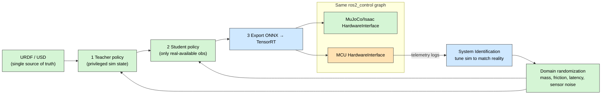

**Closing the reality gap (beyond "make sim pretty"):**

1. **Domain randomization** — randomize physics + sensor noise so the policy is forced to be robust.
2. **Teacher → student distillation** — teacher learns with privileged sim-only info; student is distilled to use _only_ sensors the real robot has.
3. **System identification** — log real motor responses, fit sim parameters to reality, feed back into DR.
4. **Avoid live on-robot RL fine-tuning** — erratic exploration destroys hardware. Iterate in sim; deploy validated weights.

---

## 11. Repository Organization (Monorepo)

You prefer a **monorepo** — correct for guaranteeing that one commit pins a matching set of CAD + firmware + software. Heavy Isaac Lab training assets and large binaries use **Git LFS** or a `git submodule`, so cloning the robot runtime stays lightweight.

```text
soccerbot/                          # one monorepo, pinned-together history
├── .github/workflows/              # CI/CD: build, test, multi-arch image push
├── docs/                           # MkDocs/Sphinx; architecture, runbooks
│
├── ros2_ws/src/                    # ── ROS 2 workspace (deployed to robots) ──
│   ├── soccer_msgs/                # custom interfaces (C++/IDL)
│   ├── soccer_bringup/             # launch + params + per-robot namespacing
│   ├── soccer_description/         # URDF / xacro (mirrors USD in /sim)
│   ├── soccer_hardware/            # ros2_control HW interfaces (real + sim)
│   ├── soccer_control/             # [C++] MPC, residual-RL runner, controllers
│   ├── soccer_perception/          # [Py] YOLO/TensorRT, ZED, 3D projection
│   ├── soccer_localization/        # [C++] EKF config (robot_localization)
│   ├── soccer_strategy/            # [C++] BehaviorTree.CPP + role auction
│   │   └── trees/                  #   striker.xml, goalie.xml, supporter.xml
│   ├── soccer_teamcomm/            # decentralized DDS world model + bids
│   └── game_controller_bridge/     # UDP 3838/3939 ↔ /gc/game_state
│
├── soccer-firmware/                # ── [submodule] STM32 Master/Slave (NOT deployed via ROS) ──
│   └── (Master: safety + aggregation · CAN-FD MIT bridge to Robostride)
│
├── sim/                            # ── Isaac Lab (runs on workstation) ──
│   ├── tasks/                      # RL envs (walk, kick, getup, push-recovery)
│   ├── assets/                     # USD models (Git LFS)
│   └── export/                     # ONNX → TensorRT conversion
│
├── hardware/                       # CAD, PCB schematics (Git LFS)
│
├── deploy/                         # ── DevOps ──
│   ├── docker/                     # Dockerfiles (dev + lean runtime, multi-arch)
│   ├── compose/                    # local multi-robot sim bring-up
│   └── ansible/                    # fleet: pull image + restart on N robots
│
└── tools/                          # dev scripts, dataset tooling, calibration
```

### Package dependency graph

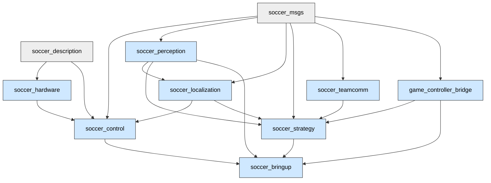

---

## 12. Deployment & DevOps Workflow

**Git holds the recipe; the registry holds the baked cake; Ansible serves it to the robots.** You never `git clone` onto a robot.

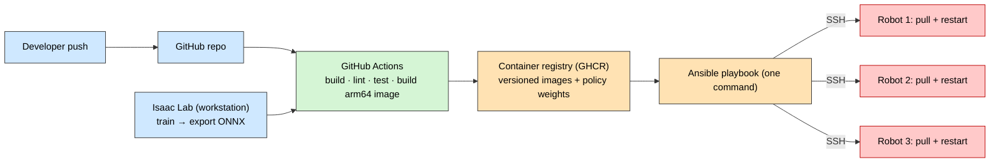

**Answering the questions raised in the prior docs:**

- **"Docker registry vs Git?"** Git = source code. A **registry** (GitHub Container Registry, free with your repo) stores **built images**. Robots pull a tagged image; they never see source or unneeded files.
- **"Do we dump the whole repo on robots?"** No. The **lean runtime Docker image** contains only the built `install/` space + dependencies. No CAD, no sim assets, no training code.
- **"What is Ansible / fleet management?"** One command on your laptop SSHes into all robots, pulls the new image, and restarts containers — reproducible, no manual per-robot fiddling. For 1–3 robots this is the right-sized professional tool (heavier fleet tools like Greengrass/balena are overkill now).
- **"CV/control/strategy — nodes or packages?"** Both: a **package** is a code folder; a **node** is a running process. `zed-ros2-wrapper` is one package that spawns several nodes. You'll write a `soccer_strategy` _package_ that runs a strategy _node_.
- **Secrets:** registry tokens / Wi-Fi creds live in CI secrets or `.env` files in `.gitignore` — **never** logged to stdout/stderr or committed.

---

## 13. Budget Allocation (~$10,000, approximate 2026 pricing)

Two viable allocations depending on the §3.2 decision. **Verify live prices before purchase.**

### Recommended: "Pragmatic + 1 pilot" (Path B + one Thor)

| Item                                                           | Qty | Approx. unit | Approx. total |
| -------------------------------------------------------------- | --- | ------------ | ------------- |
| RTX 4090/5090 training workstation                             | 1   | $3,500       | $3,500        |
| Jetson Orin NX 16 GB (module + carrier)                        | 2   | $850         | $1,700        |
| Jetson Thor T4000 (lead-robot pilot, latest Isaac ROS)         | 1   | $2,800       | $2,800        |
| ZED Mini (supplement existing)                                 | 1   | $450         | $450          |
| 5 GHz Wi-Fi router/AP (team comms)                             | 1   | $250         | $250          |
| NVMe SSDs (Jetson/Thor storage)                                | 3   | $130         | $390          |
| Misc: cables, MCU dev boards, current-sense parts, contingency | —   | —            | $900          |
| **Total**                                                      |     |              | **≈ $9,990**  |

### Alternative: "All-Orin, max savings" (Path B only)

| Item                                          | Qty | Approx. total                                            |
| --------------------------------------------- | --- | -------------------------------------------------------- |
| RTX 4090/5090 workstation                     | 1   | $3,500                                                   |
| Jetson Orin NX 16 GB                          | 3   | $2,550                                                   |
| ZED Mini supplement / ZED upgrade             | —   | $900                                                     |
| Networking + SSDs + misc + larger contingency | —   | $1,800                                                   |
| **Total**                                     |     | **≈ $8,750** (≈ $1,250 reserve for motors/PCB iteration) |

> Motors, frame, and the custom PCB are typically separate (firmware/mechanical) budgets. If they must come from this $10k, lead with the **all-Orin** allocation to preserve reserve.

---

## 14. Phased Roadmap (sequence, not schedule)

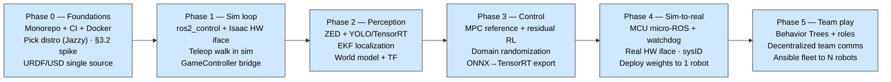

**Exit criteria per phase** (what "done" means):

- **P0:** one `colcon build` + CI green; distro decided; ZED+CUDA validated in target container.
- **P1:** robot walks in Isaac via teleop through the _same_ `ros2_control` graph you'll use on hardware.
- **P2:** robot reliably detects + localizes ball/goal in sim and from a real ZED feed.
- **P3:** push-recovery + walk policy stable in sim with domain randomization.
- **P4:** the _identical_ ROS graph drives the real robot via the MCU; watchdog safe-halt verified.
- **P5:** 2–3 robots auto-assign roles and play a scrimmage with GameController control.

---

## 15. What I Recommend You Confirm Next

1. **§3.2 decision** — approve **Jazzy** as the project distro, and choose **Path B (Orin + Jazzy container)** vs **buying one Thor pilot**. _(This unblocks all purchasing.)_
2. **Actuator type** — Dynamixel (fast path, current-mode torque) vs custom BLDC/FOC (more capable, more firmware work). Drives the RL state-vector wiring.
3. **Where motors/PCB/frame are funded** — from this $10k or a separate budget? Determines which allocation in §13.
4. **RoboCup sub-league** — KidSize vs AdultSize? Affects robot count rules, field size, and GameController `Competition` config.

---

### Appendix — Sources (verified June 2026)

- ROS 2 distributions & EOL dates — docs.ros.org Releases (Humble EOL May 2027; Jazzy LTS → 2029; Lyrical Luth May 2026).
- NVIDIA Isaac ROS getting-started — latest release targets **ROS 2 Jazzy**, **JetPack 7.1 / Jetson Thor**, Ubuntu 24.04 (updated Apr 2026).
- Stereolabs ZED ROS 2 — SDK v5.x supports Humble **and** Jazzy (Ubuntu 22.04 / 24.04).
- RoboCup-Humanoid-TC GameController — UDP broadcast **3838 @ 2 Hz** (`HlRoboCupGameControlData`); status return **3939 @ 0.5–2 Hz**; competitions KidSize/AdultSize/DropIn.
- Isaac Lab docs — domain randomization + teacher→student distillation sim-to-real; Newton physics integration (experimental).
