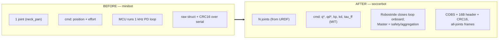
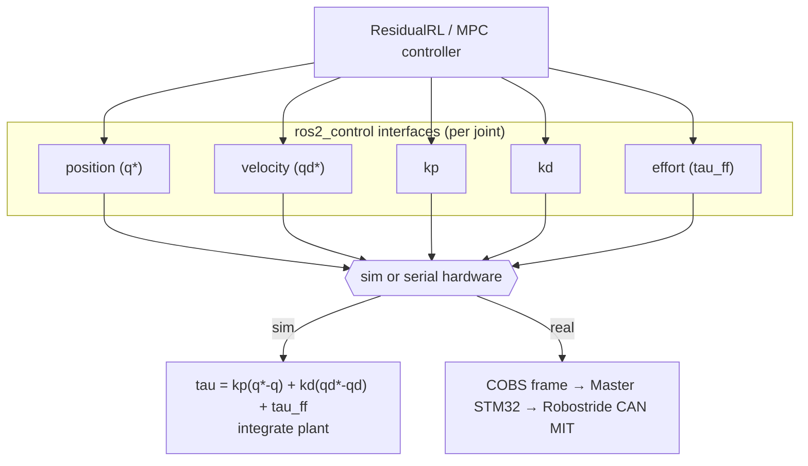

# `soccer_hardware` Rewrite — What Changed and Why

> Status: **DRAFT.** Authored 2026-06-27. Companion to
> [jetson_master_protocol.md](jetson_master_protocol.md). Records exactly what
> changed in the `ros2_control` hardware layer, the `minibot → soccerbot` rename,
> and the reasoning. The user flagged the hardware as **"we will change this
> later"** — this is a reviewable first cut, not a final design.

---

## 1. Why this change at all

The repository was generated as an AI "MiniBot" template: **one** `neck_pan`
motor, **one** camera, **one** IMU, with the real-hardware story being _"an MCU
runs a 1 kHz PD loop."_ The actual robot is a **RoboCup humanoid** driven by
**Robostride** quasi-direct-drive actuators that **close the impedance loop
onboard** (MIT mode). Three things followed:

1. The single-joint hardware interface had to become **generic over N joints**.
2. The command had to become a **full MIT impedance tuple** (`q*, qd*, kp, kd,
τ_ff`), not position + effort.
3. The "1 kHz PD on the MCU" narrative had to go — the **actuator** owns the fast
   loop; the Jetson streams setpoints to a **Master STM32** that aggregates and
   enforces safety.



---

## 2. File-by-file changes

| Action                  | File                                                                                                                                                        | Notes                                                                                                                                                                               |
| ----------------------- | ----------------------------------------------------------------------------------------------------------------------------------------------------------- | ----------------------------------------------------------------------------------------------------------------------------------------------------------------------------------- |
| **Added**               | `include/soccer_hardware/wire_protocol.hpp`                                                                                                                 | Host-side draft of the Jetson↔Master contract: 16-byte header, `JointMitCmd`, `JointState`, `BodyState`, CRC16-CCITT, COBS. Marked for replacement by a **generated** shared header |
| **Added**               | `include/soccer_hardware/soccerbot_serial_hardware.hpp` + `src/soccerbot_serial_hardware.cpp`                                                               | Real interface. N-joint, full MIT, COBS framing, IMU parsed from telemetry, watchdog                                                                                                |
| **Added**               | `include/soccer_hardware/soccerbot_sim_hardware.hpp` + `src/soccerbot_sim_hardware.cpp`                                                                     | Sim interface. N-joint, applies the same MIT impedance law the actuator uses onboard                                                                                                |
| **Removed**             | `minibot_serial_hardware.{hpp,cpp}`, `minibot_sim_hardware.{hpp,cpp}`                                                                                       | Single-joint, position+effort, "1 kHz PD on MCU" model                                                                                                                              |
| **Changed**             | `soccer_hardware.xml`                                                                                                                                       | Plugin classes → `SoccerbotSimHardware` / `SoccerbotSerialHardware`                                                                                                                 |
| **Changed**             | `CMakeLists.txt`                                                                                                                                            | Builds the new sources                                                                                                                                                              |
| **Changed**             | `package.xml`                                                                                                                                               | Description rewritten to the MIT / Robostride reality                                                                                                                               |
| **Renamed**             | `soccer_description/urdf/minibot.urdf.xacro` → `soccerbot.urdf.xacro`                                                                                       | robot `name="soccerbot"`; macro call updated                                                                                                                                        |
| **Renamed + rewritten** | `minibot.ros2_control.xacro` → `soccerbot.ros2_control.xacro`                                                                                               | New MIT command interfaces; new plugin/system names                                                                                                                                 |
| **Renamed**             | `rviz/minibot.rviz` → `soccerbot.rviz`, `config/minibot_params.yaml` → `soccerbot_params.yaml`, `sim/tasks/minibot_reach_env.py` → `soccerbot_reach_env.py` |                                                                                                                                                                                     |
| **Renamed (symbol)**    | `MinibotField` → `SoccerbotField`, `MinibotReachEnvCfg` → `SoccerbotReachEnvCfg`                                                                            | localization + sim                                                                                                                                                                  |

> Code identifiers use **`soccerbot`** (no hyphen — required for valid C++/ROS
> identifiers); the repo/prose name is **`soccer-bot`** (hyphen).

---

## 3. The interface contract change

### Before (minibot)

```
joint neck_pan:
  command: position, effort
  state:   position, velocity, effort
```

### After (soccerbot) — per joint, generic over N

```
joint <name>:
  command: position, velocity, kp, kd, effort   # full MIT impedance tuple
  state:   position, velocity, effort
sensor imu_sensor:
  state:   orientation(4) + angular_velocity(3) + linear_acceleration(3)
```

`kp` and `kd` are **custom command interfaces** (`ros2_control` allows interface
names beyond position/velocity/effort). `effort` carries the **feed-forward
torque** `τ_ff`. This is the minimum set that lets a controller exploit the
Robostride's variable impedance — stiff in stance, compliant in swing.



---

## 4. Behaviour preserved on purpose

| Property                                                                                               | Kept because                                                                                                                                                              |
| ------------------------------------------------------------------------------------------------------ | ------------------------------------------------------------------------------------------------------------------------------------------------------------------------- |
| **No-MCU degraded mode** (`on_activate` returns SUCCESS, `read`/`write` no-op when the port is absent) | A known `ros2_control` 4.x crash-on-ERROR issue ([bring_up_investigation_report.md](../bring_up_investigation_report.md)); keeps the rest of the graph alive on a dev box |
| **Host-side watchdog** (fault on silent Master past `watchdog_timeout_ms`)                             | Defence in depth; the Master zeroes torque independently                                                                                                                  |
| **CRC16-CCITT + framing parameters**                                                                   | Match the firmware (`soccer-firmware`) so both ends interoperate                                                                                                          |
| **Single sim/real boundary**                                                                           | Sim and real expose identical interfaces — the linchpin of sim-to-real parity (blueprint §10)                                                                             |

The **sim model now consumes the commanded `kp/kd`** (`τ = kp·(q*−q) +
kd·(qd*−qd) + τ_ff`), i.e. it simulates the _same_ law the actuator runs. Before,
gains were hard-coded constants in the sim class.

---

## 5. Known limitations of this draft

| #   | Limitation                                                                                                                        | Resolution path                                                         |
| --- | --------------------------------------------------------------------------------------------------------------------------------- | ----------------------------------------------------------------------- |
| L1  | `wire_protocol.hpp` is **hand-written** and not yet shared with the firmware                                                      | Generate C/C++/Python from one spec (protocol doc rec #4 / decision D6) |
| L2  | The contract structs are **not yet implemented in the firmware** (`MSG_MOTOR_CMD` is still a stub there; `SpiMitCmd` drops gains) | Firmware work tracked in the protocol doc, findings #2/#3               |
| L3  | The URDF still has the **single placeholder `neck_pan` joint**                                                                    | Replaced when the real humanoid URDF lands ("change this later")        |
| L4  | The serial parser assumes whole frames per read loop iteration; **reassembly is basic**                                           | Harden with the firmware once on real hardware                          |
| L5  | **Cannot `colcon build`** on the Windows dev host (no ROS 2 toolchain)                                                            | Validate on the Jetson / dev container / CI (`ros2-build-test`)         |

---

## 6. Validation status

- **Static review** only on this host (Windows, no ROS 2). C++ consistency checked
  by hand: class/file/plugin names match across `.hpp`/`.cpp`/`.xml`/`CMakeLists`;
  interface names match between the hardware export and the xacro.
- **Build/CI**: relies on the `ros2-build-test` GitHub Actions job and the dev
  container. The image tag was renamed `minibot-runtime → soccerbot-runtime`.
- **No git commit** has been made; all changes are staged/working-tree.

> Repo-identity items (git remote still `…/soccer-software.git`, the GHCR image
> path segment) are a **separate, deploy-affecting** change and were intentionally
> **not** auto-applied to remotes.
