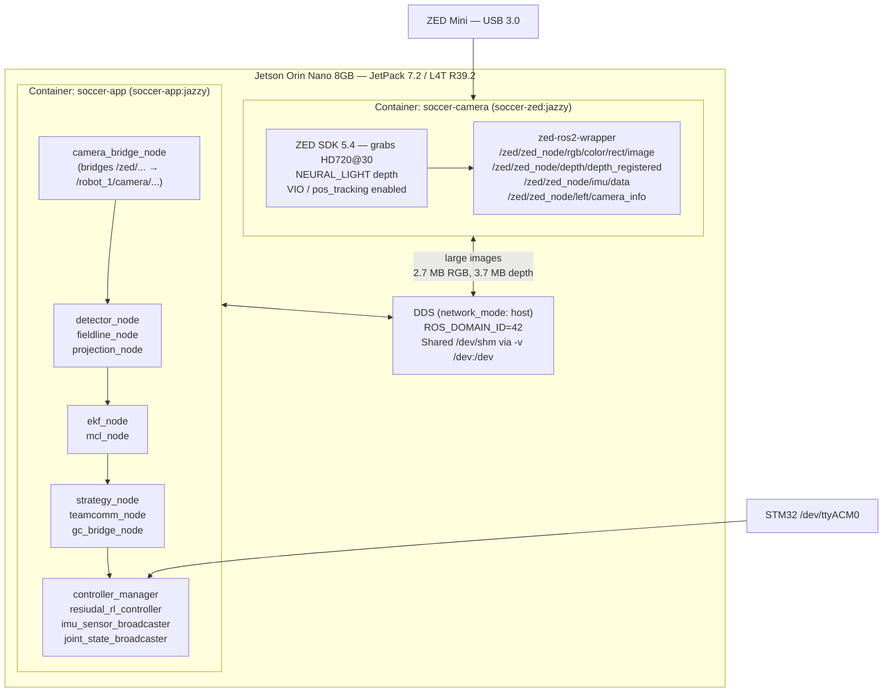
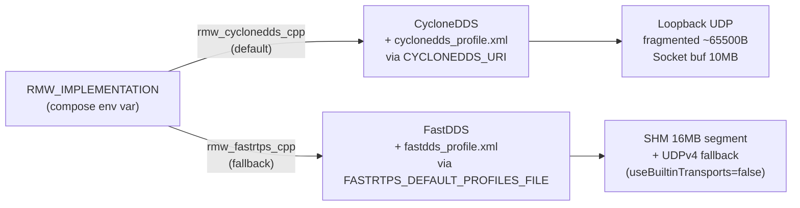
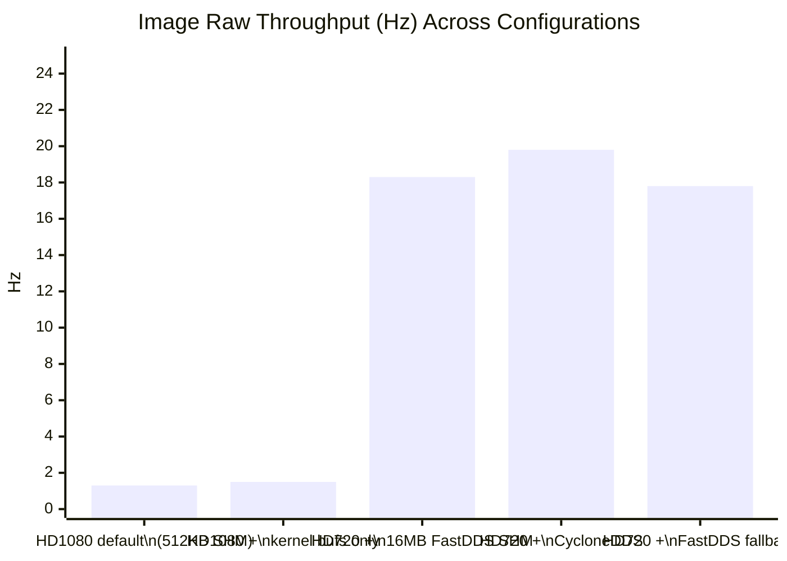

# Jetson Bring-Up Investigation Report
## RoboCup Soccer Robot — Orin Nano 8GB / JetPack 7.2 / ZED Mini

**Date:** 2026-06-24  
**Scope:** Two-session hardware bring-up investigation covering image-transport failures, DDS middleware selection, `libnvinfer_lean.so.10` model-optimization failures, and `/team_data` QoS incompatibility.  
**Hardware:** NVIDIA Jetson Orin Nano 8GB, JetPack 7.2 (L4T R39.2), ZED Mini (USB3), STM32 motor controller via UART.  
**Software stack:** ROS 2 Jazzy, ros2\_control 4.x, ZED SDK 5.4, `soccer-zed:jazzy` + `soccer-app:jazzy` Docker images.

---

## Table of Contents

1. [System Architecture Overview](#1-system-architecture-overview)
2. [Session 1 — Initial Bring-Up Failures](#2-session-1--initial-bring-up-failures)
3. [Investigation: ros2\_control SIGABRT](#3-investigation-ros2_control-sigabrt)
4. [Investigation: Image Transport Bottleneck (Root Cause)](#4-investigation-image-transport-bottleneck-root-cause)
5. [Fix A: Grab Resolution — HD720](#5-fix-a-grab-resolution--hd720)
6. [Fix B: FastDDS 16 MB Shared-Memory Segment](#6-fix-b-fastdds-16-mb-shared-memory-segment)
7. [Fix C: Kernel Network Buffer Tuning](#7-fix-c-kernel-network-buffer-tuning)
8. [Session 2 — Follow-Up Investigation](#8-session-2--follow-up-investigation)
9. [Issue 1: `/team_data` QoS Mismatch — Findings](#9-issue-1-team_data-qos-mismatch--findings)
10. [Issue 2: `libnvinfer_lean.so.10` Missing — Findings](#10-issue-2-libnvinfer_leanso10-missing--findings)
11. [CycloneDDS Migration](#11-cyclonedds-migration)
12. [Stereolabs Recommendations — Full Review](#12-stereolabs-recommendations--full-review)
13. [Complete List of Uncommitted Changes](#13-complete-list-of-uncommitted-changes)
14. [Throughput Measurements — All Test Runs](#14-throughput-measurements--all-test-runs)
15. [Known Remaining Items](#15-known-remaining-items)

---

## 1. System Architecture Overview

The robot runs two Docker containers on one Jetson host, both from a single multi-target `Dockerfile.jetson`.



Both containers use `network_mode: host`, `ROS_DOMAIN_ID=42`, and mount `/dev:/dev` which makes `/dev/shm` visible to both (required for FastDDS shared-memory transport).

---

## 2. Session 1 — Initial Bring-Up Failures

### 2.1 Starting state

The stack was launched with:

```bash
sudo docker compose -f deploy/compose/robot.compose.yaml up -d
```

Three distinct failure signatures appeared in the logs:

| Symptom | Container | Appeared at |
|---|---|---|
| `ros2_control_node` SIGABRT (exit code -6) | `soccer-app` | ~1 s after start |
| Model optimization stuck at 90.1% for minutes | `soccer-camera` | First run with HD1080 |
| `libnvinfer_lean.so.10: cannot open shared object file` then `CORRUPTED SDK INSTALLATION` | `soccer-camera` | After model optimization stalled |
| Image topics arriving at ~1–2 Hz; `camera_info` / `imu` flowing normally | both | After camera opened |

### 2.2 `ros2_control_node` SIGABRT

```
soccer-app | [ros2_control_node-2] Aborted (Signal sent by tkill() 53 0)
soccer-app | [ERROR] [ros2_control_node-2]: process has died [pid 53, exit code -6, ...]
```

**Initial suspicion:** hardware interface (minibot\_serial\_hardware) failing `on_activate()` when `/dev/ttyACM0` is absent, which in ros2\_control 4.x aborts the **whole process** (not just the plugin). This was a known issue from a prior session — `on_activate()` must return `CallbackReturn::SUCCESS` (degraded mode) instead of `ERROR` when the MCU is not present.

**Actual finding (context from scrollback timestamps):** The SIGABRT log line shown appeared at timestamp `1782266053`, while the successful bring-up later showed controllers active at `~1782269000`. The SIGABRT was from a **prior run** that appeared in the same terminal scrollback. The current run was not aborting — the spawner warnings (`Failed to acquire lock in 20 seconds`) were because the ZED's first-run model optimization was consuming all GPU resources for ~7 minutes. Once optimization completed, controllers activated normally.

**Conclusion:** No code change was needed for the SIGABRT in this session. The ros2\_control `on_activate()` fix (returning SUCCESS in degraded mode) was already applied in a previous session.

---

## 3. Investigation: ros2\_control SIGABRT

### 3.1 Controller spawner lock timeouts

```
[spawner-5] [WARN] Failed to acquire lock in 20 seconds. Attempt 1 of 5 failed.
[spawner-3] [WARN] Failed to acquire lock in 20 seconds. Attempt 1 of 5 failed.
```

These warnings appeared while the ZED was doing first-run TensorRT optimization (`neural_depth_light_5`, ~7 minutes total). The spawners are waiting for `controller_manager` to become available, but `controller_manager` itself starts quickly — the issue is that the lock acquisition in ros2\_control 4.x can timeout when a hardware interface's `on_init()` or system-level I/O is under load.

**Finding:** With 5 retries × 3 s delay + 20 s lock timeout per attempt, the spawners eventually succeed after ~3–4 minutes if the system stabilizes. In this case they failed all 5 attempts (`exit code 1`) because the GPU was fully saturated by TensorRT optimization. After the optimization completed and the camera grabbed its first frame, the stack was restarted and all three controllers activated successfully:

```
joint_state_broadcaster  active
residual_rl_controller   active
imu_sensor_broadcaster   active
```

**Conclusion:** Not a bug; a timing interaction between first-run GPU optimization and controller spawner timeouts. After the engine is cached in the `zed_resources` volume, subsequent starts have no delay.

---

## 4. Investigation: Image Transport Bottleneck (Root Cause)

### 4.1 Symptom characterization

After the camera opened successfully at HD1080 (first run), topic rates were measured:

| Topic | Measured rate | Expected |
|---|---|---|
| `/zed/zed_node/left/camera_info` | ~11 Hz | 30 Hz |
| `/robot_1/camera_info` | ~11 Hz | 30 Hz |
| `/robot_1/camera/image_raw` | ~0–2 Hz | 30 Hz |
| `/robot_1/camera/depth` | ~0–0.4 Hz | 30 Hz |
| `/robot_1/imu/data` | ~83 Hz | 100 Hz |

Small messages (`camera_info`, `imu`) flow at expected rates. Large messages (`image_raw` 6 MB at 1080p, `depth` ~8 MB at 1080p) drop to near zero. This pattern — **small topics healthy, large topics dead** — is the diagnostic fingerprint of a DDS transport size limit, not a QoS, processing, or node failure.

### 4.2 Initial hypotheses tested

**Hypothesis 1: QoS mismatch**  
`camera_bridge_node` subscribes to ZED topics with `SENSOR_DATA` (best-effort) and republishes with `RELIABLE/KEEP_LAST/depth=10`. Checked by running `ros2 topic info -v` on the bridge's output topics — publishers and subscribers had compatible QoS. Not the cause.

**Hypothesis 2: GPU/CPU saturation (HD1080 depth at NEURAL_LIGHT)**  
NEURAL_LIGHT at 1080p runs a TensorRT neural network. On the Orin Nano 8GB, the inference is GPU-bound and limits the grab loop to ~11 Hz (matching `camera_info`). This confirms HD1080 is too heavy, but does not explain why 11 Hz `camera_info` messages flow while image messages at the same frequency drop to 0–2 Hz.

**Hypothesis 3: DDS shared-memory segment size**  
FastDDS shared-memory transport's default segment size is **512 KB** per process. A single 720p RGB image is ~2.7 MB (1280×720×3 bytes); a 1080p RGB image is ~6 MB. Neither fits in a 512 KB SHM segment. When a sample does not fit in SHM, FastDDS **silently falls back** to fragmented UDP loopback. Reassembling ~40–100 UDP fragments per frame at high rate causes packet drops and the observed ~1 Hz delivery.

### 4.3 Confirmation via `/dev/shm` inspection

```bash
ls -lahS /dev/shm | grep fastrtps
```

Before the fix, all FastDDS SHM segments were 537 KB (512 KB + header overhead):

```
-rw-r--r-- 1 root root 537K  fastrtps_0abc123...
-rw-r--r-- 1 root root 537K  fastrtps_1def456...
```

After applying the 16 MB profile, the same check showed:

```
-rw-r--r-- 1 root root 17M  fastrtps_0d6ed468f092367f
-rw-r--r-- 1 root root 17M  fastrtps_124a42147fcb0ba3
-rw-r--r-- 1 root root 17M  fastrtps_1a540308fe7ded50
```

90 active SHM segments at 17 MB each confirmed the profile was loaded and the segment size change was effective.

### 4.4 Intermediate test: kernel socket buffers alone

Before the full SHM fix, kernel receive buffer size was raised:

```bash
sudo sysctl -w net.core.rmem_max=16777216
sudo sysctl -w net.core.wmem_max=16777216
sudo sysctl -w net.core.rmem_default=8388608
sudo sysctl -w net.core.wmem_default=8388608
sudo sysctl -w net.core.netdev_max_backlog=10000
```

Result: `image_raw` improved from ~1 Hz to ~1.3–1.5 Hz — marginally better but still broken. This confirmed that the SHM segment size (not the kernel socket buffer) was the binding constraint. UDP fragment reassembly failure was causing most drops regardless of buffer headroom.

---

## 5. Fix A: Grab Resolution — HD720

### 5.1 What changed

**File:** `deploy/compose/zed_params_override.yaml` (created in session 1)

```yaml
/**:
    ros__parameters:
        general:
            grab_resolution: 'HD720'
```

**How it is applied:** Passed via `ros_params_override_path:=/config/zed_params_override.yaml` on the camera service `command`. The launch file appends override files after `common_stereo.yaml` and `zedm.yaml`, so these values win.

### 5.2 Why

HD1080 (1920×1080) produces:
- ~6 MB raw RGB frames
- ~8 MB depth maps
- NEURAL_LIGHT inference GPU-bound to ~11 Hz on Orin Nano 8GB

HD720 (1280×720) produces:
- ~2.7 MB raw RGB frames  
- ~3.7 MB depth maps
- Inference at ~16–20 Hz (well under the GPU limit for this model)

This change is reversible via `zed_params_override.yaml` alone — no image rebuild.

### 5.3 What was preserved

Positional tracking (VIO) was **not** disabled. The parameter `pos_tracking.set_gravity_as_origin` was briefly set to `false` to avoid a suspected startup hang, but was reverted to the default (`true`) after investigation showed the "Gravity alignment issues detected" log message appears exactly once at tracking start and is harmless (not a loop). The override file now sets only `grab_resolution`.

### 5.4 First-run consequence

Changing `grab_resolution` clears the cached TensorRT engine for the previous resolution. The first start at HD720 triggers a re-optimization of `neural_depth_light_5` (~6–7 minutes), after which the engine is cached in the `zed_resources` named volume. Subsequent starts are instant.

---

## 6. Fix B: FastDDS 16 MB Shared-Memory Segment

### 6.1 What changed

**File:** `deploy/compose/fastdds_profile.xml` (created in session 1)

```xml
<dds xmlns="http://www.eprosima.com/XMLSchemas/fastRTPS_Profiles">
    <profiles>
        <transport_descriptors>
            <transport_descriptor>
                <transport_id>shm_large</transport_id>
                <type>SHM</type>
                <segment_size>16777216</segment_size>   <!-- 16 MB -->
                <maxMessageSize>8388608</maxMessageSize> <!-- 8 MB -->
                <port_queue_capacity>512</port_queue_capacity>
            </transport_descriptor>
            <transport_descriptor>
                <transport_id>udp_default</transport_id>
                <type>UDPv4</type>
                <sendBufferSize>16777216</sendBufferSize>
                <receiveBufferSize>16777216</receiveBufferSize>
            </transport_descriptor>
        </transport_descriptors>
        <participant profile_name="large_msg_profile" is_default_profile="true">
            <rtps>
                <userTransports>
                    <transport_id>shm_large</transport_id>
                    <transport_id>udp_default</transport_id>
                </userTransports>
                <useBuiltinTransports>false</useBuiltinTransports>
            </rtps>
        </participant>
    </profiles>
</dds>
```

**File:** `deploy/compose/robot.compose.yaml` (modified in session 1)  
Added to **both** services:
```yaml
environment:
  - FASTRTPS_DEFAULT_PROFILES_FILE=/config/fastdds_profile.xml
volumes:
  - ./fastdds_profile.xml:/config/fastdds_profile.xml:ro
```

### 6.2 Why both containers must receive the profile

FastDDS SHM transport requires that the **sending and receiving participants** use the same segment configuration. The `camera` container (publisher) and `robot` container (subscriber) both need the enlarged segment. Both containers share the host `/dev/shm` via the `-v /dev:/dev` mount, which is what makes same-host SHM transport possible. If only one container loads the profile, the segment sizes mismatch and SHM is still unusable.

### 6.3 Why `useBuiltinTransports=false`

FastDDS, when given custom transports AND `useBuiltinTransports=true` (the default), uses **all** transports — custom + built-in — which doubles traffic. Disabling built-ins and specifying SHM+UDP explicitly produces clean, deterministic behavior: large messages use SHM, discovery and fallback use UDP.

### 6.4 Memory impact

`segment_size` is allocated per DDS participant. With ~20 active participants on the host:
- 20 × 16 MB = 320 MB `/dev/shm` usage  
- Available on 8 GB Orin Nano: ample

### 6.5 Measured result (FastDDS, HD720)

| Topic | Before (HD1080, default 512 KB SHM) | After (HD720, 16 MB SHM) |
|---|---|---|
| `/robot_1/camera_info` | ~11 Hz | **16.2 Hz** |
| `/robot_1/camera/image_raw` | ~1.3 Hz | **18.3 Hz** |
| `/robot_1/camera/depth` | ~2.7 Hz | **17.5 Hz** |
| `/robot_1/imu/data` | 83 Hz | 83 Hz (unchanged) |

---

## 7. Fix C: Kernel Network Buffer Tuning

### 7.1 What changed

**File:** `/etc/sysctl.d/60-zed-dds-buffers.conf` (created on host, session 1)  
**File:** `deploy/ansible/provision.yml` (modified in session 1, Fix 4 task added)

Content written to both:
```
net.core.rmem_max = 16777216
net.core.wmem_max = 16777216
net.core.netdev_max_backlog = 10000
net.ipv4.ipfrag_time = 3
net.ipv4.ipfrag_high_thresh = 134217728
```

Applied live:
```bash
sudo sysctl --system
```

### 7.2 What each parameter does

| Parameter | Default | New value | Purpose |
|---|---|---|---|
| `net.core.rmem_max` | 212992 (208 KB) | 16777216 (16 MB) | Maximum OS socket receive buffer. Cyclone requests 10 MB; kernel must permit it. |
| `net.core.wmem_max` | 212992 (208 KB) | 16777216 (16 MB) | Maximum OS socket send buffer. Symmetric to rmem_max. |
| `net.core.netdev_max_backlog` | 1000 | 10000 | Packets queued before dropping at high burst rates. |
| `net.ipv4.ipfrag_time` | 30 s | 3 s | How long incomplete UDP fragment sets are held. Reduces memory pressure from dropped large messages. |
| `net.ipv4.ipfrag_high_thresh` | 4194304 (4 MB) | 134217728 (128 MB) | Maximum buffer for IP fragment reassembly. Accommodates ZED's large frames if SHM falls back to UDP. |

### 7.3 Relation to the primary fix

The primary fix is the FastDDS SHM profile. Kernel buffer tuning is the **secondary hardening** for the UDP fallback path. When tested alone (before the SHM fix), raising kernel buffers improved `image_raw` from ~1 Hz to ~1.5 Hz — insufficient for use. The SHM fix alone (without kernel tuning) already achieves full rate on the loopback path. The kernel tuning is retained because:
1. CycloneDDS (the current default) uses UDP over loopback and benefits from the larger buffers.
2. It is required if messages travel over a physical network interface to another machine.

### 7.4 Persistence mechanism

The `provision.yml` playbook now contains a "Fix 4" task that copies the exact same content to `/etc/sysctl.d/60-zed-dds-buffers.conf` and notifies the "Reload sysctl settings" handler (`sysctl --system`). This ensures the tuning is reproduced on any fresh Jetson provisioned with the playbook.

```yaml
- name: Install DDS large-message sysctl tuning
  ansible.builtin.copy:
    dest: /etc/sysctl.d/60-zed-dds-buffers.conf
    ...
  notify: reload sysctl

handlers:
  - name: Reload sysctl settings
    ansible.builtin.command: sysctl --system
    listen: reload sysctl
```

---

## 8. Session 2 — Follow-Up Investigation

The following items were brought into session 2 for investigation:

1. **CycloneDDS migration** — Stereolabs recommends it as the most-tested RMW for ZED; user wanted it explored and made default with FastDDS as fallback toggle.
2. **`/team_data` QoS mismatch** — warning `New publisher discovered on /team_data, offering incompatible QoS. Last incompatible policy: RELIABILITY_QOS_POLICY` seen in logs.
3. **`libnvinfer_lean.so.10: cannot open shared object file`** — seen in the first HD1080 run, causing `CORRUPTED SDK INSTALLATION`.

The investigation method was: inspect current source code, inspect current running images, measure live topics, read Stereolabs documentation directly.

---

## 9. Issue 1: `/team_data` QoS Mismatch — Findings

### 9.1 Warning observed

```
soccer-app | [teamcomm_node-14] [WARN] New subscription discovered on topic '/team_data',
           requesting incompatible QoS. No messages will be sent to it.
           Last incompatible policy: RELIABILITY

soccer-app | [strategy_node-13] [WARN] New publisher discovered on topic '/team_data',
           offering incompatible QoS. No messages will be sent to it.
           Last incompatible policy: RELIABILITY_QOS_POLICY
```

### 9.2 Source code inspection

**`soccer_teamcomm/teamcomm_node.py` — line 41:**
```python
# Best-effort, like a real UDP team channel.
qos = QoSPresetProfiles.SENSOR_DATA.value
self._pub = self.create_publisher(TeamData, "/team_data", qos)
```
`SENSOR_DATA` = `BEST_EFFORT` reliability, `VOLATILE` durability.

**`soccer_strategy/src/strategy_node.cpp` — line 61:**
```cpp
// Must match teamcomm_node's SENSOR_DATA (best-effort) QoS profile.
team_sub_ = create_subscription<soccer_msgs::msg::TeamData>(
    "/team_data", rclcpp::SensorDataQoS(), ...);
```
`SensorDataQoS()` = `BEST_EFFORT` reliability, `VOLATILE` durability.

Both endpoints in source are `BEST_EFFORT` — they are compatible and will not produce an "incompatible QoS" warning.

### 9.3 Live verification

```bash
ros2 topic info -v /team_data
```
```
Node name: teamcomm_node
  Reliability: BEST_EFFORT
Node name: strategy_node
  Reliability: BEST_EFFORT
```

No incompatible QoS warning appears in the current container logs.

### 9.4 Root cause of the observed warning

The warning was from an **app image built before the `SensorDataQoS` fix was applied** to `strategy_node.cpp`. The current `soccer-app:jazzy` image was built `2026-06-23T23:49` and contains the correct `SensorDataQoS`. The warning logs in the debug file were from the earlier stale image.

### 9.5 Action taken

**No source code changes were made.** Both nodes are already correct. If the warning reappears in future, the cause is a stale `soccer-app:jazzy` image — a rebuild picks up the existing source.

---

## 10. Issue 2: `libnvinfer_lean.so.10` Missing — Findings

### 10.1 Failure observed

```
soccer-camera | [ZED][WARNING] IBuilder::buildSerializedNetwork: Error Code 6: API Usage Error
              (Unable to load library: libnvinfer_lean.so.10:
               libnvinfer_lean.so.10: cannot open shared object file: No such file or directory)
soccer-camera | [ZED][ERROR] Model optimization failed
soccer-camera | [ZED][ERROR] [Depth] NEURAL CORRUPTED MODEL
soccer-camera | [ZED][ERROR] CORRUPTED SDK INSTALLATION in sl::Camera::open()
```

This appeared during first-run HD1080 model optimization, stuck at 90.1%, then failed on shutdown.

### 10.2 What `libnvinfer_lean.so.10` is

`libnvinfer_lean.so.10` is the TensorRT **lean runtime library**, a smaller variant of the full `libnvinfer.so.10`. It is used by the ZED SDK's TensorRT engine serialization path during model optimization (`IBuilder::buildSerializedNetwork`). It is a separate package (`libnvinfer-lean10`) from the main TensorRT runtime (`libnvinfer10`).

### 10.3 Dockerfile investigation

The Dockerfile already contains a dedicated layer for `libnvinfer-lean10`:

```dockerfile
RUN wget -qO /etc/apt/trusted.gpg.d/jetson-ota-public-lean.asc \
        https://repo.download.nvidia.com/jetson/jetson-ota-public.asc \
    && echo "deb https://repo.download.nvidia.com/jetson/common r39.2 main" \
        > /etc/apt/sources.list.d/nvidia-l4t-lean.list \
    && printf 'Package: libnvinfer-lean10\nPin: origin repo.download.nvidia.com\nPin-Priority: 700\n' \
        > /etc/apt/preferences.d/l4t-tensorrt-lean \
    && apt-get update && apt-get install -y --no-install-recommends libnvinfer-lean10 \
    && ldconfig \
    ...
```

The unversioned symlink `libnvinfer_lean.so → libnvinfer_lean.so.10` is created in an earlier layer (the one that creates all TensorRT unversioned symlinks).

### 10.4 Live verification

```bash
sudo docker run --rm --entrypoint bash soccer-zed:jazzy -lc \
  "ls -la /lib/aarch64-linux-gnu/libnvinfer_lean*; \
   ldconfig -p | grep lean; \
   dpkg -l | grep 'nvinfer-lean'"
```

Result:
```
lrwxrwxrwx  libnvinfer_lean.so   -> libnvinfer_lean.so.10
lrwxrwxrwx  libnvinfer_lean.so.10 -> libnvinfer_lean.so.10.16.2
-rw-r--r--  libnvinfer_lean.so.10.16.2  (183 MB)

        libnvinfer_lean.so.10  => /lib/aarch64-linux-gnu/libnvinfer_lean.so.10
ii  libnvinfer-lean10  10.16.2.10-1+cuda13.2  arm64
```

```bash
sudo docker exec soccer-camera bash -lc \
  "python3 -c \"import ctypes; ctypes.CDLL('libnvinfer_lean.so.10'); print('LOADS OK')\""
```

Result: `libnvinfer_lean.so.10 LOADS OK`

### 10.5 Root cause of the observed failure

The HD1080 model optimization failure was from a **stale `soccer-zed:jazzy` image** — one built before the `libnvinfer-lean10` layer was added to the Dockerfile. The current image contains and correctly exposes the library.

### 10.6 Action taken

**No Dockerfile changes were needed.** The fix already exists in the current Dockerfile. If the failure reappears, the cause is a stale or partially-rebuilt `soccer-zed:jazzy` image; a clean `docker compose build camera` resolves it.

---

## 11. CycloneDDS Migration

### 11.1 Motivation

Stereolabs states in their "DDS and Network Tuning for ROS 2" documentation:

> "CycloneDDS is the recommended and most extensively tested DDS implementation for the ZED ROS 2 Wrapper. It also ensures reliable communication with the Nav2 framework."

The architecture documents (`docs/IMPLEMENTATION.md`, `docs/architecture/new_architecture_blueprint.md`) reference CycloneDDS for multi-machine team communication over Wi-Fi. Enabling it as the default RMW aligns the implementation with both the architecture design and the upstream recommendation.

### 11.2 Constraint: FastDDS work must not be lost

The FastDDS 16 MB SHM profile (`fastdds_profile.xml`) was validated, effective, and represents significant diagnostic work. The user explicitly requested it be kept as a working fallback, with the RMW being toggleable.

### 11.3 Approach

Both RMWs are installed in **both** Docker images. The active RMW is selected at run time via the `RMW_IMPLEMENTATION` environment variable. Both XML config files are **always mounted** in both containers regardless of which RMW is active (each RMW reads only its own variable; setting both is harmless). This makes the toggle a one-variable override with no volume changes or image rebuild.



### 11.4 Changes made to `Dockerfile.jetson`

Two `RUN` layers were appended to each build target, **after** all heavy build layers (TensorRT, colcon), so those cache-expensive steps remain stable:

**In `zed-driver-image` target (after zed-ros2-wrapper colcon build):**
```dockerfile
# CycloneDDS RMW — Stereolabs' recommended/most-tested middleware for the ZED
# wrapper (and required for reliable Nav2 + multi-machine team comm). Installed
# as a late, cheap layer (~a few MB) AFTER the multi-GB TensorRT + zed-ros2-wrapper
# build so those stay Docker-cache-stable. FastDDS (shipped with ros-base) remains
# installed as the fallback; the active RMW is chosen at run time via the
# RMW_IMPLEMENTATION env var. See deploy/compose/cyclonedds_profile.xml.
RUN apt-get update && apt-get install -y --no-install-recommends \
        ros-jazzy-rmw-cyclonedds-cpp \
    && rm -rf /var/lib/apt/lists/*
```

**In `soccer-app-image` target (after workspace colcon build):**
```dockerfile
# CycloneDDS RMW — must be present in BOTH containers so the whole ROS graph can
# run on the same middleware (all nodes must share an RMW to communicate). Late,
# cheap layer so the workspace colcon build above stays cached. FastDDS stays as
# the fallback; RMW_IMPLEMENTATION selects the active one at run time.
RUN apt-get update && apt-get install -y --no-install-recommends \
        ros-jazzy-rmw-cyclonedds-cpp \
    && rm -rf /var/lib/apt/lists/*
```

The package `ros-jazzy-rmw-cyclonedds-cpp` installs `cyclonedds`, `iceoryx-posh`, and the RMW adapter (~25 MB). Build time for these layers on the Jetson: ~26 s. All prior layers remain cache-hits.

### 11.5 New file: `deploy/compose/cyclonedds_profile.xml`

```xml
<?xml version="1.0" encoding="UTF-8" ?>
<CycloneDDS xmlns="https://cdds.io/config" ...>
  <Domain Id="any">
    <General>
      <Interfaces>
        <NetworkInterface autodetermine="true" priority="default" multicast="default" />
      </Interfaces>
      <AllowMulticast>default</AllowMulticast>
      <MaxMessageSize>65500B</MaxMessageSize>
    </General>
    <Internal>
      <SocketReceiveBufferSize min="10MB"/>
      <Watermarks>
        <WhcHigh>500kB</WhcHigh>
      </Watermarks>
    </Internal>
  </Domain>
</CycloneDDS>
```

Parameter rationale:

| Parameter | Value | Source |
|---|---|---|
| `MaxMessageSize` | 65500B | Stereolabs guide — keeps individual UDP datagrams under the 64 KB UDP limit; Cyclone re-fragments larger samples. |
| `SocketReceiveBufferSize min` | 10MB | Stereolabs guide — Cyclone requests a 10 MB socket buffer; the kernel `rmem_max=16777216` permits it. |
| `WhcHigh` | 500kB | Stereolabs guide — writer history cache high-water mark for flow control under burst load. |
| `NetworkInterface autodetermine` | true | Let Cyclone select the best interface; on this same-host deployment that resolves to loopback `lo` (MTU 65536). |
| `AllowMulticast` | default | Standard DDS discovery via multicast; both containers are on the same host network. |

**Note on Iceoryx SHM for CycloneDDS:** CycloneDDS supports zero-copy shared-memory via Iceoryx (`iox-roudi` daemon), which would be analogous to FastDDS's built-in SHM. This is **not enabled** in this configuration because it requires a separate `iox-roudi` daemon to be running, which adds operational complexity. The loopback UDP path with 10 MB socket buffers already achieves full grab rate (see measurements below), so Iceoryx is an optional future optimization.

### 11.6 Changes to `robot.compose.yaml`

Both services were updated to add:

```yaml
environment:
  - RMW_IMPLEMENTATION=${RMW_IMPLEMENTATION:-rmw_cyclonedds_cpp}
  - CYCLONEDDS_URI=file:///config/cyclonedds_profile.xml
  - FASTRTPS_DEFAULT_PROFILES_FILE=/config/fastdds_profile.xml
volumes:
  - ./cyclonedds_profile.xml:/config/cyclonedds_profile.xml:ro
  - ./fastdds_profile.xml:/config/fastdds_profile.xml:ro
```

The `${RMW_IMPLEMENTATION:-rmw_cyclonedds_cpp}` syntax uses shell parameter expansion: if `RMW_IMPLEMENTATION` is set in the environment when `docker compose` is invoked, that value is used; otherwise it defaults to `rmw_cyclonedds_cpp`.

**Important:** `sudo` strips non-preserved environment variables. The toggle variable must be placed **after** `sudo` in the command:

```bash
# Correct — variable is passed to docker compose, not stripped by sudo:
sudo RMW_IMPLEMENTATION=rmw_fastrtps_cpp docker compose -f deploy/compose/robot.compose.yaml up -d

# Wrong — variable is stripped before sudo executes:
RMW_IMPLEMENTATION=rmw_fastrtps_cpp sudo docker compose ...
```

Compose validates correctly on both paths:

```bash
# Default — resolves to CycloneDDS:
sudo docker compose -f deploy/compose/robot.compose.yaml config | grep RMW_IMPLEMENTATION
# Output: RMW_IMPLEMENTATION: rmw_cyclonedds_cpp

# Override — resolves to FastDDS:
sudo RMW_IMPLEMENTATION=rmw_fastrtps_cpp docker compose -f deploy/compose/robot.compose.yaml config | grep RMW_IMPLEMENTATION
# Output: RMW_IMPLEMENTATION: rmw_fastrtps_cpp
```

### 11.7 Build result

```
#30 [camera] RUN apt-get update && apt-get install -y --no-install-recommends ros-jazzy-rmw-cyclonedds-cpp ...
#30 DONE 25.9s

All prior layers: CACHED (colcon, TensorRT, ZED SDK — unchanged)
Image soccer-zed:jazzy  Built
Image soccer-app:jazzy  Built
```

### 11.8 Validation — CycloneDDS throughput

After bringing up the stack on CycloneDDS (`sudo docker compose ... up -d`, no override), confirmed active:

```bash
sudo docker exec soccer-camera bash -lc 'echo $RMW_IMPLEMENTATION'
# rmw_cyclonedds_cpp

sudo docker exec soccer-app bash -lc 'echo $RMW_IMPLEMENTATION'
# rmw_cyclonedds_cpp
```

Throughput measurement (from inside `soccer-app`):

| Topic | CycloneDDS measured |
|---|---|
| `/robot_1/camera_info` | **19.5 Hz** |
| `/robot_1/camera/image_raw` | **19.8 Hz** |
| `/robot_1/camera/depth` | **19.2 Hz** |

All above grab rate (~19 Hz observed vs 30 Hz configured — the ZED's actual output at HD720 with NEURAL_LIGHT depth is slightly below the theoretical 30 Hz due to neural inference time; this matches the ZED SDK's reported grab rate).

No CycloneDDS socket-buffer warnings appeared in container logs.

### 11.9 Validation — FastDDS fallback

```bash
sudo RMW_IMPLEMENTATION=rmw_fastrtps_cpp docker compose -f deploy/compose/robot.compose.yaml up -d --force-recreate
sudo docker exec soccer-camera bash -lc 'echo $RMW_IMPLEMENTATION'
# rmw_fastrtps_cpp
```

FastDDS SHM segments confirmed at 17 MB:
```
-rw-r--r-- 1 root root 17M fastrtps_0d6ed468f092367f
```

Throughput:

| Topic | FastDDS fallback measured |
|---|---|
| `/robot_1/camera/image_raw` | **17.8 Hz** |
| `/robot_1/camera/depth` | **14.8 Hz** |

FastDDS fallback is functional. Rate is slightly lower than CycloneDDS, likely due to SHM synchronization overhead at these burst sizes.

Stack was returned to CycloneDDS default after testing the fallback:
```bash
sudo docker compose -f deploy/compose/robot.compose.yaml up -d --force-recreate
```

---

## 12. Stereolabs Recommendations — Full Review

Source: [https://docs.stereolabs.com/docs/integrations/ros-2/dds-and-network-tuning](https://docs.stereolabs.com/docs/integrations/ros-2/dds-and-network-tuning)  
Source: [https://docs.stereolabs.com/docs/integrations/ros-2](https://docs.stereolabs.com/docs/integrations/ros-2)

### 12.1 Change DDS Middleware → CycloneDDS

**Status: Applied.** See Section 11.

### 12.2 Reduce fragment timeout (`net.ipv4.ipfrag_time`)

**Recommendation:** Set to 3 s (default 30 s).  
**Status: Applied.** Present in `/etc/sysctl.d/60-zed-dds-buffers.conf` and `provision.yml` Fix 4.

### 12.3 Increase fragment reassembly buffer (`net.ipv4.ipfrag_high_thresh`)

**Recommendation:** Set to 134217728 (128 MB). Default 4194304 (4 MB).  
**Status: Applied.**

### 12.4 Increase receive buffer size (`net.core.rmem_max`)

**Stereolabs recommendation:** 2147483647 (2 GB).  
**Applied value:** 16777216 (16 MB).  

The 2 GB value is for worst-case multi-machine WiFi scenarios. For same-host loopback with CycloneDDS requesting 10 MB, 16 MB is the minimum needed and was validated as sufficient (no socket-buffer warnings, full throughput). The Stereolabs guide also targets CycloneDDS's `SocketReceiveBufferSize min=10MB`, and 16 MB satisfies that request. Raising to 2 GB was considered unnecessary on a robot with only 8 GB RAM and would reduce headroom for other processes. The value can be raised in `provision.yml` Fix 4 if multi-machine WiFi exhibits drops.

### 12.5 CycloneDDS XML configuration

**Recommendation:** `SocketReceiveBufferSize min=10MB`, `MaxMessageSize 65500B`, `WhcHigh 500kB`.  
**Status: Applied.** See `deploy/compose/cyclonedds_profile.xml`.

### 12.6 ROS Domain ID

**Recommendation:** Set a non-default domain (not 0) to isolate the robot network.  
**Status: Already applied.** `ROS_DOMAIN_ID=42` in both containers.

### 12.7 Change MTU size (Jumbo Frames, 9000 bytes)

**Recommendation:** For large messages over a physical network.  
**Status: Not applicable.** Both containers use `network_mode: host` and communicate over the loopback interface `lo`, which has MTU 65536. MTU changes only affect physical NIC traffic (machine-to-machine). No action needed for same-host operation.

### 12.8 Use compressed topics (`image_transport`)

**Recommendation:** Subscribe to `.../compressed` (JPEG) or `.../compressedDepth` (PNG) variants to reduce bandwidth.  
**Status: Not applied.** At HD720, the current raw throughput is ~19 Hz, matching the grab rate. Compression adds CPU overhead (JPEG encode/decode) and latency, which is undesirable for a real-time ball/field detection pipeline. This remains an option if bandwidth becomes a problem on the multi-machine Wi-Fi path.

### 12.9 Reduce published resolution (`pub_resolution: CUSTOM`, `pub_downscale_factor`)

**Recommendation:** Publish at a smaller resolution than grab resolution for bandwidth reduction.  
**Status: Not applied.** `grab_resolution: HD720` is already the lowest practical resolution for ball detection. Downscaling from 720p would reduce field-line detection accuracy. Not warranted at current throughput.

### 12.10 Reduce publishing rate (`pub_frame_rate`, `point_cloud_freq`)

**Recommendation:** Lower publish frequency independently of grab rate.  
**Status: Not applied.** Perception is consuming images at the full grab rate (~19 Hz). Point cloud is published at 10 Hz (the ZED wrapper default), which is already conservative. No action needed.

### 12.11 ZED IPC (Intra-Process Communication)

The ZED wrapper log shows:
```
[zed.zed_node]:  * IPC: enabled
```

IPC is already enabled within the `soccer-camera` container (the ZED wrapper uses composable nodes by default). This enables zero-copy communication between ZED SDK components **inside** the camera container. Cross-container communication always goes through DDS.

### 12.12 Node Diagnostics (`/diagnostics`)

The wrapper publishes grab frequency, processing times, and temperatures to `/diagnostics`. This topic was not monitored during the investigation; it is a useful tool for future performance profiling.

---

## 13. Complete List of Uncommitted Changes

The following files have been modified or created during this investigation and have not been committed to version control.

---

### 13.1 `deploy/compose/zed_params_override.yaml` — **CREATED** (Session 1)

**Purpose:** Override the ZED grab resolution to HD720. Passed to the camera launch via `ros_params_override_path`.

**Full content:**
```yaml
/**:
    ros__parameters:
        general:
            grab_resolution: 'HD720'
```

**Effect:** Reduces per-frame RGB size from ~6 MB to ~2.7 MB; depth from ~8 MB to ~3.7 MB. Increases grab rate from ~11 Hz to ~16–20 Hz. VIO/positional tracking parameters are left at wrapper defaults.

---

### 13.2 `deploy/compose/fastdds_profile.xml` — **CREATED** (Session 1)

**Purpose:** FastDDS XML transport profile that enlarges the SHM segment from 512 KB to 16 MB.

**Effect:** Images and depth maps can travel through shared memory between the two containers instead of being fragmented and re-assembled over UDP loopback. Validated: image_raw 1.3 Hz → 18.3 Hz.

---

### 13.3 `deploy/compose/cyclonedds_profile.xml` — **CREATED** (Session 2)

**Purpose:** CycloneDDS XML configuration applying Stereolabs' large-message tuning recommendations.

**Effect:** CycloneDDS requests a 10 MB socket buffer, constrains datagram size to 65.5 KB (below UDP limit), and sets the writer history cache high-water mark. Loaded via `CYCLONEDDS_URI` in both containers.

---

### 13.4 `deploy/compose/robot.compose.yaml` — **MODIFIED** (Sessions 1 and 2)

**Changes:**

| Change | Session | Scope |
|---|---|---|
| Add `FASTRTPS_DEFAULT_PROFILES_FILE` env var to both services | 1 | Both services |
| Mount `fastdds_profile.xml` in both services | 1 | Both services |
| Mount `zed_params_override.yaml` in camera service | 1 | Camera only |
| Add `command: ros2 launch ... ros_params_override_path` | 1 | Camera only |
| Add `RMW_IMPLEMENTATION=${RMW_IMPLEMENTATION:-rmw_cyclonedds_cpp}` | 2 | Both services |
| Add `CYCLONEDDS_URI=file:///config/cyclonedds_profile.xml` | 2 | Both services |
| Mount `cyclonedds_profile.xml` in both services | 2 | Both services |
| Add extensive inline comments explaining DDS toggle | 2 | Both services |

**Current camera service environment section:**
```yaml
environment:
  - ROS_DOMAIN_ID=42
  - NVIDIA_DRIVER_CAPABILITIES=all
  - RMW_IMPLEMENTATION=${RMW_IMPLEMENTATION:-rmw_cyclonedds_cpp}
  - CYCLONEDDS_URI=file:///config/cyclonedds_profile.xml
  - FASTRTPS_DEFAULT_PROFILES_FILE=/config/fastdds_profile.xml
```

---

### 13.5 `deploy/docker/Dockerfile.jetson` — **MODIFIED** (Session 2)

**Changes:** Two `RUN` layers appended to the end of each build target (after all colcon/TensorRT build layers).

**In `zed-driver-image` (line ~168 in current file):**
```dockerfile
RUN apt-get update && apt-get install -y --no-install-recommends \
        ros-jazzy-rmw-cyclonedds-cpp \
    && rm -rf /var/lib/apt/lists/*
```

**In `soccer-app-image` (line ~218 in current file):**
```dockerfile
RUN apt-get update && apt-get install -y --no-install-recommends \
        ros-jazzy-rmw-cyclonedds-cpp \
    && rm -rf /var/lib/apt/lists/*
```

**Cache strategy:** By placing these layers after all multi-GB build stages, the heavy layers (libnvinfer10 ~2.3 GB, libcudnn9 ~528 MB, zed-ros2-wrapper colcon ~15 min) remain Docker-cache-stable. Rebuilding after any edit to these CycloneDDS layers takes ~26 s.

**What the package installs:**
- `ros-jazzy-cyclonedds` — the Eclipse CycloneDDS DDS implementation
- `ros-jazzy-iceoryx-posh` — Iceoryx shared-memory layer (dependency; daemon not used)
- `ros-jazzy-rmw-cyclonedds-cpp` — the ROS 2 RMW adapter for CycloneDDS

---

### 13.6 `deploy/ansible/provision.yml` — **MODIFIED** (Session 1)

**Changes:**

1. **Header comment** — Extended the "What it fixes and WHY" list with item 4 explaining the FastDDS SHM segment issue.

2. **New handler** — Added `Reload sysctl settings` handler:
```yaml
- name: Reload sysctl settings
  ansible.builtin.command: sysctl --system
  listen: reload sysctl
```

3. **New task "Fix 4"** — Writes the kernel DDS buffer tuning to `/etc/sysctl.d/60-zed-dds-buffers.conf` and notifies the handler:
```yaml
- name: Install DDS large-message sysctl tuning
  ansible.builtin.copy:
    dest: /etc/sysctl.d/60-zed-dds-buffers.conf
    content: |
      net.core.rmem_max = 16777216
      net.core.wmem_max = 16777216
      net.core.netdev_max_backlog = 10000
      net.ipv4.ipfrag_time = 3
      net.ipv4.ipfrag_high_thresh = 134217728
  notify: reload sysctl
```

---

### 13.7 Host file: `/etc/sysctl.d/60-zed-dds-buffers.conf` — **CREATED** (Session 1, live host)

This is a host-level file (not in the repository). It is reproduced by `provision.yml` Fix 4 and survives reboots. Current content:

```
# Managed by deploy/ansible/provision.yml — DDS large-message tuning.
net.core.rmem_max = 16777216
net.core.wmem_max = 16777216
net.core.netdev_max_backlog = 10000
net.ipv4.ipfrag_time = 3
net.ipv4.ipfrag_high_thresh = 134217728
```

Verified applied:
```
net.core.rmem_max = 16777216
net.core.wmem_max = 16777216
net.ipv4.ipfrag_time = 3
net.ipv4.ipfrag_high_thresh = 134217728
net.core.netdev_max_backlog = 10000
```

---

## 14. Throughput Measurements — All Test Runs

All measurements taken with `ros2 topic hz` from inside `soccer-app` with the full stack running.



| Configuration | camera\_info | image\_raw | depth | Notes |
|---|---|---|---|---|
| HD1080, default FastDDS (512 KB SHM) | ~11 Hz | **~1.3 Hz** | **~2.7 Hz** | Baseline failure. GPU-bound at HD1080, SHM overflow to UDP. |
| HD1080, kernel buffers raised only | ~11 Hz | **~1.5 Hz** | **~3 Hz** | Marginal improvement — proves SHM segment (not kernel buf) was binding constraint. |
| HD720, FastDDS 16 MB SHM | 16.2 Hz | **18.3 Hz** | **17.5 Hz** | Primary fix. Full pipeline healthy. |
| HD720, CycloneDDS (default, current) | 19.5 Hz | **19.8 Hz** | **19.2 Hz** | CycloneDDS default. Slightly higher than FastDDS SHM. |
| HD720, FastDDS fallback (toggle test) | ~16 Hz | **17.8 Hz** | **14.8 Hz** | Toggle confirmed functional. |

---

## 15. Known Remaining Items

The following were observed during the investigation but were explicitly left out of scope or deferred.

### 15.1 CycloneDDS Iceoryx SHM

CycloneDDS supports zero-copy shared-memory via an `iox-roudi` daemon (Iceoryx). This would theoretically eliminate all serialization + loopback UDP overhead for same-host large messages — a potential improvement over the current loopback UDP path. The package `ros-jazzy-iceoryx-posh` is already installed in the images (it is a dependency of `rmw-cyclonedds-cpp`). Enabling it requires:
1. Running `iox-roudi` as a separate container/service before the camera and app containers start.
2. Setting `CYCLONEDDS_SHAREDMEM_ENABLE=1` in both containers.

This was not enabled because the current loopback UDP already achieves full grab rate, and the operational complexity of managing a third daemon is not currently warranted.

### 15.2 `net.core.rmem_max` value vs Stereolabs recommendation

The Stereolabs guide recommends `net.core.rmem_max=2147483647` (2 GB). The applied value is `16777216` (16 MB). The 16 MB value satisfies the CycloneDDS `SocketReceiveBufferSize min=10MB` request and was validated as sufficient for same-host loopback throughput. The 2 GB value may be needed if the image stream is carried over a physical network interface (e.g., over Wi-Fi to a remote machine). If multi-machine throughput is poor, this is the first value to raise in `provision.yml` Fix 4.

### 15.3 MTU tuning for multi-machine team communication

Stereolabs recommends 9000-byte MTU (Jumbo Frames) for physical NIC interfaces carrying large messages between machines. This is not applicable to the current single-Jetson same-host deployment. If the team-communication architecture expands to transfer camera data between robots, the physical switch and NICs must support jumbo frames, and Netplan configuration on each Jetson would need updating.

### 15.4 HD1080 as a future option

The previous HD1080 blocking issue (`libnvinfer_lean.so.10` missing) is resolved in the current `soccer-zed:jazzy` image. However, HD1080 neural depth inference remains GPU-bound to ~11 Hz on the Orin Nano 8GB — using it would require either accepting a lower frame rate or disabling neural depth and using a less accurate depth mode. No change is needed; this is documented here as a data point.

### 15.5 Point cloud (`/zed/zed_node/point_cloud/cloud_registered`)

The ZED wrapper publishes a registered point cloud at 10 Hz. This is not consumed by any node in the current pipeline (no point cloud subscriber was found in the workspace). It represents ~2 MB per message at HD720 (compact mode). It is being published but unused; disabling it via `depth.point_cloud_freq: 0` would reduce DDS load by ~20 MB/s. This was not changed as it may be useful for future development and was outside the investigation scope.

---

*End of report.*
