# Jetson + ZED Development & Test Workflow

> **Purpose.** A concrete, professional answer to: _do we use the ZED ROS 2
> wrapper, how do we set up the Jetson, how does day-to-day development look for a
> mixed team (some laptops without an NVIDIA GPU), how do we test things
> separately / partially / all together, which Jetson should we buy next, and how
> do we move from this proof-of-concept Jetson to a better one without rewriting
> code._
>
> **Your hardware snapshot (June 2026):**
>
> | Thing         | Value                                                                                    | Consequence                                                                       |
> | ------------- | ---------------------------------------------------------------------------------------- | --------------------------------------------------------------------------------- |
> | Board         | **Jetson Orin Nano (Super) Engineering Ref Dev Kit**, 8 GB                               | 8 GB shared CPU/GPU RAM is the real bottleneck (§11)                              |
> | L4T / JetPack | **JetPack 7.2** (L4T R39.2, Ubuntu 24.04 userspace)                                      | **Ubuntu 24.04 ⇒ ROS 2 Jazzy is _native_** — the JP6 distro friction is gone (§4) |
> | Power mode    | **25 W "Super"** (`nvpmodel` mode `1`)                                                   | ~67 INT8 TOPS available; set clocks for benchmarking (§5)                         |
> | Camera        | **ZED Mini** (USB-C 3.0, built-in IMU, **rolling shutter**)                              | needs ZED SDK + CUDA → **only runs where there is an NVIDIA GPU** (§2)            |
> | MCU           | **STM32 master**, CRC16 serial to Jetson, CAN/MIT to RobStride motors                    | `/dev/ttyUSB*` passthrough for hardware-in-the-loop (§8)                          |
> | Team          | mixed: some **Win 11 + WSL2 / Apple-Silicon Mac** (no NVIDIA GPU), some with NVIDIA GPUs | two developer "personas" with different capabilities (§7)                         |
> | Shared kit    | **1 Jetson + 1 ZED Mini** today                                                          | the camera is a _single physical resource_ → most dev happens off-Jetson (§7–§8)  |

> **▶ STATUS (2026-06): this plan is now IMPLEMENTED & PROVEN ON HARDWARE.** A ZED
> Mini + `zed-ros2-wrapper` was brought up live on the Orin Nano (JetPack 7.2 /
> **L4T R39.2**, CUDA 13.2) in Docker, and the repo now ships the real plumbing:
> [`deploy/docker/Dockerfile.jetson`](../deploy/docker/Dockerfile.jetson), the
> `camera_bridge` node + [`camera.launch.py`](../ros2_ws/src/soccer_bringup/launch/camera.launch.py),
> [`deploy/compose/robot.compose.yaml`](../deploy/compose/robot.compose.yaml) and
> [`deploy/ansible/provision.yml`](../deploy/ansible/provision.yml). The
> authoritative, as-built record — exact versions, the **verified** ZED topic
> names, and the mandatory host fixes — is
> **[`docs/zed_jetson_integration.md`](zed_jetson_integration.md)**; where this
> planning doc and that report disagree, **the report wins.** The headline
> corrections folded in below: L4T is **R39.2** (not r38); the container bases on
> **`nvcr.io/nvidia/cuda:13.2.1-devel-ubuntu24.04`** (there is no `l4t-jetpack`
> r39 image); the ZED publishes RGB on **`/zed/zed_node/rgb/color/rect/image`**;
> and GPU access uses **`--gpus all` + CDI** (never `--runtime nvidia`, which
> re-adds a broken toolkit hook).

---

## 0. TL;DR — the decisions

| Question                             | Answer                                                                                                                                                                                                               |
| ------------------------------------ | -------------------------------------------------------------------------------------------------------------------------------------------------------------------------------------------------------------------- |
| Use `stereolabs/zed-ros2-wrapper`?   | **Yes.** It is the supported, Apache-2.0, ROS 2-native driver. Don't write your own. (§2)                                                                                                                            |
| Run it where?                        | **On the Jetson only** (it needs ZED SDK + CUDA). No-GPU laptops can never run the ZED SDK. (§2)                                                                                                                     |
| Distro on the Jetson?                | **Jazzy is _native_ on JetPack 7.2 (Ubuntu 24.04)** — no Humble/22.04 juggling. Run the ZED stack directly, or in a matching Jazzy + CUDA 13.2 container for fleet reproducibility. (§4)                             |
| How do no-GPU / Mac devs work?       | Code + **CPU sim** locally; replay **rosbags recorded from the ZED** (no GPU needed); view with **Foxglove**; SSH into the Jetson for real-hardware runs. (§7)                                                       |
| Is the repo configured right?        | **Architecturally yes** (generic camera topics make the ZED a drop-in). **Operationally no** — there is no ZED launch, no CUDA/L4T image, no GPU container runtime wiring yet. (§10)                                 |
| Which Jetson next?                   | **Orin NX 16 GB** per robot (production), **AGX Thor dev kit** as the future-proof bench/lead brain. Keep the Orin Nano as PoC/spare. (§11)                                                                          |
| Code changes when we upgrade Jetson? | **None in the application layer.** Your Orin Nano and a future Thor are _both JetPack 7_ — they even share the base image; only the on-device **TensorRT engine** (rebuilt per GPU) and **power mode** differ. (§12) |

---

## 1. The constraints that drive everything

Three hard facts shape the whole workflow. Internalize these first.

1. **The ZED SDK requires an NVIDIA GPU + CUDA.** There is _no_ CPU fallback. A
   Windows-WSL2 laptop or an Apple-Silicon Mac **cannot** open the ZED Mini, full
   stop. (The open-source `zed-open-capture` can grab _raw_ USB stereo frames
   without the SDK, but you get **no depth, no neural, no IMU fusion, no
   positional tracking** — useless for our pipeline.) ⇒ **The ZED lives on the
   Jetson.**

2. **JetPack 7.2 is already an Ubuntu 24.04 world, so ROS 2 Jazzy is _native_.**
   The distro mismatch that forces JetPack 6 (Ubuntu 22.04 / Humble) Jetsons into
   container gymnastics **does not apply to you** — the project standard (Jazzy)
   _is_ the platform default. This removes the single biggest piece of friction
   before it starts (§4).

3. **You have exactly one camera and one Jetson.** They are a _shared, physical,
   serial_ resource. A professional team does **not** queue five people behind one
   camera. Instead you **record once, replay everywhere** (§7–§8). The Jetson is
   reserved for true hardware-in-the-loop; everything else is done off it.

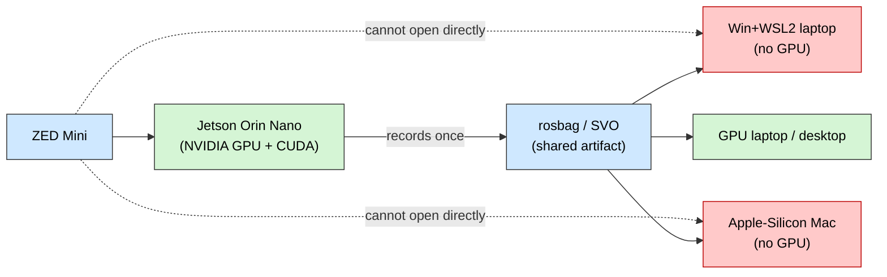

---

## 2. Do we use `zed-ros2-wrapper`? — Yes

**Use it.** It is the official Stereolabs ROS 2 driver and the only sane way to
get ZED data into ROS.

| Property       | Value (verified June 2026)                                                                                                                                                 |
| -------------- | -------------------------------------------------------------------------------------------------------------------------------------------------------------------------- |
| Repo           | `github.com/stereolabs/zed-ros2-wrapper`                                                                                                                                   |
| License        | **Apache-2.0** (compatible with a closed team stack)                                                                                                                       |
| Latest release | **v5.4.0**                                                                                                                                                                 |
| ROS 2 distros  | Foxy (EOL), **Humble**, **Jazzy**                                                                                                                                          |
| Requires       | **ZED SDK ≥ 5.x** + **CUDA** (⇒ NVIDIA GPU / Jetson only)                                                                                                                  |
| Publishes      | rectified L/R images, **depth**, point cloud, `camera_info`, **IMU**, visual-inertial **odometry/pose**, optional object detection                                         |
| Bonus          | ZED-SDK **positional tracking / VIO** = a ready-made Tier-1 odometry source (blueprint §5, localization report §3); **Isaac Sim sim-mode**; YOLO-ONNX custom detector hook |

What it gives _our_ architecture for free:

- `camera/image_raw` + `camera_info` → `detector_node` and `fieldline_node`
  (localization report §3.2).
- `camera/depth` → `projection_node` (the depth path that replaces the fragile
  flat-ground homography — report §6).
- `imu/data` → `ekf_node` Tier-1 odometry (report §3).
- ZED **VIO pose** → an _extra_ Tier-1 odometry input (report §3, §4).

> ⚠️ **ZED Mini caveat (rolling shutter).** The Mini is rolling-shutter; humanoid
> gait + head motion smears field lines (localization report open-question #3). It
> is **fine for the PoC**, but if line blur hurts the MCL, the upgrade is a
> **global-shutter ZED X** — not a code change, just a `camera_model` arg.

---

## 3. The key idea: isolate the vendor driver

The single most important architectural decision for this whole problem:

> **The ZED driver is the _only_ component coupled to ZED SDK + CUDA + JetPack.
> Put it in its own container behind a stable topic contract. Everything else is
> portable, distro-pinned application code.**

Your repo is _already_ built for this: every consumer subscribes to **generic**
topics (`camera/image_raw`, `camera/depth`, `camera_info`, `imu/data`), and today
a synthetic `sim_camera_node` fills them. Swapping in the ZED is "replace the node
that fills those topics" — **not** a rewrite.

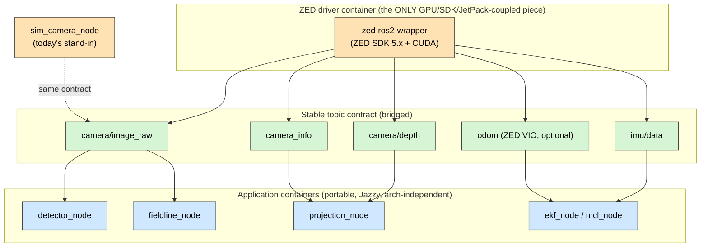

Consequences of this boundary:

- The **GPU / CUDA / ZED-SDK coupling is quarantined** to one container — and on
  JetPack 7.2 that container is plain Jazzy, the _same distro as the host_, so
  there is nothing to reconcile.
- A no-GPU dev runs **everything to the right of the contract** by replaying a
  rosbag of those topics — no ZED, no CUDA.
- Upgrading the Jetson only re-bases the **left** box (§12).

---

## 4. ROS 2 distro on JetPack 7.2 — Jazzy is native

Because JetPack 7.2 ships an **Ubuntu 24.04** userspace, **ROS 2 Jazzy is the
native distro**. The painful Humble-vs-Jazzy / 22.04-vs-24.04 mismatch that
plagues JetPack 6 Jetsons **does not exist for you** — the project standard and the
platform default are one and the same. The only real choice left is _native vs
containerized_, and **both are Jazzy**.

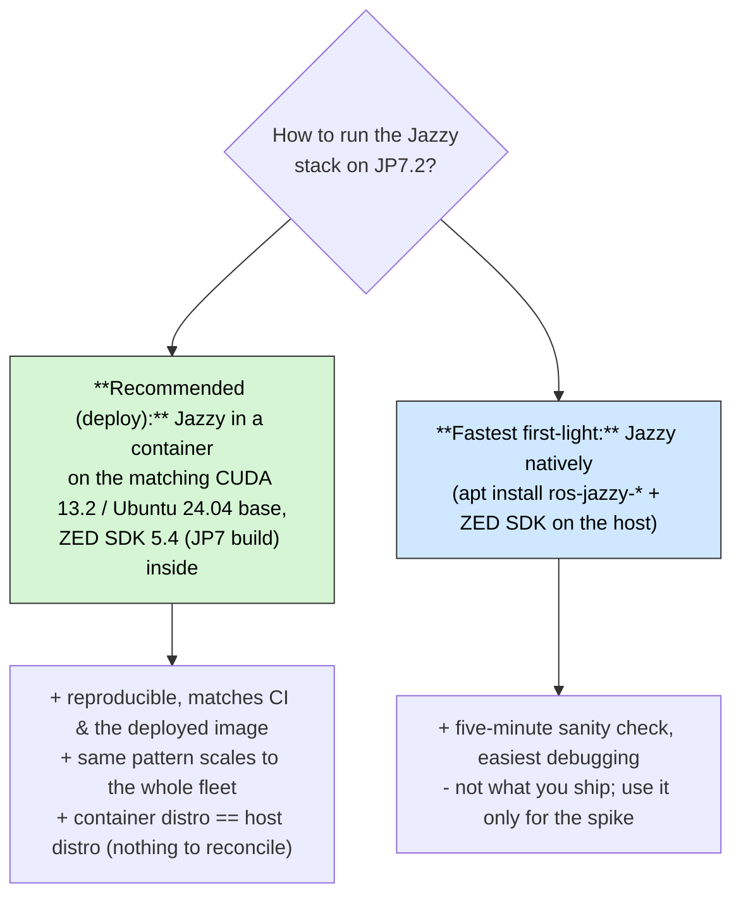

**Recommendation: containerize for deployment — and it is now a low-risk choice.**
On JetPack 6 this section was a genuine spike (_could_ the ZED SDK run in a 24.04
container on a 22.04 host?). On **JetPack 7.2 the host is already 24.04**, so the
container is plain Jazzy on a matching CUDA 13.2 base — there is nothing to
reconcile. This is no longer hypothetical: it is **built and proven** in
`deploy/docker/Dockerfile.jetson` (see `docs/zed_jetson_integration.md`).

**Use the modern tooling instead of hand-rolling the base image:**

- **`dusty-nv/jetson-containers`** — the de-facto 2026 standard for building
  matched `ros` + `cuda` + `zed` images on Jetson. It solves the
  CUDA/L4T/ROS-version matching for you (`autotag`, modular `ros:jazzy-*`, `zed`
  packages).
- **Stereolabs official images** (`stereolabs/zed`, ROS 2 Jazzy tags) — the
  best-tested ZED images; a ready-made base for the driver container.

> **Confirmed in practice:** ZED SDK **5.4 has a JetPack 7.2 (L4T 39.2) build**,
> and everything downstream (Jazzy, the wrapper, the app) is aligned — the
> end-to-end stack is proven on the Orin Nano (`docs/zed_jetson_integration.md`).
> There is no fallback distro to plan for.

---

## 5. Blank Jetson → working: one-time provisioning

Assume the Jetson is blank. This is the full, scriptable bring-up (later folded
into Ansible — §12). Run on the Jetson (over SSH is fine).

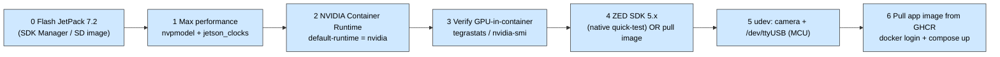

```bash
# 1) Performance: enable the 25 W Super mode + lock clocks (do this for benchmarks)
sudo nvpmodel -q              # confirm available modes
sudo nvpmodel -m 1            # the 25 W mode shown in your nvpmodel -q
sudo jetson_clocks            # pin max clocks (benchmarking; relax for thermal-limited runs)

# 2) Docker + NVIDIA Container Runtime (preinstalled by JetPack 7.2; default-runtime is already nvidia).
#    MANDATORY host fixes proven during the live bring-up — without them every
#    --gpus / CDI container panics with `slice bounds out of range [:73]`:
#    a) disable the buggy enable-cuda-compat CDI hook, then regenerate the spec:
echo 'NVIDIA_CTK_CDI_GENERATE_DISABLED_HOOKS=enable-cuda-compat' \
  | sudo tee /etc/nvidia-container-toolkit/nvidia-cdi-refresh.env
sudo systemctl restart nvidia-cdi-refresh.service
grep -c enable-cuda-compat /var/run/cdi/nvidia.yaml      # must print 0
#    b) force the runtime into CDI mode (also fixes `--runtime nvidia`):
sudo sed -i 's/^mode = "auto"/mode = "cdi"/' /etc/nvidia-container-runtime/config.toml
#    deploy/ansible/provision.yml applies (a)+(b) idempotently across the fleet.

# 3) Verify the GPU is visible inside a container (CDI path)
sudo docker run --rm --gpus all nvcr.io/nvidia/cuda:13.2.1-devel-ubuntu24.04 bash -lc "nvidia-smi -L || tegrastats --interval 500 | head -n 2"

# 4) (Optional but recommended for the first smoke test) install the ZED SDK natively.
#    ZED SDK 5.4 for JetPack 7.x (L4T 39.2) from stereolabs.com/developers
chmod +x ZED_SDK_Tegra_L4T39.2_v5.4.*.run && ./ZED_SDK_Tegra_L4T39.2_v5.4.*.run
ZED_Diagnostic -c              # console mode (the GUI segfaults headless); camera + depth health

# 5) udev: stable names for the MCU serial link (CRC16 protocol) and CAN dongle
#    e.g. /etc/udev/rules.d/99-soccer.rules  ->  SYMLINK+="ttyMCU" for the STM32 master
sudo udevadm control --reload && sudo udevadm trigger

# 6) Pull the prebuilt app image (built by CI for arm64) and run
echo "$GHCR_TOKEN" | docker login ghcr.io -u <user> --password-stdin
cd deploy/compose && docker compose -f robot.compose.yaml up   # (compose file to be added — §10)
```

> **Jetson build gotcha** (from the wrapper README): if you build `zed-ros2-wrapper`
> from source and hit `CUDA_TOOLKIT_ROOT_DIR`/`FindCUDA` errors,
> install the dev meta-packages: `sudo apt install nvidia-jetpack
nvidia-jetpack-dev`.

---

## 6. How to test the ZED Mini on the Jetson

The first thing you actually want: _prove the camera works, then prove it works in
ROS, then capture data so the rest of the team can work without it._

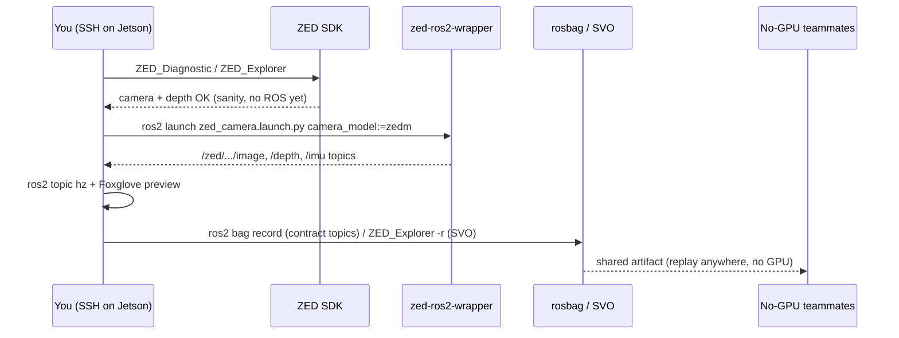

**Step 1 — SDK-level sanity (no ROS):**

```bash
ZED_Diagnostic           # health check, headless OK
# or, with a display / X-forward:  ZED_Explorer   (live view),  ZED_Depth_Viewer
```

**Step 2 — ROS-level (the real test):** run the wrapper in a container with GPU +
USB access, remapped onto _our_ contract.

```bash
sudo docker run --rm -it --gpus all --privileged --network host \
  -v /dev:/dev -v zed_resources:/usr/local/zed/resources \
  -e ROS_DOMAIN_ID=42 \
  soccer-zed:jazzy \
  ros2 launch zed_wrapper zed_camera.launch.py camera_model:=zedm
# soccer-zed:jazzy is built on-device from deploy/docker/Dockerfile.jetson
# (--target zed-driver-image); the zed_resources volume persists the neural-depth engine.
```

In a second shell verify data is actually flowing:

```bash
ros2 topic list
ros2 topic hz  /zed/zed_node/rgb/color/rect/image       # verified ~30 Hz on the Orin Nano
ros2 topic hz  /zed/zed_node/depth/depth_registered     # depth_mode defaults to NEURAL_LIGHT (TensorRT)
ros2 topic echo /zed/zed_node/imu/data --once           # verified ~99 Hz
```

**Step 3 — wire it to our contract** with the `camera_bridge` node (in
`soccer_bringup`, started by `camera.launch.py`). The ZED node is a _composable_
node, which launch-level `SetRemap` cannot reliably retarget — so a tiny relay
node re-publishes its native topics onto our contract with corrected QoS
(best-effort in, reliable out). It maps:

| ZED topic (verified live)                  | Our contract topic           |
| ------------------------------------------ | ---------------------------- |
| `/zed/zed_node/rgb/color/rect/image`       | `camera/image_raw`           |
| `/zed/zed_node/rgb/color/rect/camera_info` | `camera_info`                |
| `/zed/zed_node/depth/depth_registered`     | `camera/depth`               |
| `/zed/zed_node/imu/data`                   | `imu/data`                   |
| `/zed/zed_node/odom`                       | `odom` (optional Tier-1 VIO) |

`projection_node` now reads `camera_info` for the ZED's real intrinsics and uses
the depth path automatically (falling back to the flat-ground homography when no
depth is flowing), so the _existing_ detector / fieldline / MCL pipeline runs on
real data with **zero code changes**.

**Step 4 — capture for the team (the multiplier):**

```bash
# A) rosbag of the CONTRACT topics — replayable on ANY machine, NO GPU/ZED needed
ros2 bag record -o zed_session_01 \
  /robot_1/camera/image_raw /robot_1/camera/depth \
  /robot_1/camera_info /robot_1/imu/data

# B) native SVO2 — smaller, re-renders depth at any quality, but replay STILL needs ZED SDK+GPU
ZED_Explorer -r            # or set svo recording in the wrapper params
```

> **The distinction that unlocks the mixed team:** a **rosbag of decoded topics**
> needs _nothing_ to replay (any laptop). An **SVO** needs the ZED SDK + GPU to
> replay. So: capture **both** on the Jetson, hand **rosbags** to the no-GPU/Mac
> devs, keep **SVOs** for GPU devs who want to re-tune depth quality.

---

## 7. Development personas — where work actually happens

Your team is mixed. Map each persona to what it _can_ run, so nobody is blocked.

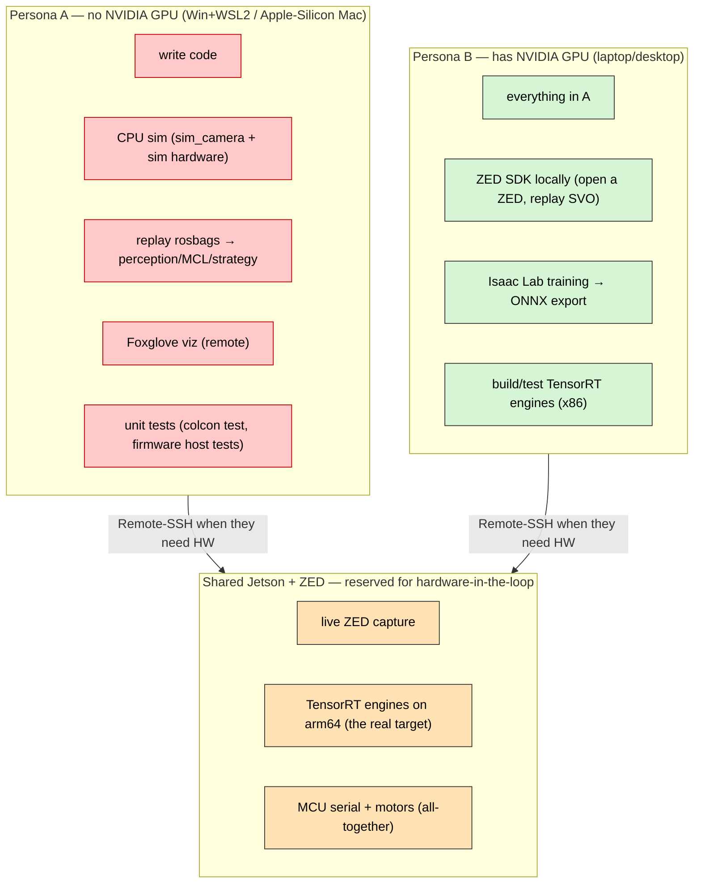

### Persona A — no-GPU laptop (Windows 11 + WSL2, Apple-Silicon Mac)

- **Windows:** do **all** ROS work inside **WSL2 Ubuntu 24.04** (or the
  devcontainer). Native Windows is not a ROS 2 target; WSL2 is. The existing
  `.devcontainer` already gives a Jazzy toolchain.
- **Apple-Silicon Mac:** run the **Jazzy dev container** (arm64) via Docker
  Desktop / Dev Containers. This is _great_ news — your Mac is arm64, the **same
  architecture as the Jetson**, so an arm64 dev image is realistic. (No CUDA, so
  no ZED/TensorRT — but full sim, perception-on-rosbag, control, strategy.)
- Both: **replay rosbags** for perception/localization/strategy work, **Foxglove
  Studio** (native Mac/Win app) to visualize, and **Remote-SSH into the Jetson**
  for anything that needs the real camera or motors.

### Persona B — NVIDIA GPU laptop / desktop

- Everything Persona A can do, **plus** open the ZED locally, replay SVOs at full
  quality, and — most importantly — **run Isaac Lab training and export ONNX**
  (`sim/` is already built for this, blueprint §10).
- These machines are your **engine-bench** for x86 TensorRT experiments, but
  remember the **on-robot engine must be built on the Jetson** (§12).

### The shared Jetson — treat it as a lab instrument

One Jetson + one camera = a booked resource. Make sharing frictionless:

- **Per-developer `ROS_DOMAIN_ID`.** Two people can SSH in and run graphs
  simultaneously without DDS crosstalk if each exports a distinct
  `ROS_DOMAIN_ID` (you already default to `42`; hand out `41`, `43`, …).
- **VS Code Remote-SSH** (or **Dev Containers over SSH**): each dev edits/builds
  in their own home dir / container on the Jetson; the GPU is shared by the OS.
- **Booking**: a Slack channel or shared calendar for _exclusive_ camera/motor
  time. Most work doesn't need exclusivity (rosbag replay), so contention is low.
- **Reserve the Jetson for what only it can do:** live ZED, arm64 TensorRT,
  MCU/motor HIL. Push everything else off it.

---

## 8. Testing separately, partially, and all together

Think of it as a pyramid: cheap/local/fast at the bottom, expensive/shared/slow
at the top. Most of your testing should live in the bottom two layers.

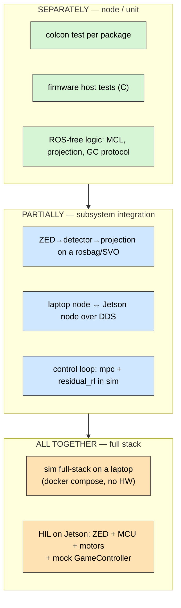

### A. Separately (node / unit) — runs anywhere, no hardware

This is what your repo already does well (IMPLEMENTATION.md §15). No GPU, no ZED,
no Jetson required:

```bash
# ROS packages — per-package or whole-workspace
cd ros2_ws && colcon build --symlink-install && colcon test && colcon test-result --verbose
colcon test --packages-select soccer_perception soccer_localization

# Firmware control law + watchdog (portable C host tests, no MCU)
cmake -S firmware/motor_controller -B build && cmake --build build && ctest --test-dir build

# Pure logic without a ROS graph (Mac/Win friendly)
pytest ros2_ws/src/soccer_localization/test/test_mcl.py
pytest ros2_ws/src/soccer_perception/test/test_projection.py
```

For the ZED specifically, "separately" = **feed a recorded frame** into
`detector_node` / `fieldline_node` and assert on the published `BoundingBoxes` /
`FieldFeatureArray`. No camera needed.

### B. Partially (subsystem) — the rosbag/SVO workflow

This is where the **record-once-replay-everywhere** pattern pays off. Examples:

```bash
# Perception subsystem on a rosbag (NO GPU, NO ZED) — Persona A can do this on a Mac
ros2 bag play zed_session_01 &
ros2 launch soccer_perception perception.launch.py   # detector + fieldline + projection
ros2 topic echo /robot_1/ball/point

# Cross-machine: ZED node on the Jetson, your new detector on your laptop, same DDS graph
#   (set matching ROS_DOMAIN_ID + RMW on both; §9)
#   Jetson:  ros2 launch soccer_bringup camera.launch.py
#   Laptop:  ros2 run soccer_perception detector_node

# Control subsystem in sim (no camera at all)
ros2 launch soccer_bringup robot.launch.py sim:=true   # then drive ControlGoal and watch neck_pan
```

Partial testing is also how you validate **one layer against a mock of its
neighbor**: e.g. `tools/mock_gamecontroller.py` exercises the strategy layer
without the real referee PC.

### C. All together — full stack

Two flavors, and you should use **both**:

1. **Full sim, on a laptop (no hardware):** the existing compose file already
   does a 2-robot scrimmage with a mock GameController.

   ```bash
   cd deploy/compose && docker compose -f sim.compose.yaml up
   ```

   This is your "does the whole graph still wire up" smoke test, runnable by
   anyone (CPU only).

2. **Hardware-in-the-loop, on the Jetson:** the real integration. ZED + MCU +
   motors + the full Jazzy graph, gated by a mock or real GameController.

   ```mermaid
   flowchart LR
       classDef j fill:#cfe8ff,stroke:#333,color:#000;
       classDef hw fill:#ffc9c9,stroke:#b00,color:#000;
       ZED["ZED Mini (USB3)"]:::hw --> ZN["camera.launch.py (Jazzy)"]:::j
       ZN --> APP["perception → localization → strategy → control"]:::j
       APP -->|"/dev/ttyMCU (CRC16 serial)"| MCU["STM32 master"]:::hw
       MCU -->|"CAN / MIT"| MOT["RobStride motor(s)"]:::hw
       GC["mock_gamecontroller.py"]:::j --> APP
   ```

   Docker needs **both** devices passed through:

   ```bash
   # Easiest: bring up the proven two-container stack (camera + app):
   cd deploy/compose && docker compose -f robot.compose.yaml up
   # …or the app container alone (GPU optional today), bridging a running ZED:
   sudo docker run --rm -it --gpus all --privileged --network host \
     -v /dev:/dev \                 # ZED (USB) + /dev/ttyMCU (serial)
     -e ROS_DOMAIN_ID=42 \
     soccer-app:jazzy \
     ros2 launch soccer_bringup robot.launch.py sim:=false camera:=zed
   ```

   Safety: the firmware watchdog zeroes torque on serial silence (firmware §11),
   so a crashed Jetson node can't run a motor away — but still bench-test with the
   robot on a stand first.

---

## 9. Network setup (you said "not decided yet")

Recommendation: a **dedicated wired/wireless LAN** for the robots + dev machines,
because ROS 2 / DDS relies on multicast discovery and is happiest on one subnet.

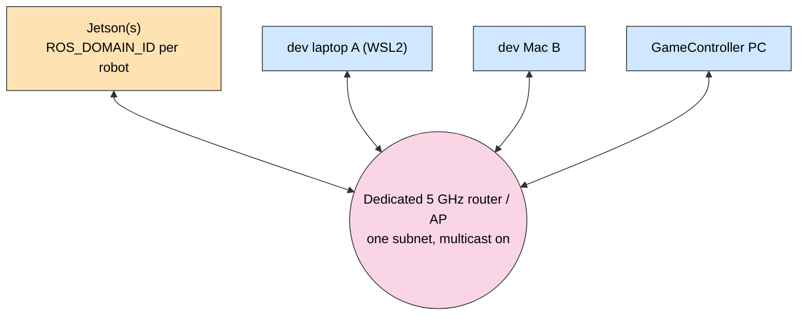

Practical settings (put them in a sourced `setup_env.sh`):

```bash
export ROS_DOMAIN_ID=42                      # same value = same graph; per-dev values to isolate
export RMW_IMPLEMENTATION=rmw_cyclonedds_cpp # CycloneDDS: robust default for multi-machine
# If discovery is flaky over Wi-Fi, pin CycloneDDS to the right NIC and/or set peers explicitly.
```

- **Same network, same `ROS_DOMAIN_ID`** ⇒ laptop and Jetson nodes see each other
  automatically (Persona B partial testing).
- **Different `ROS_DOMAIN_ID` per developer** ⇒ two people share the Jetson
  without crosstalk.
- **Remote / different networks (when "not decided" becomes "WFH"):** add
  **Tailscale** (zero-config WAN VPN) and either run **Zenoh / `zenoh-bridge-ros2dds`**
  across it or bind DDS to the Tailscale interface. This is the modern answer to
  "my Jetson is at the lab, I'm at home."
- Follow Stereolabs' **ROS 2 DDS & network tuning** guide once you stream images
  across the LAN (large-message tuning matters for camera topics).

---

## 10. Is your current workspace configured right?

**Verdict: architecturally yes — and the operational plumbing is now in place.**
The abstractions were always right; the Jetson/ZED plumbing this draft originally
flagged as missing has since been implemented (status banner above;
`docs/zed_jetson_integration.md`). The mermaid + table below keep the original gap
analysis as the rationale for _what_ shipped and _why_.

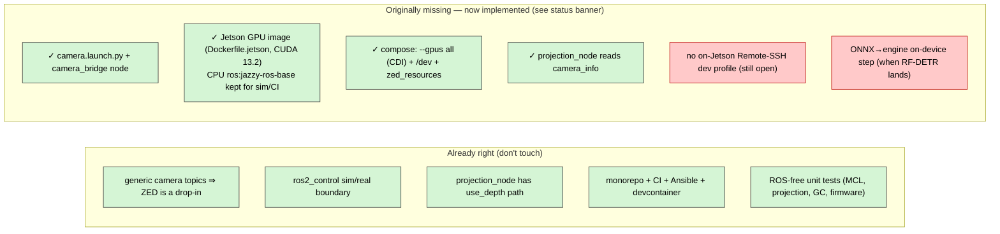

| Area            | Before                                   | Now (shipped — see `docs/zed_jetson_integration.md`)                                                                                             |
| --------------- | ---------------------------------------- | ------------------------------------------------------------------------------------------------------------------------------------------------ |
| ZED launch      | none                                     | `soccer_bringup/launch/camera.launch.py` + the `camera_bridge` node map the ZED topics onto the contract (QoS-corrected)                         |
| Dev / GPU image | `ros:jazzy-ros-base` (x86, CPU)          | `deploy/docker/Dockerfile.jetson` (CUDA 13.2 + ZED SDK 5.4 + TensorRT + wrapper), arm64, built on-device; the x86 CPU image stays for no-GPU sim |
| Runtime image   | `ros:jazzy-ros-base`                     | `soccer-app-image` target on the CUDA base (CPU-only today, GPU-ready for the RF-DETR `.engine`)                                                 |
| Compose         | no GPU wiring                            | `deploy/compose/robot.compose.yaml`: `--gpus`/CDI, `network_mode: host`, `/dev` passthrough, `zed_resources` volume                              |
| Intrinsics      | hardcoded `fx=550…` in `projection_node` | `projection_node` subscribes to `camera_info`, so the ZED's real calibration is used                                                             |
| Detector        | HSV fallback + RF-DETR TODO              | unchanged for now; load the **`.engine` built on the Jetson** (§12)                                                                              |
| Dev ergonomics  | laptop devcontainer only                 | **still TODO:** a **Remote-SSH** workflow doc/profile targeting the Jetson                                                                       |

None of these is a rewrite — they are the "make the existing contract talk to real
silicon" layer. Your earlier architectural choices (generic topics, `ros2_control`
boundary, ROS-free logic) are _exactly_ what makes this cheap.

---

## 11. Which Jetson should you buy next?

You said "no hard ceiling." The right answer is **different boards for different
jobs**, and the dominant constraint is **RAM**, not TOPS: ZED **Neural depth** +
a **transformer detector** + the **full ROS graph** will starve 8 GB.

| Role                                        | Board                                       | RAM    | ~Compute                 | ~Price                           | Why                                                                                                                                                                                         |
| ------------------------------------------- | ------------------------------------------- | ------ | ------------------------ | -------------------------------- | ------------------------------------------------------------------------------------------------------------------------------------------------------------------------------------------- |
| **Future-proof bench / lead brain (ideal)** | **Jetson AGX Thor Dev Kit**                 | 128 GB | Blackwell, ~2 PFLOPS FP4 | ~$3,499                          | Same **JetPack 7 / Jazzy** family as your Orin Nano (seamless upgrade) but with the headroom the Nano lacks: latest Isaac ROS + cuVSLAM, whole-body MPC + multiple nets + VSLAM, 128 GB RAM |
| **Production on-robot (recommended buy)**   | **Jetson Orin NX 16 GB** (module + carrier) | 16 GB  | ~100 TOPS                | ~$600 module + ~$200–400 carrier | Blueprint's on-robot pick; fits a KidSize robot's **power/weight** (10–25 W); 16 GB runs the real stack; **one per robot**                                                                  |
| **Powerful shared dev box (middle)**        | **Jetson AGX Orin 64 GB Dev Kit**           | 64 GB  | ~275 TOPS                | ~$2,000                          | tons of RAM to run ZED Neural + RF-DETR + full graph _and_ experiment; great team bench (JP7 / Jazzy on the Orin family)                                                                    |
| **Budget / keep**                           | **Orin Nano Super 8 GB** (current)          | 8 GB   | ~67 TOPS                 | already owned                    | fine PoC for single-camera perception; **8 GB is the ceiling** — expect ZED depth `PERFORMANCE/NEURAL_LIGHT` + a small detector                                                             |

**Concrete recommendation given no ceiling:**

- Buy **one AGX Thor dev kit** as the **lead/bench brain** — same JetPack 7 /
  Jazzy family as your Orin Nano (so it is a drop-in upgrade), but with the compute
  and 128 GB RAM headroom for the full stack plus the next two years of Isaac ROS.
- Buy **Orin NX 16 GB modules for the actual robots** (one per robot) — Thor is
  too heavy/power-hungry to bolt onto a KidSize humanoid; Orin NX is the
  blueprint's on-robot sweet spot.
- **Keep the Orin Nano** as a CI/perception PoC and spare.

> If you must pick _one_ board to buy now: **AGX Thor dev kit** — it buys the
> RAM/compute headroom the 8 GB Nano lacks, and because it shares the Orin Nano's
> JetPack 7 / Jazzy base, everything you develop deploys down to an Orin NX
> unchanged (§12).

---

## 12. Upgrading the Jetson without rewriting code

This is the heart of "PoC now, better Jetson later." **Done right, upgrading a
Jetson changes essentially no application code.** The trick is a two-layer image
and treating ONNX vs TensorRT engines correctly.

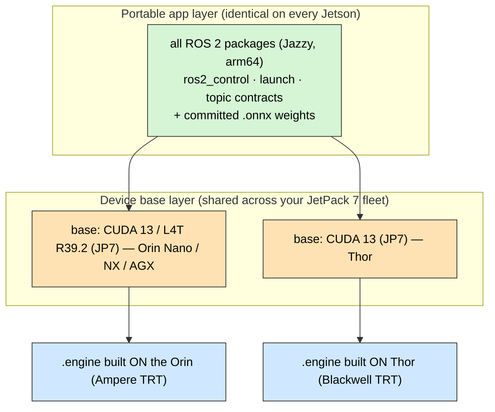

### What changes vs what doesn't

| Layer                                         | Portable across Jetsons?     | Notes                                                                                                                    |
| --------------------------------------------- | ---------------------------- | ------------------------------------------------------------------------------------------------------------------------ |
| ROS 2 application packages                    | ✅ **yes**                   | pure arm64 + Jazzy; no per-board code                                                                                    |
| `ros2_control`, URDF, launch, topic contracts | ✅ yes                       | the whole point of the boundary                                                                                          |
| App Docker layers (above the base)            | ✅ yes                       | rebuilt on the new base, Dockerfile unchanged                                                                            |
| Base image (L4T/CUDA tag)                     | ⚠️ **per JetPack**           | today the whole fleet is **JP7 / R39.2 (CUDA 13) → one shared base**; only a future JetPack bump adds a build-matrix row |
| **TensorRT `.engine`**                        | ❌ **per GPU + TRT version** | **commit `.onnx`; build `.engine` ON the target** — never copy an Orin engine to a Thor                                  |
| Power profile                                 | ❌ per board                 | one `nvpmodel`/`jetson_clocks` setting (Ansible var)                                                                     |
| ROS distro                                    | ✅ stays Jazzy               | already Jazzy-native across the JP7 fleet — no distro change on upgrade                                                  |
| udev / device names                           | ⚠️ maybe                     | abstract camera + `/dev/ttyMCU` via udev rules                                                                           |

### The cardinal rule

> **Git stores `.onnx` (portable). The device builds `.engine` (not portable).**
> A TensorRT engine is specialized to the exact GPU architecture + TensorRT
> version. Building it on an Orin and shipping it to a Thor (or vice-versa) is the
> classic mistake. Build the engine **on the target**, at image-build time for
> that arch or on first boot.

```bash
# On the target Jetson (or in its arch-matched CI build):
trtexec --onnx=models/rf_detr.onnx --saveEngine=models/rf_detr.engine --fp16
# detector_node loads the .engine via its existing engine_path param — no code change.
```

### The professional flow

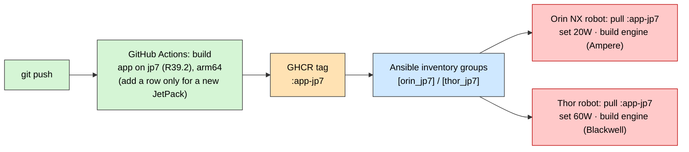

So **adding a better Jetson becomes a checklist, not a project:**

1. Flash its JetPack; install NVIDIA Container Runtime; set power mode.
2. Add it to the right **Ansible group** (`[thor_jp7]`).
3. CI already publishes the matching base tag (add one build-matrix row the first
   time a new JetPack appears).
4. `ansible-playbook deploy.yml` → it pulls the right image, builds the engine
   on-device, starts the container.
5. **No application code changed.**

---

## 13. Next-steps checklist

Ordered, each item small and independently verifiable:

1. ✅ **DONE (proven on hardware):** **ZED SDK 5.4 (JetPack 7.2 / L4T 39.2) +
   `zed-ros2-wrapper`** runs on the Orin Nano in the **Jazzy + CUDA 13.2
   container** (`deploy/docker/Dockerfile.jetson`) — RGB ~30 Hz, IMU ~99 Hz,
   neural-depth optimized. Details in `docs/zed_jetson_integration.md` (§4).
2. ✅ **DONE:** GPU container path enabled via the two mandatory CDI host fixes
   (disable `enable-cuda-compat`; `mode = "cdi"`), codified in
   `deploy/ansible/provision.yml`.
3. ✅ **DONE:** `camera.launch.py` + the `camera_bridge` node map the ZED topics
   onto `camera/image_raw` / `camera/depth` / `camera_info` / `imu/data`.
4. ✅ **DONE:** `projection_node` now reads `camera_info` for real intrinsics and
   uses the depth path by default (auto flat-ground fallback when depth is silent).
5. **Record `zed_session_*` rosbags** on the Jetson and commit them (Git LFS) or
   drop them on shared storage — unblocks every no-GPU/Mac dev immediately.
6. ✅ **DONE:** `deploy/compose/robot.compose.yaml` (GPU via CDI, host network,
   `/dev` passthrough, `zed_resources` volume) brings up the camera + app stack.
7. ✅ **DONE (image):** the arm64 Jetson image is `Dockerfile.jetson` (CUDA 13.2
   base), **built on-device / a self-hosted arm64 runner** — not cloud CI (a 19 GB
   licensed-SDK image under QEMU is impractical). The CPU `Dockerfile.runtime`
   stays in cloud CI for sim. Commit `.onnx`; build `.engine` on-device.
8. **Stand up the network** (§9): dedicated AP, `setup_env.sh` with
   `ROS_DOMAIN_ID` + CycloneDDS; add Tailscale if remote.
9. **Document the Remote-SSH-into-Jetson** dev profile for Persona A.
10. **Buy** an **AGX Thor dev kit** (bench, max RAM/compute headroom) + **Orin NX
    16 GB** per robot; keep the Orin Nano as PoC/spare (§11).

---

## Appendix — device-passthrough & command cheat-sheet

| Need                         | Flag / command                                                                                                                  |
| ---------------------------- | ------------------------------------------------------------------------------------------------------------------------------- |
| GPU in container             | `--gpus all` (CDI path; needs the `provision.yml` host fixes — do **not** rely on `--runtime nvidia`, it re-adds a broken hook) |
| ZED Mini (USB3)              | `--privileged -v /dev:/dev` (or scope to the USB bus) + GPU                                                                     |
| MCU serial (CRC16)           | `--device=/dev/ttyMCU` (udev symlink for the STM32 master)                                                                      |
| CAN dongle (motor bench)     | `--device=/dev/ttyUSB0` (CH341 USB-CAN test path)                                                                               |
| ROS graph across machines    | `--network host` + matching `ROS_DOMAIN_ID` + `RMW_IMPLEMENTATION`                                                              |
| Headless camera health       | `ZED_Diagnostic`                                                                                                                |
| Topic rate sanity            | `ros2 topic hz /zed/zed_node/rgb/color/rect/image`                                                                              |
| Cross-platform viz (Mac/Win) | `ros2 run foxglove_bridge foxglove_bridge` → Foxglove Studio                                                                    |
| Power / thermal              | `sudo nvpmodel -m <mode>` · `sudo jetson_clocks` · `tegrastats`                                                                 |
| Build engine on-device       | `trtexec --onnx=… --saveEngine=… --fp16`                                                                                        |

> Verify exact ZED SDK version, Docker image tags, and JetPack base tags against
> Stereolabs / NVIDIA at purchase/setup time — pin them once a known-good combo is
> confirmed by the §13.1 spike.
