# soccerbot — ROS 2 Runtime Graph

> The live **node / topic** graph of the as-built soccerbot stack, verified against
> the source in `ros2_ws/src/` and the `soccer-firmware/` submodule. It shows the **real-robot**
> configuration (`sim:=false`, `camera:=zed`); the simulation differences are
> called out in [Sim vs real](#sim-vs-real). Every per-robot topic is drawn with
> the `/robot_x/` namespace that `robot.launch.py` pushes; `/team_data` is global.

**Legend** — blue = ROS 2 node (Jetson) · purple dashed = namespaced topic ·
orange dashed = global topic · pink = MCU / actuator (hard real-time) · grey = physical
hardware · faded dashed edge = planned / not-yet-wired.

```mermaid
flowchart LR
%% ── Style Definitions ──
classDef jetsonNode fill:#cfe8ff,stroke:#1a5f7a,stroke-width:1.5px,color:#000;
classDef rosTopic fill:#f3f0ff,stroke:#5c3e91,stroke-width:1px,stroke-dasharray: 4 4,color:#000;
classDef globalTopic fill:#ffddc6,stroke:#d35400,stroke-width:1.5px,stroke-dasharray: 2 2,color:#000;
classDef nonRos fill:#ffe8d6,stroke:#a75a10,stroke-width:1.5px,color:#000;
classDef mcuComp fill:#ffe5ec,stroke:#9d0208,stroke-width:1.5px,color:#000;
classDef physical fill:#e2e2e2,stroke:#333,stroke-width:2px,color:#000;
classDef planned fill:#f7f7f7,stroke:#9e9e9e,stroke-width:1px,stroke-dasharray: 6 4,color:#555;

    subgraph NET ["EXTERNAL BOUNDARIES"]
        REF["UDP Referee Broadcast"]:::nonRos
    end

    subgraph HW ["PHYSICAL ROBOT HW"]
        direction TB
        CAM["ZED Mini Stereo Camera<br/>RGB + depth + built-in IMU"]:::physical
        MOT["neck_pan Robostride actuator<br/>+ encoder + current sense"]:::physical
    end

    subgraph JETSON ["NVIDIA JETSON (Linux / ROS 2 Jazzy / Ubuntu 24.04)"]
        direction LR

        subgraph PERCEP ["1. Perception Pipeline (camera:=zed)"]
            direction TB
            ZEDW["zed_wrapper<br/>(Stereolabs driver · own container)"]:::jetsonNode
            CAMBR["camera_bridge<br/>(ZED topics → camera contract)"]:::jetsonNode
            T_IMG["/robot_x/camera/image_raw"]:::rosTopic
            T_DEPTH["/robot_x/camera/depth"]:::rosTopic
            T_CAMINFO["/robot_x/camera_info"]:::rosTopic
            DET["detector_node"]:::jetsonNode
            SEG["fieldline_node"]:::jetsonNode
            T_BB["/robot_x/detections<br/>(BoundingBoxes)"]:::rosTopic
            T_FEAT["/robot_x/field_features<br/>(FieldFeatureArray)"]:::rosTopic
            PROJ["projection_node"]:::jetsonNode
            T_BALL_P["/robot_x/ball/point"]:::rosTopic
            T_OBJF["/robot_x/object_features<br/>(goalpost landmarks)"]:::rosTopic
        end

        subgraph STRAT_LOC ["2. Localization & Strategy"]
            direction TB
            GCB["game_controller_bridge<br/>(gc_bridge_node)"]:::jetsonNode
            T_GC["/robot_x/gc/game_state"]:::rosTopic
            STRAT["soccer_strategy<br/>(strategy_node)"]:::jetsonNode
            T_LOCAL_BID["/robot_x/strategy/role_bid"]:::rosTopic
            TEAM["soccer_teamcomm<br/>(teamcomm_node)"]:::jetsonNode
            T_GLOBAL_TEAM["/team_data<br/>(Un-Namespaced / Shared Role Auction)"]:::globalTopic
            EKF["soccer_localization<br/>(ekf_node)"]:::jetsonNode
            T_ODOM["/robot_x/odom"]:::rosTopic
            MCL["soccer_localization<br/>(mcl_node)"]:::jetsonNode
            T_MCL_P["/robot_x/mcl_pose"]:::rosTopic
        end

        subgraph CTRL_TIER ["3. Control & Hardware IO"]
            direction TB
            T_GOAL["/robot_x/control/goal"]:::rosTopic
            MPC["soccer_control<br/>(mpc_node)"]:::jetsonNode
            T_REF["/robot_x/control/mpc_reference"]:::rosTopic
            RSP["robot_state_publisher"]:::jetsonNode
            T_JS["/robot_x/joint_states"]:::rosTopic
            T_IMU["/robot_x/imu/data"]:::rosTopic

            subgraph CM ["ros2_control Controller Manager (100 Hz Async)"]
                direction TB
                JSB["joint_state_broadcaster"]:::jetsonNode
                ISB["imu_sensor_broadcaster"]:::jetsonNode
                RRC["residual_rl_controller"]:::jetsonNode
                SH["SoccerbotSerialHardware<br/>(C++ Hardware Plugin)"]:::jetsonNode
            end
        end
    end

    subgraph MCU ["STM32 MASTER/SLAVE BRIDGE (hard real-time safety + aggregation)"]
        direction TB
        AGG["frame parse / aggregate<br/>+ lifecycle (arm / disarm)"]:::mcuComp
        WD["watchdog<br/>(silence > 100 ms → torque 0)"]:::mcuComp
        CANB["CAN-FD MIT bridge<br/>(per actuator)"]:::mcuComp
    end

    subgraph ACT ["ROBOSTRIDE ACTUATOR (onboard MIT impedance)"]
        direction TB
        IMP["impedance loop<br/>τ = kp(q*−q) + kd(q̇*−q̇) + τ_ff"]:::mcuComp
    end

    %% Camera source (real robot, camera:=zed)
    CAM -->|"USB 3.0"| ZEDW
    ZEDW -->|"/zed/zed_node/*"| CAMBR
    CAMBR --> T_IMG
    CAMBR --> T_DEPTH
    CAMBR --> T_CAMINFO
    CAMBR --> T_IMU

    %% Perception pipeline
    T_IMG --> DET & SEG
    DET --> T_BB --> PROJ
    SEG --> T_FEAT --> MCL
    T_DEPTH --> PROJ
    T_CAMINFO --> PROJ
    PROJ --> T_BALL_P
    PROJ --> T_OBJF
    T_BALL_P --> STRAT
    T_BALL_P --> TEAM
    T_OBJF -.->|"planned: MCL not yet subscribed"| MCL

    %% Mission + strategy routing
    GCB --> T_GC --> STRAT
    STRAT --> T_GOAL --> MPC
    MPC --> T_REF --> RRC

    %% Two-tier localization
    EKF --> T_ODOM --> MCL
    MCL --> T_MCL_P --> TEAM

    %% Joint states + TF
    JSB --> T_JS --> RSP

    %% Decentralized role auction
    STRAT --> T_LOCAL_BID --> TEAM
    TEAM -->|"bundles MCL pose + ball + role bid"| T_GLOBAL_TEAM
    T_GLOBAL_TEAM -->|"every robot reads every bid (no master)"| STRAT

    %% IMU into Tier-1 EKF
    ISB -->|"body IMU (Master telemetry frame / sim-synth)"| T_IMU
    T_IMU --> EKF

    %% GameController UDP (off-board referee)
    REF -->|"UDP :3838 control data"| GCB
    GCB -->|"UDP :3939 status return"| REF

    %% ros2_control command/state interfaces (shared memory)
    SH <-->|"command / state interfaces"| JSB & ISB & RRC

    %% Jetson-to-Master link (real robot only)
    SH <-->|"USB-CDC · COBS · MIT cmd / state + IMU"| AGG

    %% Master safety + CAN-FD bridge to the actuator
    AGG --> WD
    AGG --> CANB
    WD -.->|"silent >100 ms: tau = 0"| CANB
    CANB -->|"CAN-FD MIT setpoints"| IMP
    IMP -->|"apply torque (tau)"| MOT
    MOT -->|"encoder: q, qd · current-sense τ"| IMP
```

## How to read this diagram

- **Frequency tiers.** Boxes group by the layer that owns them -- L3 perception
  (~30 Hz), L2/L4 localization & strategy (10-200 Hz), L1 control (50-100 Hz on
  the Jetson) and L0 (onboard on the Robostride actuator). A crash in a slow node
  cannot stall the fast loops because they are separate processes; the Master
  watchdog is the last line of defence and zeroes torque on its own.
- **Namespacing.** `robot.launch.py` wraps the whole graph in a
  `PushRosNamespace(robot_name)`, so each `/robot_x/...` topic is really
  `/robot_1/...`, `/robot_2/...`, etc. Only `/team_data` is deliberately global so
  all robots share one world-model / role-auction bus (best-effort `SensorData`
  QoS on both the publisher and the strategy subscriber).
- **The `ros2_control` boundary.** `mpc_node`, the three controllers and
  `ekf_node` sit _above_ the command/state interfaces and are byte-for-byte
  identical in sim and on hardware. The one thing that swaps is the hardware
  plugin behind `SH`. The impedance loop runs onboard the actuator, never in the manager.

## Node-by-node contract (verified against source)

| Node (package)                            | Subscribes                                    | Publishes                                                              |
| ----------------------------------------- | --------------------------------------------- | ---------------------------------------------------------------------- |
| `camera_bridge` (soccer_bringup, real)    | `/zed/zed_node/{rgb,depth,camera_info,imu}`   | `camera/image_raw`, `camera/depth`, `camera_info`, `imu/data`          |
| `sim_camera` (soccer_bringup, sim)        | `joint_states`                                | `camera/image_raw`                                                     |
| `detector_node` (soccer_perception)       | `camera/image_raw`                            | `detections` (`BoundingBoxes`)                                         |
| `fieldline_node` (soccer_perception)      | `camera/image_raw`                            | `field_features` (`FieldFeatureArray`)                                 |
| `projection_node` (soccer_perception)     | `detections`, `camera_info`, `camera/depth`   | `ball/point` (`PointStamped`), `object_features` (`FieldFeatureArray`) |
| `ekf_node` (soccer_localization)          | `imu/data`                                    | `odom` + TF `odom->base_link`                                          |
| `mcl_node` (soccer_localization)          | `field_features`, `odom`                      | `mcl_pose` + TF `map->odom`                                            |
| `strategy_node` (soccer_strategy)         | `gc/game_state`, `ball/point`, `/team_data`   | `control/goal` (`ControlGoal`), `strategy/role_bid` (`RoleBid`)        |
| `teamcomm_node` (soccer_teamcomm)         | `mcl_pose`, `ball/point`, `strategy/role_bid` | `/team_data` (`TeamData`, global)                                      |
| `gc_bridge_node` (game_controller_bridge) | UDP `:3838`                                   | `gc/game_state` (`GameState`); UDP `:3939` return                      |
| `mpc_node` (soccer_control)               | `control/goal`                                | `control/mpc_reference` (`Float64MultiArray`)                          |
| `residual_rl_controller` (soccer_control) | `control/mpc_reference`                       | `neck_pan` MIT command — position/velocity/kp/kd/effort (ros2_control) |
| `joint_state_broadcaster`                 | hw state interfaces                           | `joint_states`                                                         |
| `imu_sensor_broadcaster`                  | hw `imu_sensor` interface                     | `imu/data`                                                             |
| `robot_state_publisher`                   | `joint_states`                                | `/tf`, `/tf_static`                                                    |

The **Robostride actuator** runs the impedance law
$\tau = k_p\,(q^* - q) + k_d\,(\dot q^* - \dot q) + \tau_{ff}$ **onboard**. The Jetson
streams the full MIT tuple (`q*, qd*, kp, kd, τ_ff`) to the Master, which returns a
per-joint `JointState` (`q`, `qd`, `τ`, `temp`, `state`, `fault`) plus a body IMU over
the same COBS/CRC16 frame. Contract: [jetson_master_protocol.md](architecture/jetson_master_protocol.md).

## Sim vs real

| Launch arg             | real (`sim:=false` / `camera:=zed`)                                                                                                                             | simulation (`sim:=true` / `camera:=sim`)                                                                       |
| ---------------------- | --------------------------------------------------------------------------------------------------------------------------------------------------------------- | -------------------------------------------------------------------------------------------------------------- |
| hardware plugin (`SH`) | `SoccerbotSerialHardware` -- streams full MIT commands to the Master over USB-CDC (COBS + CRC16), parses per-joint state + IMU, 100 ms host-side watchdog fault | `SoccerbotSimHardware` -- integrates each joint with the same MIT impedance law, synthesises a static-base IMU |
| camera source          | `zed_wrapper` (own container) + `camera_bridge` onto the contract topics                                                                                        | `sim_camera` renders an orange ball from `joint_states` at 30 Hz (no GPU)                                      |

Everything between the camera contract topics and the `ros2_control` interfaces is
identical in both modes -- that is the entire point of the boundary.

## Caveats / not-yet-wired (as built today)

1. **`object_features` has no subscriber yet.** `projection_node` already
   publishes goalpost landmarks, but `mcl_node` currently fuses only the
   `field_features` line cloud. The dashed edge marks the intended hook-up.
2. **`imu/data` has two publishers on real HW.** `camera_bridge` forwards the
   **ZED's** IMU (~99 Hz) while `imu_sensor_broadcaster` publishes the **body
   IMU** carried in the Master telemetry frame (decision D2 in the protocol doc),
   parsed by `SoccerbotSerialHardware`. Until the firmware populates that field it
   is a static-base stub. Pick one authoritative source per axis to avoid
   contention (e.g. ZED for orientation, body IMU for trunk rate).
3. **Projection uses a fixed camera mount.** `projection_node` adopts the live
   `camera_info` intrinsics but keeps fixed extrinsics (mount height / tilt)
   instead of a TF lookup from `robot_state_publisher`; TF-based projection is a
   full-system goal.
4. **Telemetry is aggregated by the Master, not micro-ROS.** The Master parses
   per-actuator CAN feedback and returns one `JointState` + IMU frame per control
   cycle over USB-CDC; there is no micro-ROS on the bridge.
