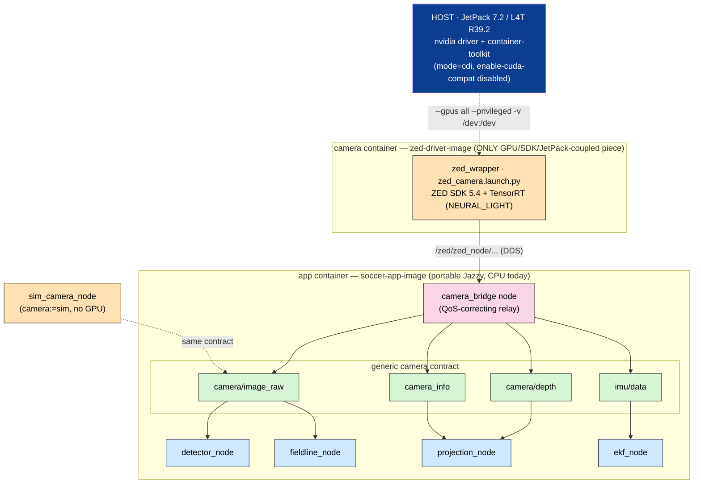
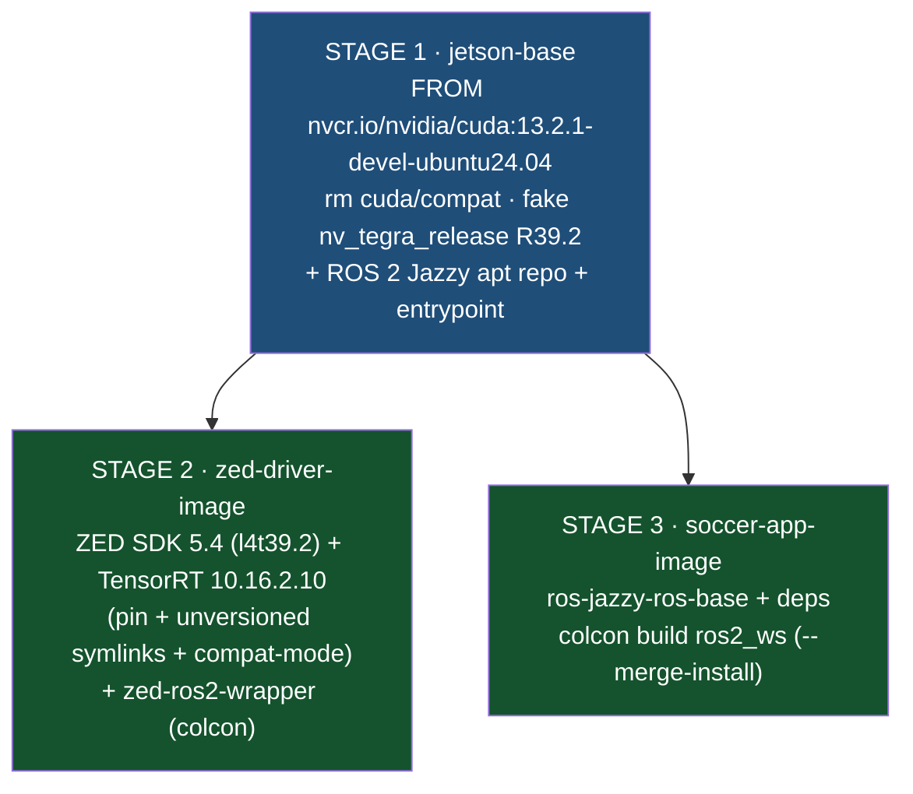
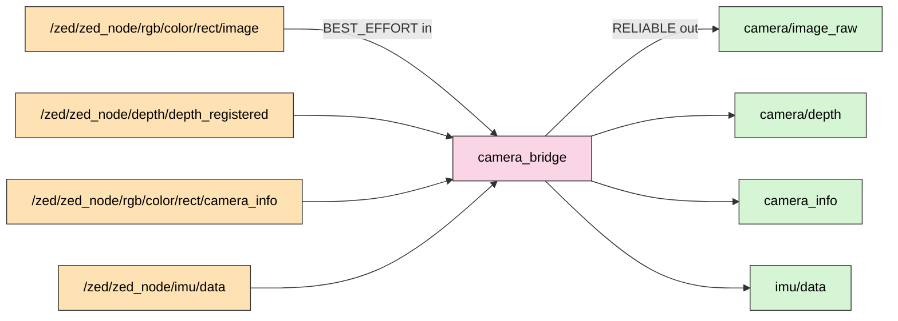
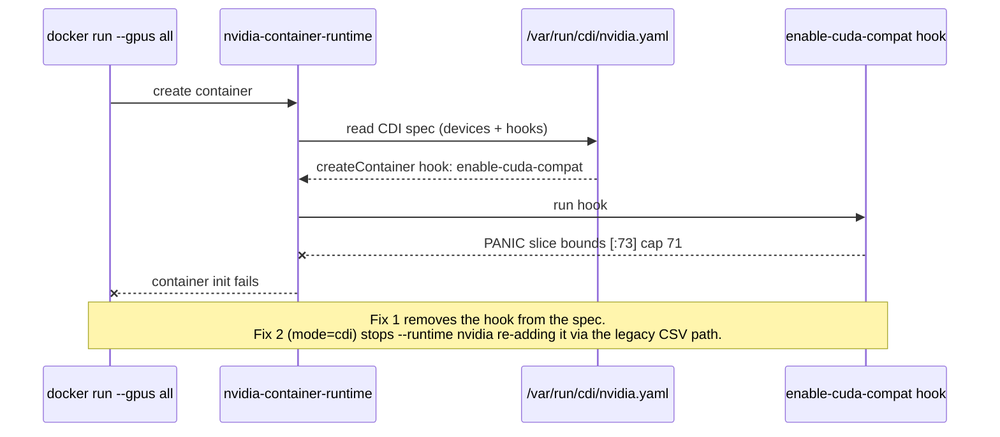
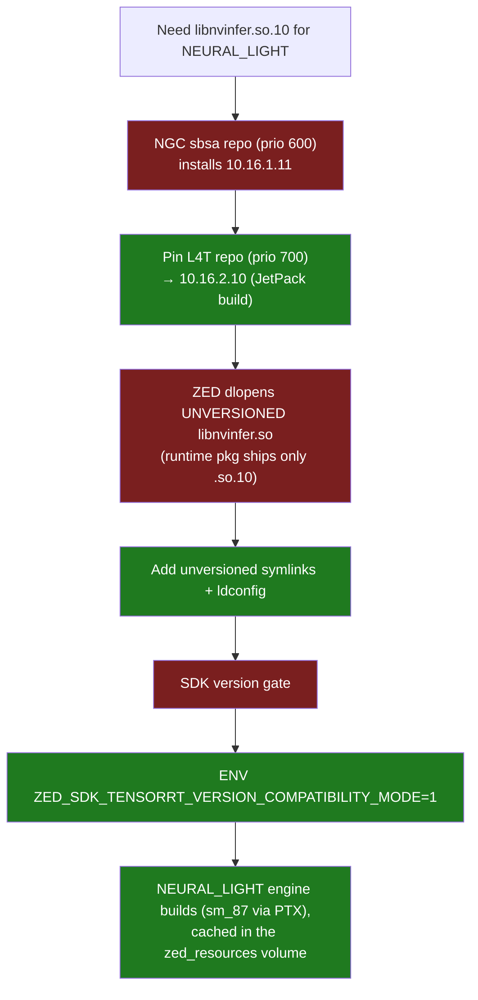
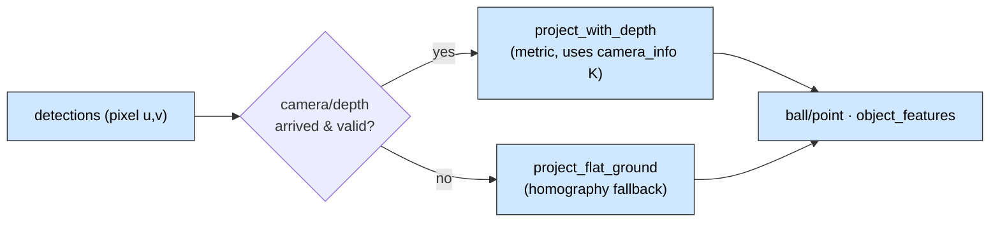
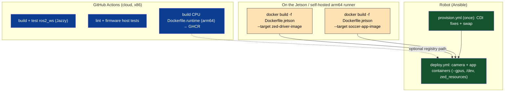

# ZED Mini + Jetson Integration — Implementation Report

> **What this is.** A justified, as-built record of the changes made to
> `soccer-software` so the repository mirrors the **proven** ZED Mini + ROS 2
> bring-up on the Jetson Orin Nano (JetPack 7.2 / L4T R39.2). It documents the
> findings, the design decisions (with rationale and the alternatives rejected),
> every file changed, and the on-device verification procedure.
>
> **Provenance.** The recipe encoded here was validated end-to-end on real
> hardware; the blow-by-blow debugging log lives in the journey doc
> (`ZED_JETPACK72_DOCKER_JOURNEY.md`). The forward-looking strategy / workflow
> rationale lives in [`docs/jetson_zed_workflow.md`](jetson_zed_workflow.md).
> **Where any document disagrees with the hardware, the hardware wins** — and the
> facts below are taken from the hardware.

---

## 1. Executive summary

The repo was already **architecturally** ready for a real camera: every consumer
subscribes to a small, driver-agnostic **topic contract** (`camera/image_raw`,
`camera/depth`, `camera_info`, `imu/data`) that a synthetic `sim_camera_node`
fills today. What was missing was the **operational** layer: a GPU/JetPack image,
the ZED→contract glue, the GPU container wiring, and the host fixes that make
`--gpus` work at all on this toolkit version.

This change set adds exactly that layer — and nothing more invasive:

| Outcome                                                   | How                                                                                                       |
| --------------------------------------------------------- | --------------------------------------------------------------------------------------------------------- |
| The ZED runs in a container on the proven stack           | New multi-target `Dockerfile.jetson` (CUDA 13.2 + ZED SDK 5.4 + TensorRT 10.16.2.10 + `zed-ros2-wrapper`) |
| The ZED's native topics feed the existing graph unchanged | New `camera_bridge` node + `camera.launch.py`; `robot.launch.py camera:=zed`                              |
| Real depth + real calibration are used                    | `projection_node` now reads `camera_info` and uses the depth path by default                              |
| One command brings up camera + app on a robot             | New `deploy/compose/robot.compose.yaml`; updated `deploy/ansible/deploy.yml`                              |
| The mandatory host fixes are reproducible per robot       | New `deploy/ansible/provision.yml`                                                                        |
| The docs state the real facts                             | Corrected `jetson_zed_workflow.md`; CI note added                                                         |

**No application logic was rewritten.** The sim flow is untouched (`camera:=sim`
remains the default), so laptops and CI keep working with zero GPU.

---

## 2. The proven environment (authoritative facts)

| Property               | Value                                                 | Consequence for the repo                                                  |
| ---------------------- | ----------------------------------------------------- | ------------------------------------------------------------------------- |
| Board                  | Jetson Orin Nano (Super), 8 GB, **sm_87**             | 8 GB ⇒ capped build parallelism + swap; engines built on-device           |
| JetPack / L4T          | **7.2 / R39.2** (`/etc/nv_tegra_release`)             | No `l4t-jetpack:r39` image exists → use a generic CUDA base               |
| OS / CUDA              | Ubuntu 24.04.4 / **CUDA 13.2**                        | ROS 2 **Jazzy is native** (24.04); base = `cuda:13.2.1-devel-ubuntu24.04` |
| Container toolkit      | `nvidia-container-toolkit 1.19.1`                     | Ships a **buggy `enable-cuda-compat` CDI hook** → must be disabled        |
| Docker default runtime | `nvidia`                                              | `--gpus all` is the supported GPU path (CDI)                              |
| Camera                 | **ZED Mini** USB3 (`2b03:f682` UVC + `2b03:f681` IMU) | Must be on a **USB 3.0** port; bridge subscribes with sensor QoS          |
| ZED SDK / wrapper      | **5.4** / `zed-ros2-wrapper` (release_5.4)            | Installer pinned to `l4t39.2/5.4`; wrapper built from source              |
| TensorRT               | **10.16.2.10** (JetPack build)                        | Default `depth_mode: NEURAL_LIGHT` needs it; pinned + symlinked           |

**Verified live topic names and rates** (these drove the bridge defaults):

| ZED topic                                  | Type                                       | Rate     |
| ------------------------------------------ | ------------------------------------------ | -------- |
| `/zed/zed_node/rgb/color/rect/image`       | `sensor_msgs/Image`                        | ~30 Hz   |
| `/zed/zed_node/rgb/color/rect/camera_info` | `sensor_msgs/CameraInfo`                   | ~30 Hz   |
| `/zed/zed_node/depth/depth_registered`     | `sensor_msgs/Image` (32-bit float, metres) | depth on |
| `/zed/zed_node/imu/data`                   | `sensor_msgs/Imu`                          | ~99 Hz   |

> The SDK 5.x wrapper publishes RGB at `…/rgb/color/rect/image` — **not** the old
> `…/rgb/image_rect_color` that earlier drafts of the workflow doc assumed.

---

## 3. Architecture — the one boundary that makes this cheap

The single most important decision (pre-existing, now realised): **quarantine the
vendor coupling.** The ZED SDK + CUDA + JetPack live in exactly one container,
behind a stable topic contract. Everything else is portable, arch-independent
Jazzy application code.



**Why two containers, not one.** The driver image is ~19 GB and JetPack-coupled;
the app image is lean, CPU-only, and changes every commit. Splitting them means a
code change rebuilds only the small image, the camera can restart independently of
strategy/control, and a no-GPU laptop can run everything to the right of the
contract from a rosbag. (Single-container mode is still available for spikes via
`camera.launch.py launch_driver:=true`.)

---

## 4. The image lineage — one multi-stage Dockerfile, two targets

`deploy/docker/Dockerfile.jetson` is a single multi-stage file with a shared base
and two independently-selectable targets.



**Why this shape** (the option you approved — _multi-stage build with multi-target
outputs_):

- The CUDA + ROS-repo foundation is defined **once** in `jetson-base` and shared,
  so the two images can never drift apart on their base layer.
- `docker build --target zed-driver-image` and `--target soccer-app-image` produce
  two clean, minimal images from the same recipe — no orphaned SDK layers in the
  app image, no duplicated base maintenance.
- It encodes, in code, the hard-won fixes from the live bring-up (each with a
  comment): remove the dGPU `cuda/compat`, fake `/etc/nv_tegra_release` so the ZED
  installer accepts a non-L4T base, pin TensorRT to the JetPack build, add the
  unversioned `libnvinfer.so` symlinks + `ZED_SDK_TENSORRT_VERSION_COMPATIBILITY_MODE=1`,
  link against the CUDA driver **stub** and `--packages-ignore zed_debug`, and cap
  build parallelism so the 8 GB Orin doesn't OOM.

> **Why a generic CUDA base, not `l4t-jetpack`.** There is no `l4t-jetpack` image
> for r39 (the `l4t-*` family stops at r36). JetPack 7.2 is a stock Ubuntu 24.04 +
> CUDA 13 userspace and the container toolkit injects the host Tegra driver libs
> at run time — so the generic CUDA image is the correct, forward-compatible base.

---

## 5. The camera bridge — why a node, not a remap or a relay

The ZED wrapper publishes under `/zed/zed_node/...`, but our graph expects the
generic contract. Two "obvious" approaches were **rejected**:

1. **Launch-level remapping (`SetRemap`).** The ZED node runs as a _composable_
   node inside a component container; launch remaps do not reliably retarget a
   composable node's topics. ❌
2. **`topic_tools relay`.** A relay republishes on a **fixed** QoS. The ZED
   publishes sensor data (best-effort), while our consumers subscribe with the
   default **reliable** QoS — a relay in the middle silently drops frames on the
   mismatch. ❌

The chosen solution is a tiny `camera_bridge` node that **corrects QoS** while
forwarding the message object unchanged (no decode/copy, cheap at 30 fps):



| Property           | Choice                                             | Why                                                                            |
| ------------------ | -------------------------------------------------- | ------------------------------------------------------------------------------ |
| Subscriptions      | `qos_profile_sensor_data` (best-effort, KEEP_LAST) | Compatible whether the wrapper publishes best-effort **or** reliable           |
| Publications       | RELIABLE, KEEP_LAST, depth 10                      | Matches what `detector`/`fieldline`/`projection`/`ekf` already subscribe with  |
| Output topic names | **relative** (`camera/image_raw`, …)               | Inherit the per-robot namespace from `robot.launch.py` → `/robot_1/camera/...` |
| Source topic names | parameters (defaults = verified ZED names)         | A different camera/model is a launch-arg change, not a code change             |

Files: [`soccer_bringup/camera_bridge.py`](../ros2_ws/src/soccer_bringup/soccer_bringup/camera_bridge.py),
the `camera_bridge_node` script wrapper, and
[`camera.launch.py`](../ros2_ws/src/soccer_bringup/launch/camera.launch.py).

---

## 6. Host prerequisites — the real unblock (CDI)

This is the part that has nothing to do with our code and everything to do with
whether a GPU container starts at all. The `nvidia-container-toolkit 1.19.1`
ships an `enable-cuda-compat` CDI hook that **panics** (`slice bounds out of range
[:73]`) and aborts every `--gpus`/CDI container.



Two mandatory host changes (idempotently applied by
[`deploy/ansible/provision.yml`](../deploy/ansible/provision.yml)):

1. `/etc/nvidia-container-toolkit/nvidia-cdi-refresh.env` →
   `NVIDIA_CTK_CDI_GENERATE_DISABLED_HOOKS=enable-cuda-compat`, then restart
   `nvidia-cdi-refresh.service` (regenerates the CDI spec without the hook).
2. `/etc/nvidia-container-runtime/config.toml` → `mode = "cdi"` (forces the modern
   path so a bare `--runtime nvidia` cannot fall back to the CSV hook).

Plus, for **on-device builds only**, an 8 GB swapfile (the template-heavy
`zed_components` compile exhausts 8 GB and freezes the board). The playbook
verifies the regenerated CDI spec no longer contains the broken hook before
declaring success.

> **Never use `--runtime nvidia` as the GPU path here.** Use `--gpus all` (CDI).
> The compose/Ansible files express this as a `device_requests` / `devices:
[driver: nvidia]` reservation, which is the toolkit's CDI injection.

---

## 7. TensorRT — why the pin, the symlinks, and the env flag

The wrapper's default `depth_mode` is `NEURAL_LIGHT`, which `dlopen`s
`libnvinfer.so.10`. Three independent issues had to be solved, all encoded in the
driver stage:



The optimized engine is cached in the **`zed_resources`** named volume, so the
multi-minute optimization runs once. The compose and Ansible files mount that
volume on `/usr/local/zed/resources`.

---

## 8. Depth + real intrinsics in `projection_node`

Two small, justified changes let the existing projection use real ZED data:

- **`camera_info` subscription.** `projection_node` previously hard-coded
  `fx=550, …`. It now subscribes to `camera_info` and adopts the ZED's calibrated
  `K` (and width/height), falling back to the constructor defaults until the first
  message. Accurate intrinsics are required for the depth back-projection to be
  metric.
- **Depth on by default.** The launch override that forced `use_depth:=false` was
  removed; the node's own default is `True`. When `camera/depth` is flowing
  (real ZED) it uses the accurate stereo-depth path; when it is silent (sim, or
  depth disabled) it **automatically** falls back to the flat-ground homography.
  So the same node is correct in sim and on hardware with no per-mode flags.



---

## 9. Deployment & CI — what builds where



**Why the Jetson image is not built in cloud CI.** A 19 GB image that downloads a
licensed ZED SDK and compiles the wrapper, built for arm64 under QEMU emulation,
is impractical and slow in hosted CI. CI keeps building the lean **CPU**
`Dockerfile.runtime` for sim and the no-GPU developer flow; the **GPU** image is
built on-device (or a self-hosted arm64 runner) and shipped via Ansible. This is
documented inline in [`.github/workflows/ci.yml`](../.github/workflows/ci.yml).

---

## 10. Files changed

| File                                                                 | Change                                                                                                         | Justification                                                                                  |
| -------------------------------------------------------------------- | -------------------------------------------------------------------------------------------------------------- | ---------------------------------------------------------------------------------------------- |
| `deploy/docker/Dockerfile.jetson`                                    | **New.** Multi-stage, two targets (`zed-driver-image`, `soccer-app-image`).                                    | Encodes the proven CUDA 13.2 + ZED SDK 5.4 + TensorRT + wrapper recipe; isolates GPU coupling. |
| `deploy/docker/entrypoint.sh`                                        | Source both `/ws/install` and `/ros2_ws/install`.                                                              | One entrypoint serves both Jetson targets.                                                     |
| `ros2_ws/src/soccer_bringup/soccer_bringup/camera_bridge.py`         | **New** `camera_bridge` node.                                                                                  | Maps ZED topics → contract with QoS correction (composable node can't be remapped).            |
| `ros2_ws/src/soccer_bringup/scripts/camera_bridge_node`              | **New** executable wrapper.                                                                                    | Lets the node be launched, mirroring `sim_camera_node`.                                        |
| `ros2_ws/src/soccer_bringup/launch/camera.launch.py`                 | **New.** Runs the bridge; optional in-process ZED via `launch_driver`.                                         | The real-hardware analogue of the sim camera.                                                  |
| `ros2_ws/src/soccer_bringup/launch/robot.launch.py`                  | Add `camera` (sim\|zed) + `camera_model` args; branch sim node vs `camera.launch.py`; drop `use_depth:=false`. | Decouples camera source from the sim/real hardware plugin; default stays `sim`.                |
| `ros2_ws/src/soccer_bringup/CMakeLists.txt`                          | Install `camera_bridge_node`.                                                                                  | So the new executable is found at runtime.                                                     |
| `ros2_ws/src/soccer_bringup/package.xml`                             | Add `rclpy`, `sensor_msgs` exec-deps.                                                                          | The bridge's runtime deps (rosdep correctness).                                                |
| `ros2_ws/src/soccer_perception/soccer_perception/projection_node.py` | Subscribe `camera_info`; depth on by default.                                                                  | Use the ZED's real calibration + accurate depth, with auto flat-ground fallback.               |
| `deploy/compose/robot.compose.yaml`                                  | **New.** `camera` + `robot` services (GPU/CDI, host net, `/dev`, `zed_resources`).                             | One-command on-device bring-up matching the proven run contract.                               |
| `deploy/ansible/provision.yml`                                       | **New.** CDI hook fix + `mode=cdi` + swap (+ verify).                                                          | Makes the mandatory host fixes reproducible per robot.                                         |
| `deploy/ansible/deploy.yml`                                          | Two-container GPU stack; registry **or** on-device images.                                                     | Deploys the new camera + app images, not the old single runtime.                               |
| `deploy/ansible/README.md`                                           | Document `provision.yml` + the two deploy models.                                                              | Operator guidance.                                                                             |
| `docs/jetson_zed_workflow.md`                                        | Status banner + corrected facts (R39.2, CUDA base, topic names, `--gpus`, bridge).                             | Remove now-disproven assumptions; point to this report.                                        |
| `.github/workflows/ci.yml`                                           | Comment: Jetson image builds on-device, not cloud CI.                                                          | Sets the build-location expectation.                                                           |

---

## 11. Verification on the device

Build the two images on the Jetson (the camera image `robosoccer-zed-ros:jazzy`
from the journey is equivalent; here we build via the repo's Dockerfile):

```bash
cd ~/soccer-software      # the repo on the robot

# Camera driver image (~19 GB; uses swap from provision.yml).
sudo docker build -f deploy/docker/Dockerfile.jetson \
  --target zed-driver-image -t soccer-zed:jazzy .

# App image (lean).
sudo docker build -f deploy/docker/Dockerfile.jetson \
  --target soccer-app-image -t soccer-app:jazzy .
```

Bring the stack up (ZED Mini on a **USB 3.0** port; host fixes already applied):

```bash
cd deploy/compose && docker compose -f robot.compose.yaml up
```

Check the contract is alive under the robot namespace (second shell, on the host
or any same-`ROS_DOMAIN_ID=42` machine):

```bash
ros2 topic hz  /robot_1/camera/image_raw      # expect ~30 Hz
ros2 topic hz  /robot_1/imu/data              # expect ~99 Hz
ros2 topic echo /robot_1/camera_info --once   # K populated from the ZED
ros2 topic hz  /robot_1/camera/depth          # depth_mode NEURAL_LIGHT (needs TensorRT)
```

> **One item to confirm with depth enabled:** the exact depth topic name. The
> bridge defaults to `/zed/zed_node/depth/depth_registered`; if your wrapper
> config differs, set `ros2 launch … ` param `depth_in:=<name>` (or the
> `camera_bridge` parameter) — no code change needed.

---

## 12. Risks, limits, and follow-ups

| Item                                  | Status / mitigation                                                                                                                                             |
| ------------------------------------- | --------------------------------------------------------------------------------------------------------------------------------------------------------------- |
| ZED Mini is rolling-shutter           | Fine for PoC; if line blur hurts MCL, a global-shutter ZED X is a `camera_model` arg, not a code change.                                                        |
| App image apt dep names               | The soccer-app stage lists common deps explicitly **and** runs `rosdep`; if a name drifts on a future Jazzy sync, rosdep still resolves it.                     |
| RF-DETR detector (GPU)                | Not enabled yet; when it lands, uncomment the GPU reservation on the `robot` service and build the `.engine` **on the target** (engines are per-GPU + per-TRT). |
| Single camera/Jetson                  | Record rosbags of the contract topics so no-GPU devs work without hardware (workflow doc §6, §8).                                                               |
| Cloud CI does not build the GPU image | By design; build on-device / self-hosted arm64 runner.                                                                                                          |

---

## 13. Decision log (what was chosen, and why)

1. **Mirror the proven recipe into the repo** rather than keep it as external
   notes — so deployment is reproducible and reviewable.
2. **Multi-stage, multi-target Dockerfile** (your selection) — one shared base,
   two minimal images, no base drift.
3. **A bridge node, not remap or `topic_tools relay`** — the ZED node is
   composable (can't be remapped) and a fixed-QoS relay drops sensor frames.
4. **Keep consumers driver-agnostic** — the contract is unchanged, so the sim
   flow and every downstream node are untouched.
5. **Depth on by default with auto fallback** — one node is correct in sim and on
   hardware; no per-mode flags to forget.
6. **Host fixes in Ansible `provision.yml`** — the CDI hook bug + `mode=cdi` are
   mandatory and easy to get wrong; encode them once.
7. **`--gpus all` (CDI), never `--runtime nvidia`** — the legacy CSV path re-adds
   the broken hook.
8. **GPU image built on-device, CPU image in CI** — match each artifact to where
   it can actually, practically build.
9. **Match versions to the platform, not the newest** — TensorRT pinned to the
   JetPack build (10.16.2.10), base pinned to CUDA 13.2.

```

```
